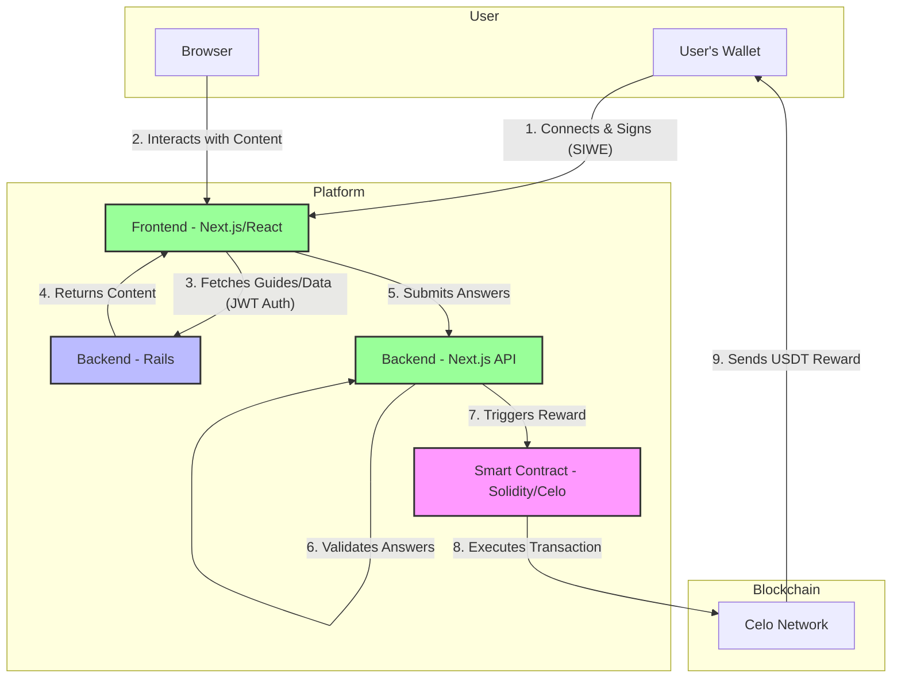

# Learn.tg - Project Architecture

## Overview

Learn.tg is a live, production gamified educational platform making learning engaging and rewarding. Students complete quality content through interactive guides and games, earning USDT cryptocurrency rewards for correct answers. The platform is currently operational at https://learn.tg with multiple courses across different subjects.

---

## System Architecture Diagram

This diagram illustrates the flow of information and actions between the user, the different parts of the application, and the blockchain.

## Architecture Stack

### 1. **Major Backend: Rails (servidor/)**
- **Framework:** Ruby on Rails (>= 3.4)
- **Database:** PostgreSQL (>= 16.2) with unaccent extension
- **Purpose:** Course management, guide organization, user data persistence, teacher administration. Also responsible for validating game answers.
- **Based on:** MSIP and cor1440_gen frameworks
- **Authentication:** Token-based (receives and validates JWT tokens from the Next.js frontend).

### 2. **Frontend and minor backend: Next.js (apps/nextjs/)**
- **Framework:** Next.js with React + TypeScript
- **UI Components:** Utilizes **Radix UI** for building a flexible and accessible component library.
- **Purpose:** User interface, content delivery, and user authentication.
- **Authentication:** Implements Sign-In With Ethereum (SIWE). The user connects with a Web3 wallet, and the frontend generates a JWT token for authenticating with the Rails backend.

### 3. **Smart Contracts: Hardhat (apps/hardhat/)**
- **Language:** Solidity ^0.8.24
- **Network:** Celo (mainnet) & Celo Sepolia (testnet)
- **Main Contract:** `LearnTGVaults.sol`
  - Manages USDT reward distribution per course.
  - Implements a 24-hour cooldown between submissions for a user.
  - Splits deposits: 80% to the student reward vault, 20% to platform
    operations.

---

## Authentication & Communication Flow

1.  **Frontend (Next.js):** A user connects their wallet and signs a message
   (SIWE).
2.  **Next.js API:** Validates the signature and generates a JWT token.
  This token is stored and used for subsequent authent icated actions.
3.  **Backend Communication:**
    - For fetching course data and content, the frontend sends the
  JWT in the `Authorization` header to the **Rails backend**.
    - For submitting answers and triggering rewards, the frontend sends
  the answers along with the JWT to a specific **Next.js API route**
  (`/api/check-crossword`).

**Key Point:** The platform uses a hybrid backend approach. The Rails server
acts as the primary administrative and content backend, while the Next.js
server handles real-time, user-specific actions like answer validation
and blockchain interactions.

---

## Reward System

**Trigger:** A student submits a crossword answer.

**Process:**
1. The frontend sends the crossword solution to the
   `POST / api/check-crossword` endpoint in the **Next.js backend**.
2. The Next.js backend validates the answer. If it's correct, it may award
   points to the user in the database.
3. The backend then calls the `submitGuideResult()` function on the
   `LearnTGVaults` smart contract. It passes the student's wallet address,
   a `profileScore` (a metric of user engagement), and a boolean indicating
   if the answer was perfect.
4.  The contract verifies on-chain:
   - The student has not already received a reward for this guide.
   - At least 24 hours have passed since the student's last submission for
     that course.
   - The course vault has a sufficient USDT balance.
   - The user's `profileScore` is at least 50.
5. If all checks pass, the contract calculates the final reward amount
   by multiplying the guide's base reward (`amountPerGuide`) by the
   `profileScore`.
6. The contract then transfers the calculated USDT amount to the student's
   wallet address.

---

## Key Technologies

| Component | Tech | Purpose |
|-----------|------|----------||
| Major Backend | Rails + PostgreSQL | Course/user management, admin interface |
| Smart Contracts | Solidity + Hardhat | USDT reward distribution, vault management |
| Frontend & API | Next.js + React + TypeScript | UI, content delivery, SIWE auth, answer validation |
| Blockchain | Celo | USDT transfers, decentralized rewards |
| Content | Markdown | Guide storage, version control |
| Wallet | OKX/Metamask/etc | User authentication and reward receipt |

---

## Development & Deployment

- **Start order:** Rails backend first, then Next.js frontend
- **Environment:** adJ 7.6 recommended (includes all dependencies)
- **Testing:** Hound CI, CodeClimate integration
- **Code Quality:** Automated linting and security checks
- **Live Deployment:** Running at https://learn.tg

