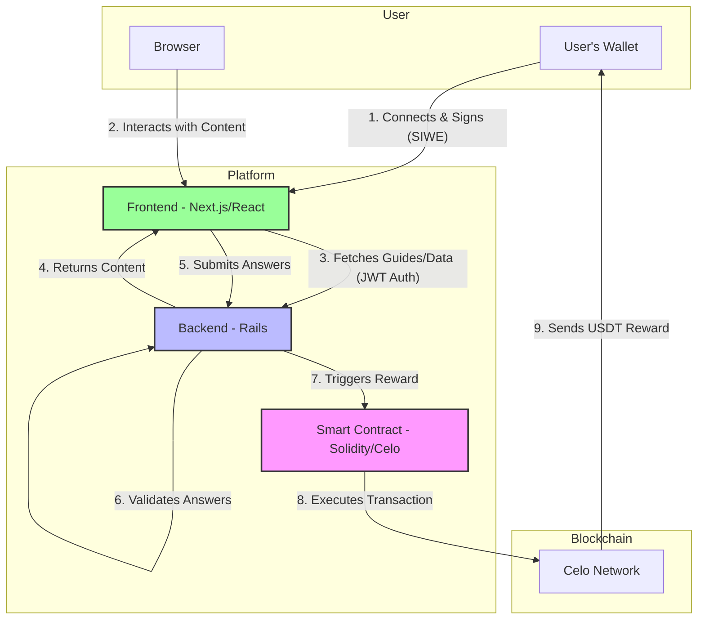

# Learn.tg - Project Architecture

## Overview

Learn.tg is a live, production gamified educational platform making learning engaging and rewarding. Students complete quality content through interactive guides and games, earning USDT cryptocurrency rewards for correct answers. The platform is currently operational at https://learn.tg with multiple courses across different subjects.

---

## System Architecture Diagram

This diagram illustrates the flow of information and actions between the user, the different parts of the application, and the blockchain.

## Architecture Stack

### 1. **Major Backend: Rails (servidor/)**
- **Framework:** Ruby on Rails (>= 3.4)
- **Database:** PostgreSQL (>= 16.2) with unaccent extension
- **Purpose:** Course management, guide organization, user data persistence, teacher administration. Also responsible for validating game answers.
- **Based on:** MSIP and cor1440_gen frameworks
- **Authentication:** Token-based (receives and validates JWT tokens from the Next.js frontend).

### 2. **Frontend and minor backend: Next.js (apps/nextjs/)**
- **Framework:** Next.js with React + TypeScript
- **UI Components:** Utilizes **Radix UI** for building a flexible and accessible component library.
- **Purpose:** User interface, content delivery, and user authentication.
- **Authentication:** Implements Sign-In With Ethereum (SIWE). The user connects with a Web3 wallet, and the frontend generates a JWT token for authenticating with the Rails backend.

### 3. **Smart Contracts: Hardhat (apps/hardhat/)**
- **Language:** Solidity ^0.8.24
- **Network:** Celo (mainnet) & Celo Sepolia (testnet)
- **Main Contract:** `LearnTGVaults.sol`
  - Manages USDT reward distribution per course.
  - Implements a 24-hour cooldown between submissions for a user.
  - Splits deposits: 80% to the student reward vault, 20% to platform operations.

---

## Authentication & Communication Flow

1.  **Frontend (Next.js):** A user connects their OKX wallet and signs a message (SIWE).
2.  **Frontend:** Validates the signature and generates a JWT token.
3.  **Backend (Rails):** The frontend sends the JWT in the `Authorization` header for all requests to the Rails backend, which uses it to identify and authenticate the user.
4.  **Smart Contract:** The backend system (likely a Next.js API route or the Rails server) calls the smart contract to trigger a reward after successfully validating a user's perfect submission.

**Key Point:** The frontend handles wallet-based authentication (SIWE), while the backend uses traditional token-based authentication (JWT) for its APIs. This separates concerns effectively.

---
## Reward System

**Trigger:** A student completes a guide with a correct crossword answer.

**Process:**
1.  The frontend submits the crossword answer to the backend.
2.  The backend validates the answer against the correct solutions for that guide.
3.  If the answer is perfect, the backend calls the `submitGuideResult()` function on the `LearnTGVaults` smart contract.
4.  The contract verifies on-chain:
   - The student has not already received a reward for this guide.
   - At least 24 hours have passed since the student's last reward claim.
   - The course vault has a sufficient USDT balance.
5.  If all checks pass, the contract transfers the configured `amountPerGuide` in USDT to the student's wallet address.

---

## Key Technologies

| Component | Tech | Purpose |
|-----------|------|----------|
| Major Backend | Rails + PostgreSQL | Course/user management, admin interface |
| Smart Contracts | Solidity + Hardhat | USDT reward distribution, vault management |
| Frontend | Next.js + React + TypeScript | UI, content delivery, SIWE auth |
| Blockchain | Celo | USDT transfers, decentralized rewards |
| Content | Markdown | Guide storage, version control |
| Wallet | OKX/Metamask/etc | User authentication and reward receipt |

---

## Development & Deployment

- **Start order:** Rails backend first, then Next.js frontend
- **Environment:** adJ 7.6 recommended (includes all dependencies)
- **Testing:** Hound CI, CodeClimate integration
- **Code Quality:** Automated linting and security checks
- **Live Deployment:** Running at https://learn.tg

