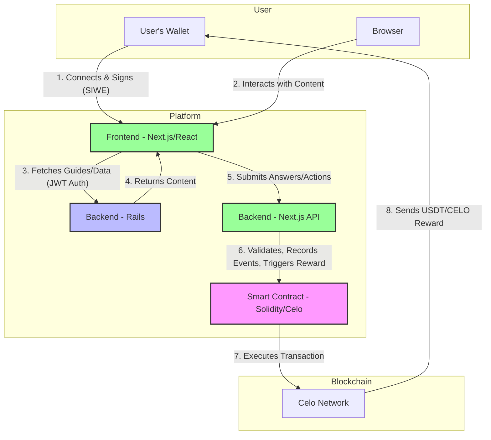

# Learn.tg - Project Architecture

## Overview

Learn.tg is a live, production gamified educational platform making learning engaging and rewarding. Students complete quality content through interactive guides and games, earning cryptocurrency rewards for correct answers. The platform is currently operational at https://learn.tg with multiple courses across different subjects.

---

## System Architecture Diagram

This diagram illustrates the flow of information and actions between the user, the different parts of the application, and the blockchain.

## Architecture Stack

### 1. **Major Backend: Rails (servidor/)**
- **Framework:** Ruby on Rails (v8.0)
- **Database:** PostgreSQL (>= 16.2) with unaccent extension
- **Purpose:** Course management, guide organization, user data persistence, teacher administration.
- **Based on:** MSIP and cor1440_gen frameworks
- **Authentication:** Token-based (receives and validates JWT tokens from the Next.js frontend).

### 2. **Frontend and minor backend: Next.js (apps/nextjs/)**
- **Framework:** Next.js (v15.3.6) with React (v19.2.3) + TypeScript
- **UI Components:** Utilizes **Radix UI** for building a flexible and accessible component library.
- **Purpose:** User interface, content delivery, and user authentication.
- **Authentication:** Implements Sign-In With Ethereum (SIWE). The user connects with a Web3 wallet, and the frontend generates a JWT token for authenticating with the Rails backend.

### 3. **Smart Contracts: Hardhat (apps/hardhat/)**
- **Language:** Solidity (^0.8.24)
- **Network:** Celo (mainnet) & Celo Sepolia (testnet)
- **Contracts:**
    - `LearnTGVaults.sol`: Manages USDT rewards for crossword puzzle completions.
    - `CeloUBI.sol`: Manages periodic claims of Universal Basic Income (UBI) in CELO.

---

## Authentication & Communication Flow

1.  **Frontend (Next.js):** A user connects their wallet and signs a message
   (SIWE).
2.  **Next.js API:** Validates the signature and generates a JWT token.
  This token is stored and used for subsequent authent icated actions.
3.  **Backend Communication:**
    - For fetching course data and content, the frontend sends the
  JWT in the `Authorization` header to the **Rails backend**.
    - For submitting answers and triggering rewards, the frontend sends
  the answers along with the JWT to a specific **Next.js API route**
  (`/api/check-crossword`).

**Key Point:** The platform uses a hybrid backend approach. The Rails server
acts as the primary administrative and content backend, while the Next.js
server handles real-time, user-specific actions like answer validation
and blockchain interactions.

---

## Reward System

The platform features two distinct reward mechanisms, demonstrating our principle of **amor** through tangible provision.

### 1. Activity Rewards (USDT for Crosswords)
- **Trigger:** A student submits a crossword answer via the `/api/check-crossword` endpoint.
- **Process:**
    1. The Next.js backend validates the answer.
    2. If correct, it calls the `submitGuideResult()` function on the `LearnTGVaults.sol` contract.
    3. The contract verifies on-chain that the user has a `profileScore` of at least 50, has not already been rewarded for the guide, and has respected the 24-hour cooldown period.
    4. If checks pass, the contract calculates and transfers the USDT reward to the student's wallet.

### 2. Universal Basic Income (UBI) Claims in CELO
- **Trigger:** A user initiates a UBI claim via the `/api/claim-celo-ubi` endpoint.
- **Process:**
    1. The Next.js backend verifies the user's eligibility (e.g., wallet, `profileScore`, potential cooldowns).
    2. It then calls the `claim()` function on the `CeloUBI.sol` contract.
    3. The contract validates the claim conditions (such as cooldown periods) on-chain.
    4. Upon successful validation, it transfers a set amount of CELO to the user's wallet.

---

## Progress and Scoring System

The platform tracks user progress and scores through two main database tables:

### `guide_usuario` (per-guide progress)
- `points`: 1 if the guide was answered correctly, 0 otherwise
- `amountpaid`: USDT amount rewarded for this guide (0 if not yet paid)
- `profilescore`: User's profile score at the time of submission

### `course_usuario` (per-course progress)
- `guidespoints`: Sum of `points` for all guides in the course
- `amountscholarship`: Total USDT received for the course
- `percentagecompleted`: Percentage of guides completed (with points > 0)

### Global user scores (in `usuario` table)
- `learningscore`: Total points across all guides and courses
- `profilescore`: Metric of user engagement (≥50 required for rewards)

### Progress calculation
When a user answers a guide correctly:
1. `guide_usuario.points` is set to 1
2. `updateUserAndCoursePoints()` recalculates all course metrics
3. `learningscore` is updated as the sum of all guide and course points
4. Progress percentages are recomputed based on completed vs total guides

The frontend displays progress using a three-color arc showing completion and payment percentages.

---

## Metrics and Analytics System

In line with our principle of **transparency**, we have refactored our metrics system to be a robust, server-side-only process. This ensures data integrity, prevents event manipulation, and provides a single source of truth for user interactions.

### Philosophy: Backend-Driven Tracking

- **The backend is the source of truth.** The client-side application no longer tracks events. Instead, it makes API calls for its core functions (e.g., fetching a guide, checking an answer).
- **Events are side-effects of API calls.** The server records an event as a direct consequence of a user's action being processed. For example, when a user successfully fetches a guide's content from `/api/guide`, the server records a `guide_view` event.

### Implementation and Data Flow

1.  **User Action**: A user performs an action in the frontend, such as viewing a guide or submitting a crossword.
2.  **API Request**: The frontend makes a standard API request to the Next.js backend (e.g., `GET /api/guide` or `POST /api/check-crossword`).
3.  **Backend Logic Execution**: The API endpoint performs its primary function (fetches content, validates the answer, etc.).
4.  **Event Recording**: After successfully executing the primary logic, the API endpoint itself calls the `recordEvent()` function from `lib/metrics-server.ts`.
5.  **Database Storage**: The `recordEvent()` function inserts a new entry into the `userevent` table with the relevant event type (`guide_view`, `course_start`, `course_progress`, `game_complete`) and associated data.

### Key Changes Implemented

-   **Deleted Endpoint**: The `/api/track-event` endpoint has been completely removed.
-   **No Client-Side Logic**: The `lib/metrics.ts` file and all client-side `trackEvent` calls have been deleted.
-   **Centralized Recording**: All event recording now happens within the API routes in the Next.js backend (`/api/guide`, `/api/check-crossword`), making the system more secure and reliable.

The existing **Metrics Dashboard** (`/metrics`) and its corresponding API (`/api/metrics`) continue to function as before, but they now draw from a more reliable and accurate dataset.

---

## Database Schema

The PostgreSQL database is shared between the Rails backend and Next.js backend. Rails manages the core schema through ActiveRecord migrations, while Next.js accesses the same tables directly via the Kysely ORM for performance-critical operations like answer validation and progress tracking.

### Core Rails Tables (PostgreSQL)

#### `cor1440_gen_proyectofinanciero` (courses)
- `id`: Primary key, referenced as `courseId` throughout the platform
- `titulo`: Course title displayed to users
- `subtitulo`: Optional subtitle
- `prefijoRuta`: URL path prefix (e.g., "gooddollar")
- `idioma`: Language ("en" or "es")
- Additional administrative fields for project management

#### `cor1440_gen_actividadpf` (guides)
- `id`: Primary key, referenced as `actividadpf_id` in related tables
- `proyectofinanciero_id`: Foreign key to `cor1440_gen_proyectofinanciero`
- `titulo`: Guide title
- `nombrecorto`: Short name used for ordering
- `sufijoRuta`: URL path suffix (e.g., "guide1") - must be non-empty for published guides
- `descripcion`: Optional description

#### Guide Ordering and Mapping
- Guides are filtered by `proyectofinanciero_id = {courseId}` and `sufijoRuta IS NOT NULL AND sufijoRuta <> ''`
- In the crossword validation API (`/api/check-crossword`), guides are ordered by `nombrecorto`
- Guide numbers (1-indexed) correspond to the position in this ordered list
- The frontend uses `sufijoRuta` to construct URLs: `/{lang}/{prefijoRuta}/{sufijoRuta}`
- **Note**: While the validation API orders by `nombrecorto`, other parts of the system (like the Rails backend API) may use different ordering. The 1-indexed `guideId` passed to the smart contract must match the ordering used in `check-crossword`.

#### User Management Tables

##### `usuario` (users)
- `id`: Primary key
- `profilescore`: Engagement metric (≥50 required for blockchain rewards)
- `learningscore`: Total points across all guides and courses
- `updated_at`: Last update timestamp

##### `billetera_usuario` (wallet linking)
- `billetera`: Wallet address (case-insensitive)
- `usuario_id`: Foreign key to `usuario`
- `token`: JWT token for API authentication
- `answer_fib`: Stores correct crossword answers (pipe-separated ` | `) provided by the Rails backend after guide viewing

##### `guide_usuario` (per-guide progress)
- `usuario_id`, `actividadpf_id`: Composite primary key
- `points`: 1 if guide was answered correctly, 0 otherwise
- `amountpaid`: USDT amount rewarded for this guide (0 if not paid)
- `profilescore`: Snapshot of user's `profilescore` at submission time

##### `course_usuario` (per-course progress)
- `usuario_id`, `proyectofinanciero_id`: Composite primary key
- `guidespoints`: Sum of `points` for all guides in the course
- `amountscholarship`: Total USDT received for the course
- `percentagecompleted`: Percentage of guides completed (points > 0)

##### `userevent` (user events)
- `id`: Primary key
- `usuario_id`: Optional foreign key to `usuario`
- `event_type`: Type identifier (guide_view, game_start, etc.)
- `event_data`: JSON payload with event-specific data
- `created_at`: Timestamp of event

### Data Flow Notes
1. User wallet connection creates/updates `billetera_usuario` with a signed token
2. Course and guide data is fetched from Rails APIs (which query the above tables)
3. Crossword answers are validated against `billetera_usuario.answer_fib`
4. Progress is tracked in `guide_usuario` and aggregated in `course_usuario`
5. Blockchain rewards update `guide_usuario.amountpaid` and `course_usuario.amountscholarship`
6. User events (guide views, game completions, etc.) are recorded in `userevent` via the metrics tracking system

---

## Key Technologies

| Component | Tech | Purpose |
|-----------|------|----------||
| Major Backend | Rails + PostgreSQL | Course/user management, admin interface |
| Smart Contracts | Solidity + Hardhat | USDT reward distribution, vault management |
| Frontend & API | Next.js + React + TypeScript | UI, content delivery, SIWE auth, answer validation |
| Blockchain | Celo | USDT transfers, decentralized rewards |
| Content | Markdown | Guide storage, version control |
| Metrics & Analytics | Next.js + Recharts + PostgreSQL | User engagement tracking, performance metrics, dashboard visualization |
| Wallet | OKX/Metamask/etc | User authentication and reward receipt |

---

## Development & Deployment

- **Start order:** Rails backend first, then Next.js frontend
- **Environment:** adJ 7.6 recommended (includes all dependencies)
- **Testing:** Hound CI, CodeClimate integration
- **Code Quality:** Automated linting and security checks
- **Live Deployment:** Running at https://learn.tg

