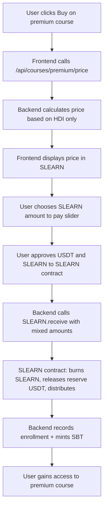

Enable users to purchase premium courses using the already-deployed `SLEARN.receive()` function (from I129). Add dynamic pricing based on user's country (HDI). No contract changes needed — all logic is already in SLEARN.sol from I129.

**Depends on:** I129 (SLEARN token launch, contracts deployed and operational)

---

## Summary of Key Decisions

| Decision | Details |
| :--- | :--- |
| **Payment method** | Mixed USDT + SLEARN (same `SLEARN.receive()` used for donations) |
| **Price calculation** | Off-chain (backend): base USDT price (3–15 USD) adjusted by HDI only (no profileScore discount) |
| **Distribution percentages** | Premium payment distribution (55% pdJ, 10% vault, 10% reward, 10% missional, 2.5% UBI, 2.5% referrals, 5% churches) |
| **SLEARN burning** | Handled inside `SLEARN.receive()` (user's SLEARN are burned, reserve USDT released) |
| **Access control** | After payment, user receives SBT for course access and record in `premium_course_usuario` table |
| **UI** | Show price in SLEARN, allow user to choose mixed payment (slider) |

---

## Design Overview



---

## 1. Backend Changes (learn.tg)

### 1.1 Dynamic Price Calculation

**File:** `app/api/courses/premium/price/route.ts` (new)

**Input:** `courseId`, `userWallet` (JWT authenticated)

**Output:** `priceUSDT`, `priceSLEARN`, `hdiUsed`, `country`

**Logic:**
```typescript
// 1. Get user's country from KYC (self.xyz verification)
const country = await getUserCountry(userWallet);

// 2. Get HDI for country (from local DB or external API)
const hdi = getHDIForCountry(country); // 0 to 1

// 3. Calculate base price in USDT (min $3, max $15)
const maxPrice = 15;
const minPrice = 3;
// Higher HDI = richer country = higher price
// Lower HDI = poorer country = lower price
const priceUSDT = minPrice + (hdi * (maxPrice - minPrice));

// Round to 2 decimal places
const roundedPriceUSDT = Math.round(priceUSDT * 100) / 100;

// 4. Convert to SLEARN
const rate = await slearnContract.usdtToSlearnRate(); // 22
let priceSLEARN = roundedPriceUSDT * rate;

// 5. Apply minimum SLEARN (to avoid dust)
// Minimum 1 SLEARN unit = 0.01 SLEARN (since 2 decimals)
const minSLEARN = 1;
priceSLEARN = Math.max(priceSLEARN, minSLEARN);
```

**Response:**
```json
{
  "priceUSDT": 5.50,
  "priceSLEARN": 121,
  "hdiUsed": 0.65,
  "country": "Sierra Leone"
}
```

### 1.2 Purchase Endpoint

**File:** `app/api/courses/premium/purchase/route.ts` (new)

**Input:** `courseId`, `usdtAmount`, `slearnAmount`, `referralAddress` (optional)

**Process:**
```typescript
// 1. Verify user is authenticated (JWT from SIWE)
// 2. Calculate expected price (same as price endpoint)
// 3. Verify that usdtAmount + (slearnAmount / rate) >= expectedPriceUSDT
// 4. Verify user has sufficient SLEARN balance (if slearnAmount > 0)
// 5. Call SLEARN.receive() with:
//    - payer: user wallet
//    - usdtAmount: user's USDT contribution
//    - slearnAmount: user's SLEARN contribution
//    - courseId: premium course ID
//    - percentages: premium distribution (see §1.3)
//    - referralAddress: if user came from referral
// 6. Wait for transaction receipt
// 7. Record enrollment in premium_course_usuario table
// 8. Mint SBT for course access (PasosDeJesusCredentials.mintCredential)
// 9. Return success + transaction hash
```

### 1.3 Premium Distribution Percentages

These percentages match the whitepaper §3.1.2:

| Destination | Percentage | Notes |
| :--- | :--- | :--- |
| pdJ Treasury | 55% | Operations & creators |
| Course Vault | 10% | 5% USDT, 5% SLEARN equivalent |
| Student Reward | 10% | Minted as SLEARN to student |
| Missional Courses | 10% | 5% USDT, 5% SLEARN equivalent |
| UBI | 2.5% | 1.25% USDT, 1.25% SLEARN equivalent |
| Referrals | 2.5% | 1.25% USDT, 1.25% SLEARN equivalent |
| Churches | 5% | 2.5% USDT, 2.5% SLEARN equivalent |
| **Total** | **100%** | |

### 1.4 Database Schema

**New table:** `premium_course_usuario`

```sql
CREATE TABLE premium_course_usuario (
    id SERIAL PRIMARY KEY,
    usuario_id INTEGER NOT NULL REFERENCES usuario(id),
    course_id INTEGER NOT NULL REFERENCES cor1440_gen_proyectofinanciero(id),
    purchased_at TIMESTAMP DEFAULT CURRENT_TIMESTAMP,
    usdt_amount_paid DECIMAL(10,2),
    slearn_amount_paid INTEGER, -- in 2 decimals (100 = 1.00 SLEARN)
    transaction_hash VARCHAR(66) NOT NULL,
    expires_at TIMESTAMP, -- NULL = lifetime access
    UNIQUE(usuario_id, course_id)
);
```

### 1.5 SBT Minting on Purchase

**File:** `lib/credentials/sbt-course-access.ts`

```typescript
// After successful payment, mint an SBT for course access
// This SBT is different from completion SBT (which is minted after finishing all guides)
await credentialsContract.mintCredential(
    userWallet,
    ACCESS_TOKEN_ID, // New token type: "premium_access"
    1
);
```

**Token type registration (one-time, before launch):**
```bash
./bin/m credentials:register-type \
  --site learn.tg \
  --type premium_access \
  --display-name "Premium Course Access" \
  --soulbound true \
  --icon /img/premium-badge.svg
```

---

## 2. Frontend Changes

### 2.1 Course Card Component

**File:** `components/CourseCard.tsx`

- [ ] Add "Premium" badge for courses with `precio_usdt > 0`
- [ ] Display "Buy with SLEARN" button instead of "Start"
- [ ] Show price in SLEARN (fetch from `/api/courses/premium/price`)

### 2.2 Purchase Modal

**File:** `components/CheckoutModal.tsx` (new)

**Features:**
- [ ] Display price in USDT and SLEARN
- [ ] Slider to choose how much SLEARN to use (0 to max SLEARN balance)
- [ ] Show remaining amount to pay in USDT
- [ ] Button to approve USDT and SLEARN to SLEARN contract
- [ ] Button to execute purchase
- [ ] Loading states and error handling
- [ ] Success page with transaction hash

**UI flow:**
```
┌─────────────────────────────────┐
│  Premium Course: Web3 & UBI     │
│  Price based on your country    │
│  (Sierra Leone): 121 SLEARN     │
├─────────────────────────────────┤
│  Pay with SLEARN:               │
│  ├───●───┼───┼───┤ 60 SLEARN    │
│  Remaining: 61 SLEARN ($2.77)   │
│  Will pay with USDT: $2.77      │
├─────────────────────────────────┤
│  [Approve USDT] [Approve SLEARN]│
│  [Purchase Course]              │
└─────────────────────────────────┘
```

### 2.3 User Profile - Premium Courses

**File:** `app/[lang]/profile/premium-courses/page.tsx` (new)

- [ ] List all premium courses purchased by user
- [ ] Show purchase date, amount paid (USDT/SLEARN)
- [ ] Link to course (if still accessible)
- [ ] Show expiry date (if applicable)

### 2.4 Course Access Control

**File:** `app/[lang]/[pathPrefix]/[pathSuffix]/page.tsx`

- [ ] Before rendering course content, check if user has:
  - Completed SBT (if they finished the course)
  - Premium access SBT (if they purchased but not completed)
  - Regular free access (if course is free)
- [ ] If no access, show purchase modal

---

## 3. HDI Data Source

### 3.1 Database Table

```sql
CREATE TABLE country_hdi (
    country_code VARCHAR(2) PRIMARY KEY, -- ISO 3166-1 alpha-2
    country_name VARCHAR(100),
    hdi DECIMAL(4,3), -- 0.000 to 1.000
    updated_at TIMESTAMP DEFAULT CURRENT_TIMESTAMP
);
```

### 3.2 Initial Data Population

```bash
# Download UNDP HDI data (2024-2025)
# Script: scripts/populate-hdi.ts
```

**Source:** [UNDP Human Development Index](https://hdr.undp.org/data-center/human-development-index#/indicies/HDI)

**Fallback:** If country not found, use world average HDI = 0.732

**Special case for Sierra Leone:** HDI = 0.458 (as of 2024)

### 3.3 Example Prices by Country

| Country | HDI | Price USDT | Price SLEARN (22 rate) |
| :--- | :--- | :--- | :--- |
| Sierra Leone | 0.458 | $8.50 | 187 |
| Nigeria | 0.535 | $9.42 | 207 |
| India | 0.644 | $10.73 | 236 |
| Brazil | 0.754 | $12.05 | 265 |
| United States | 0.927 | $14.12 | 311 |
| Norway | 0.966 | $14.59 | 321 |

---

## 4. Testing & Verification

### 4.1 Unit Tests

- [ ] Price calculation for various countries (US, SL, IN, BR, NO)
- [ ] Edge cases: HDI = 0 (min price $3), HDI = 1 (max price $15)
- [ ] Mixed payment amount validation
- [ ] Edge cases: insufficient balance, minimum payment

### 4.2 Integration Tests

- [ ] End-to-end: purchase with 100% SLEARN
- [ ] End-to-end: purchase with 100% USDT
- [ ] End-to-end: purchase with mixed payment (50/50)
- [ ] Verify SBT minted after purchase
- [ ] Verify enrollment recorded in database
- [ ] Verify user can access course after purchase
- [ ] Verify correct price for different countries (test with mock KYC)

### 4.3 Regression Tests

- [ ] Free courses unaffected
- [ ] Existing scholarships unaffected
- [ ] Leaderboard still works
- [ ] Transparency dashboard shows premium payments

---

## 5. Acceptance Criteria

- [ ] Price endpoint returns correct amount based on user's country HDI
- [ ] Price is higher for high-HDI countries, lower for low-HDI countries
- [ ] User can purchase premium course using mixed USDT + SLEARN
- [ ] SLEARN paid is burned; reserve USDT released and redistributed
- [ ] User receives SBT for premium access
- [ ] User can access course immediately after purchase
- [ ] Purchased courses appear in user's profile
- [ ] All events logged in transparency dashboard
- [ ] Works for users with zero SLEARN (100% USDT)
- [ ] Works for users with sufficient SLEARN (100% SLEARN)
- [ ] Graceful error handling for insufficient balance, network issues, etc.

---

## 6. Out of Scope (for this issue)

- Discount by profileScore (removed by decision)
- Subscription-based premium access (recurring payments)
- Discount codes or promotions
- Team/group purchases
- Refund mechanism (handled manually if needed)
- Exchange SLEARN for Leones (SLE) via stable-sl (separate project)

---

## 7. Dependencies Checklist

- [ ] I129 completed (SLEARN.sol deployed on mainnet)
- [ ] I129 completed (LearnTGVaultsV3 deployed on mainnet)
- [ ] SLEARN contract has `receive()` function with mixed payment support
- [ ] User KYC data includes country (self.xyz verification)
- [ ] HDI data populated in database
- [ ] SBT token type `premium_access` registered

---

> *"For which of you, intending to build a tower, does not sit down first and count the cost, whether he has enough to finish it?"* (Luke 14:28)

---

**Created:** 2026-04-08
**Status:** Pendiente
