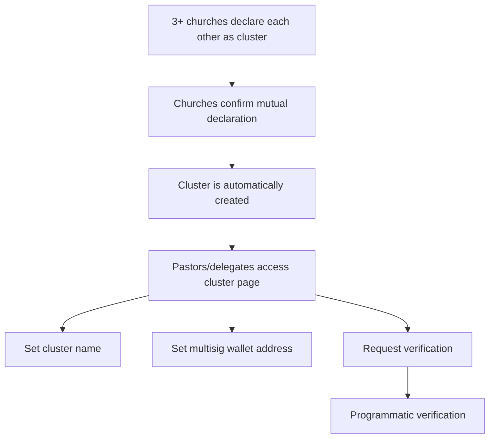

Build the foundation for Global Disciples cluster formation by enabling users to declare their church/place of worship, register as pastors, delegate administration, and form clusters of 3+ churches.

## Dependencies
- Existing user profiles (religion, location)
- Existing wallet system (OneKey/OKX)
- Profile score system (+32 points for completion)

---

## 1. Church/Place of Worship Declaration (User Profile)

### 1.1 Fields for All Users

| Field | Type | Required | Notes |
|-------|------|----------|-------|
| Geographic location | Selector (country/city) | Yes | |
| Church/center name | Autocomplete + open text | Yes | If not in list, creates new entry (pending curation) |

**Note:** Religion field already exists in profile. No need for "type of center."

### 1.2 Fields for Christians (when religion = Christian)

| Field | Type | Required | Notes |
|-------|------|----------|-------|
| Role | Selector (Pastor, Leader, Member) | Yes | |
| Pastor name | Text | Yes | If role is not Pastor |
| Pastor WhatsApp | Text | Yes | If role is not Pastor |
| Pastor wallet | Text | Optional | If role is not Pastor |

### 1.3 Fields for "Pastor" Role

| Field | Type | Required | Notes |
|-------|------|----------|-------|
| Complete church registration | Button | Yes | Redirects to church registration form |
| ID document | File upload | Yes | Front of ID (photo) |
| ID document back | File upload | Yes | Back of ID (photo) |

### 1.4 Fields for All Users in Sierra Leone

| Field | Type | Required | Notes |
|-------|------|----------|-------|
| ID document | File upload | Yes | Front of ID (photo) |
| ID document back | File upload | Yes | Back of ID (photo) |
| Interview date proposals | Date picker | Yes | Multiple date options for manual verification |

**Reason:** Self protocol (self.xyz) does not operate in Sierra Leone. All SL users require manual verification via WhatsApp/Telegram interview.

### 1.5 Rewards

- **+32 profile score** for completing all required fields

---

## 2. Church Registration (For Pastors)

### 2.1 Registration Form

| Field | Type | Required | Notes |
|-------|------|----------|-------|
| Denomination | Text | Yes | |
| Government registration | File upload | Yes | Photo of registration document |
| Delegate wallet | Text | Yes | Must correspond to a wallet already verified in learn.tg |
| Interview date proposals | Date picker | Yes | Multiple date options for manual verification |

### 2.2 Church Curation

| Feature | Description |
|---------|-------------|
| **Curation** | pdJ reserves the right to curate the church list (avoid duplicates from misspelled names) |
| **Notification** | Users receive email notification when their church entry is changed |

---

## 3. Church Page

### 3.1 Page Content

| Section | Content |
|---------|---------|
| Basic info | Name, location, denomination, registration |
| Pastor | Name, WhatsApp, wallet |
| Delegate | Name, wallet (if applicable) |
| Cluster | Indication of other 2+ churches in the cluster |
| Reputation | Current score |
| Ranking | Position in church ranking |

### 3.2 Access Control

- **Page access:** Pastor or delegated leader (who can manage the page)
- **Cluster declaration:** Only available to pastors/delegated leaders of the churches in the cluster

---

## 4. Delegation of Administration

### 4.1 Functionality

| Feature | Description |
|---------|-------------|
| **Pastor delegates** | A registered pastor can delegate church administration to a trusted leader |
| **Scope** | The delegated leader can manage the church page (including declaring cluster membership) |
| **Multisig wallet** | The delegated leader operates the cluster multisig wallet (the pastor is informed and trusts the delegate) |
| **Audit** | The pastor can view all operations performed by the delegated leader |

---

## 5. Cluster Formation

### 5.1 Process Flow

### 5.2 Cluster Declaration

| Step | Description |
|------|-------------|
| **1. Mutual declaration** | Each church declares from its page the other 2+ churches it is in a cluster with |
| **2. Confirmation** | Churches confirm each other's declarations |
| **3. Cluster creation** | When 3+ churches have declared and confirmed, the cluster is created |
| **4. Access** | Pastors and delegated leaders of the churches in the cluster can access the cluster page |

### 5.3 Cluster Page

| Section | Content |
|---------|---------|
| Cluster name | Pastors/delegates can set a name |
| Multisig wallet | Cluster multisig wallet address |
| Verification status | Request verification button |
| Members | List of churches in the cluster |
| Funds | Cluster funds (USDT and SLEARN) |
| Ranking | Position in cluster ranking |

### 5.4 Access to Cluster Page

- **Entry point:** From the ranking OR from the church page
- **Active for:** Only pastors/delegated leaders of the churches in the cluster

---

## 6. Multisig Wallet Verification

### 6.1 Programmatic Verification

| Step | Description |
|------|-------------|
| **1. Request** | Cluster requests verification via button |
| **2. Verification** | System verifies that the multisig has at least one wallet per church (pastor or delegate) |
| **3. Confirmation** | Confirms that the multisig is configured correctly |
| **4. Status** | Verification status appears on the cluster page |

**Note:** Verification requires that each church in the cluster has a pastor or delegate with a wallet associated with the multisig.

---

## 7. Future: Updates and Changes

| Scenario | Mechanism |
|----------|-----------|
| **Pastor change** | Previous pastor must delegate/claim; new pastor must pass manual verification |
| **Church name change** | Request to pdJ; requires verification |
| **Denomination change** | Pastor can update from the church page |
| **Registration change** | Pastor can update from the church page |

---

## 8. Summary of New Features

| Feature | Description | Priority |
|---------|-------------|----------|
| Church declaration in user profile | Users declare their church/center of worship | 🔴 High |
| Church registration for pastors | Pastors register their church with government documents | 🔴 High |
| Church page | Public page for each church with pastor/delegate info | 🔴 High |
| Delegation system | Pastors can delegate administration to trusted leaders | 🟡 Medium |
| Cluster formation | 3+ churches can declare and form a cluster | 🔴 High |
| Cluster page | Page for each cluster with multisig wallet, funds, ranking | 🔴 High |
| Multisig verification | Programmatic verification of cluster multisig wallet | 🟡 Medium |
| Manual verification system | For users in Sierra Leone (ID upload, interview scheduling) | 🔴 High |

---

## 9. Acceptance Criteria

- [ ] Users can declare their church/center of worship with all required fields
- [ ] +32 profile score is awarded for completing the declaration
- [ ] Pastors can register their church with government documents
- [ ] Users in Sierra Leone can upload ID documents and schedule interviews
- [ ] Pastors can delegate administration to trusted leaders
- [ ] Delegated leaders can manage the church page
- [ ] 3+ churches can declare and form a cluster
- [ ] Cluster page displays members, funds, multisig wallet, and ranking
- [ ] Multisig wallet verification works programmatically
- [ ] Church list is curated and users are notified of changes

---

> *"For which of you, intending to build a tower, does not sit down first and count the cost, whether he has enough to finish it?"* (Luke 14:28)

---

**Created:** 2026-06-28
**Status:** Pendiente
