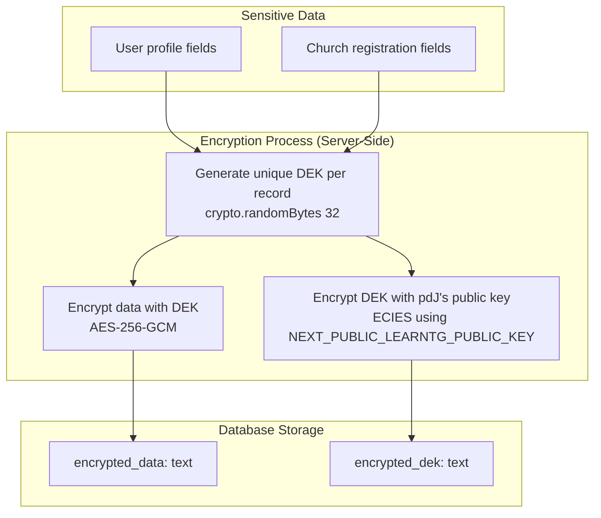
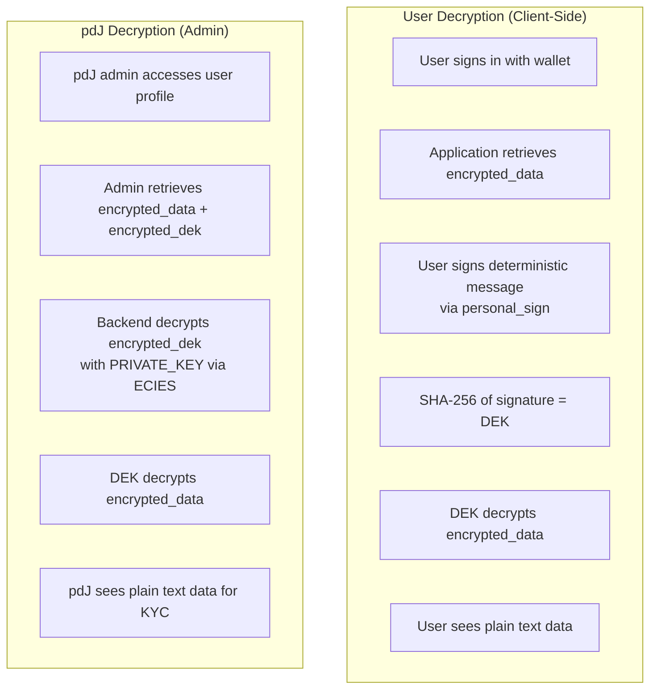
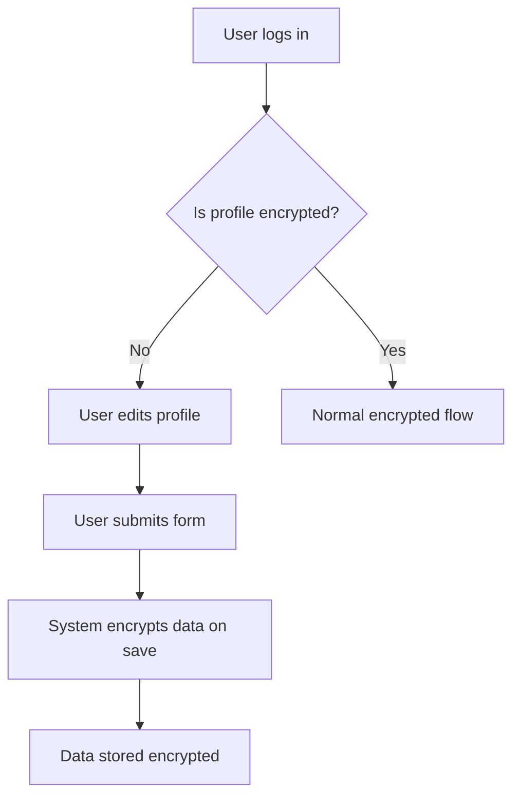

# R-#153: Implement Encrypted Profile Data with Multi-Key Access


Implement encryption for sensitive user profile data so that:
1. Data is encrypted in the database at rest.
2. Only the user (by signing a message with their wallet) can decrypt their own data.
3. pdJ can decrypt data for KYC and support purposes using learn.tg's backend wallet keys.

## Dependencies
- R-#152 (Profiles of Church / GD Cluster)
- Existing wallet system (SIWE, OneKey/OKX)
- `ecies-geth` or `@metamask/eth-sig-util` for ECIES encryption of DEK for pdJ

---

## 1. Scope

### 1.1 Sensitive Fields to Encrypt

| Field | Source | Notes |
|-------|--------|-------|
| Pastor name | User profile | |
| Pastor WhatsApp | User profile | |
| ID document (front/back) | User profile (SL only) | |
| Government registration | Church registration | |
| Church registration document | Church registration | |
| Pastor wallet (if provided) | User profile | Optional |

### 1.2 Non-Sensitive Fields (Keep in Plain Text)

| Field | Source | Notes |
|-------|--------|-------|
| Geographic location | User profile | Country/city |
| Church name | User profile/church | Public |
| Denomination | Church registration | Public |
| Role (Pastor/Leader/Member) | User profile | Public |
| Persecution checkbox | User profile | Preference |
| Interview date proposals | User profile | Scheduling data |

---

## 2. Encryption Architecture

### 2.1 Key Generation

| Key | Owner | Purpose |
|-----|-------|---------|
| **User's wallet** | User | Signs deterministic message to derive DEK |
| **User's signature** | User | Hash of `personal_sign` output = DEK (never stored) |
| **pdJ's public key** | pdJ / learn.tg | `NEXT_PUBLIC_LEARNTG_PUBLIC_KEY` — raw uncompressed public key (64 bytes) of the learn.tg backend wallet, for ECIES encryption |
| **pdJ's private key** | pdJ / learn.tg | `PRIVATE_KEY` — the learn.tg backend wallet private key, for ECIES decryption |

**Why `NEXT_PUBLIC_LEARNTG_PUBLIC_KEY` instead of `NEXT_PUBLIC_ADDRESS`:** An Ethereum address is `keccak256(publicKey)[12:32]` — a one-way hash. ECIES requires the raw uncompressed public key (64 bytes). The raw key can be derived at deploy time:
```bash
node -e "const {privateKeyToAccount}=require('viem/accounts'); \
  console.log(privateKeyToAccount(process.env.PRIVATE_KEY).publicKey)"
```

**Why `personal_sign` for user DEK (not ECIES with raw public key):** The other approach — encrypt DEK with user's raw public key — requires the user's wallet to expose the private key for ECIES decryption, which no browser wallet does (MetaMask, OKX, OneKey, MiniPay). `personal_sign` works universally. The deterministic message (`"learn.tg profile decryption v1"`) is hardcoded in the frontend — the user cannot choose a different message. If the message ever changes (version bump), `encryption_version` handles migration by re-encrypting data with the new DEK. This is simpler, more compatible, and equally secure for the use case.

**Security note:** A malicious client cannot impersonate the user. `personal_sign` requires the wallet's private key — the signature is produced inside the wallet, not by the frontend. Even if a rogue client sends a different message, the resulting DEK won't match the one used for encryption, so the data remains unreadable. The user also sees the message in their wallet before signing. There is no impersonation vector here.

### 2.2 Encryption Flow



**User DEK recovery (client-side):** The user does NOT store an encrypted DEK. Instead, when the user needs to decrypt their data:
1. User signs a deterministic message (e.g., `"learn.tg profile decryption v1"`) via `personal_sign`
2. The signature is hashed with SHA-256 → this is the DEK
3. DEK decrypts `encrypted_data`

This works because `personal_sign` produces a deterministic signature for the same message + private key. No private key exposure needed — works with MetaMask, OKX, OneKey, and MiniPay.

### 2.3 Decryption Flow



---

## 3. Implementation Plan

### 3.1 Phase 1: Database Schema Changes

| Table | New Columns | Type | Notes |
|-------|-------------|------|-------|
| `usuario` | `encrypted_data` | JSONB | All sensitive fields in one encrypted JSON blob (AES-256-GCM) |
| `usuario` | `encrypted_dek` | TEXT | DEK encrypted with pdJ's public key via ECIES |
| `usuario` | `encryption_version` | INTEGER | For future key rotation (default: 1) |

### 3.2 Phase 2: User Public Key Recovery

| Table | New Columns | Type | Notes |
|-------|-------------|------|-------|
| `billetera_usuario` | `public_key` | TEXT | User's public key recovered from SIWE signature via `ecrecover` |

**How it works:** During SIWE authentication (`auth-options.ts`), the signed message + signature are already available. `ecrecover(signature, messageHash)` recovers the public key. This is stored once and reused. The wallet address alone cannot derive the public key (address = last 20 bytes of `keccak256(publicKey)` — one-way hash).

### 3.3 Phase 3: Encryption/Decryption Service

| Component | Description |
|-----------|-------------|
| `lib/encryption.ts` | Encryption/decryption utilities |
| `lib/encryption.ts` | `encryptSensitiveData(data)` |
| `lib/encryption.ts` | `decryptWithSignature(encryptedData, signature)` |
| `lib/encryption.ts` | `decryptForPdJ(encryptedData, encryptedDek)` |

### 3.4 Phase 4: Profile Update Flow

| Step | Description |
|------|-------------|
| **1** | User submits profile form with sensitive data |
| **2** | Backend generates DEK via `crypto.randomBytes(32)` |
| **3** | Backend encrypts sensitive data with DEK (AES-256-GCM) |
| **4** | Backend encrypts DEK with pdJ's public key via ECIES (using `NEXT_PUBLIC_LEARNTG_PUBLIC_KEY`) |
| **5** | Backend stores `encrypted_data` + `encrypted_dek` |

**User DEK recovery:** Not stored. User re-derives DEK client-side by signing a deterministic message and hashing the signature.

### 3.5 Phase 5: Profile Display Flow

| Step | Description |
|------|-------------|
| **1** | User signs in with wallet (SIWE) |
| **2** | Frontend retrieves `encrypted_data` from backend |
| **3** | Frontend asks wallet to sign `"learn.tg profile decryption v1"` via `personal_sign` |
| **4** | Frontend hashes signature with SHA-256 → this is the DEK |
| **5** | Frontend uses DEK to decrypt `encrypted_data` (AES-256-GCM) |
| **6** | Frontend displays plain text data to user |

**Why `personal_sign` works:** The same private key + same message always produces the same signature (deterministic ECDSA). SHA-256 of that signature gives a stable 32-byte DEK without exposing the private key.

### 3.6 Phase 6: pdJ Admin Access

| Step | Description |
|------|-------------|
| **1** | pdJ admin navigates to user profile in admin panel |
| **2** | Backend retrieves `encrypted_data` + `encrypted_dek` |
| **3** | Backend decrypts `encrypted_dek` with `PRIVATE_KEY` via ECIES → DEK |
| **4** | Backend uses DEK to decrypt `encrypted_data` (AES-256-GCM) |
| **5** | Backend displays plain text data to admin |
| **6** | Backend records access in `userevent` table (`pdj_profile_access`) |

---

## 4. Migration: Existing Data

### 4.1 Strategy: Gradual Migration

| Approach | Description | Recommendation |
|----------|-------------|----------------|
| **Lazy migration** | Encrypt data on next profile update | ✅ **Recommended for MVP** |
| **Batch migration** | Encrypt all existing data in one script | Risk of errors; can be done later |
| **Manual migration** | pdJ manually re-enters data for existing users | Time-consuming; not recommended |

### 4.2 Lazy Migration Flow



### 4.3 Migration Script

```sql
-- Add columns (NULL allowed initially — lazy migration)
ALTER TABLE usuario ADD COLUMN encrypted_data JSONB;
ALTER TABLE usuario ADD COLUMN encrypted_dek TEXT;
ALTER TABLE usuario ADD COLUMN encryption_version INTEGER DEFAULT 1;

-- Add public_key column to billetera_usuario
ALTER TABLE billetera_usuario ADD COLUMN public_key TEXT;

-- Dual-state handling: existing data in plain-text columns stays until user updates profile.
-- Code MUST check: if encrypted_data IS NOT NULL → decrypt and use.
-- Otherwise → read from legacy plain-text columns.
-- Sensitive plain-text columns can be dropped after all data is migrated.
```

---

## 5. User Experience

### 5.1 User Profile Page

| Element | Description |
|---------|-------------|
| **Sensitive fields** | Displayed in plain text when decrypted |
| **Loading state** | "Decrypting your data..." while decrypting |
| **Error state** | "Unable to decrypt data. Please try again." |
| **Consent** | User must sign a message to decrypt (`personal_sign`) |

### 5.2 Admin Panel (pdJ)

| Element | Description |
|---------|-------------|
| **Sensitive fields** | Displayed in plain text after decryption |
| **Access log** | pdJ access logged to `userevent` (`pdj_profile_access`) |
| **Consent check** | Verify that user has consented to KYC |

---

## 6. Security Considerations

| Consideration | Implementation |
|---------------|----------------|
| **pdJ's private key in environment** | `PRIVATE_KEY` — never in code or database |
| **pdJ's public key** | `NEXT_PUBLIC_LEARNTG_PUBLIC_KEY` — raw 64-byte public key of learn.tg backend wallet |
| **User DEK never stored** | DEK re-derived from `personal_sign` each session — no DEK at rest for user side |
| **ECIES for pdJ DEK** | DEK encrypted with pdJ's public key — only `PRIVATE_KEY` can decrypt |
| **Key rotation** | `encryption_version` field for future rotation |
| **Audit log** | All pdJ decryption access logged in `userevent` table (`pdj_profile_access`) |
| **Rate limiting** | Limit decryption attempts |

---

## 7. Acceptance Criteria

- [ ] Sensitive profile fields are encrypted in the database
- [ ] User can decrypt and view their own data using their wallet
- [ ] pdJ can decrypt and view user data for KYC using pdJ's key
- [ ] Migration strategy for existing data is defined (lazy migration)
- [ ] Encryption/decryption works for:
  - [ ] User profile (pastor name, WhatsApp, ID photos)
  - [ ] Church registration (government registration, documents)
- [ ] Non-sensitive fields remain in plain text
- [ ] Admin panel displays decrypted data for pdJ
- [ ] Access logs recorded in `userevent` for pdJ decryption (`pdj_profile_access`)

---

## 8. Out of Scope

- Key rotation system (can be added later)
- End-to-end encrypted messaging between users
- Hardware wallet support for encryption/decryption

---

> *"The prudent see danger and take refuge, but the simple keep going and pay the penalty."* (Proverbs 22:3)


---

**Created:** 2026-06-29
**Status:** Pendiente
