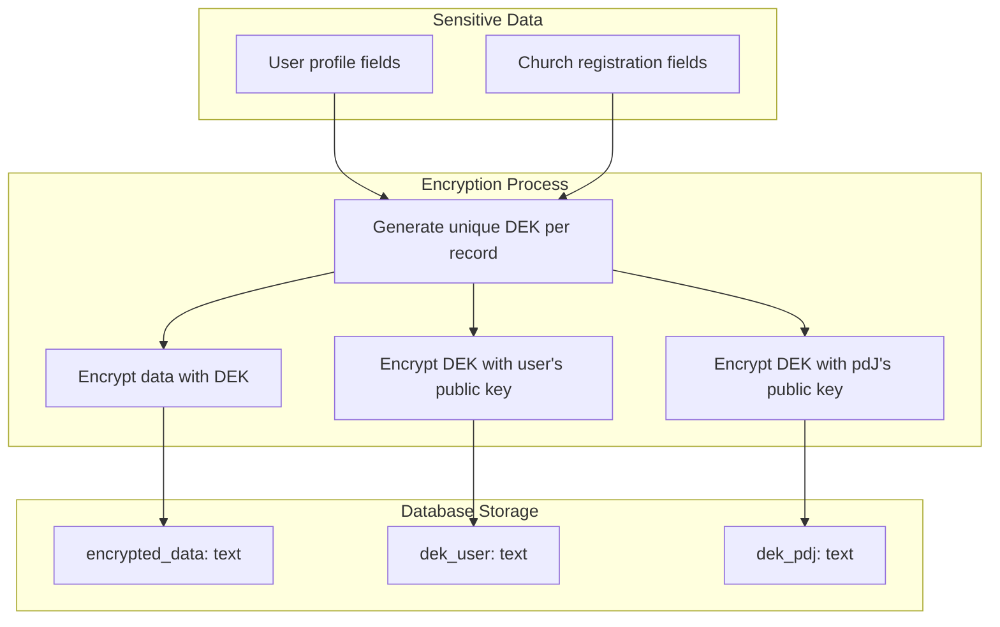
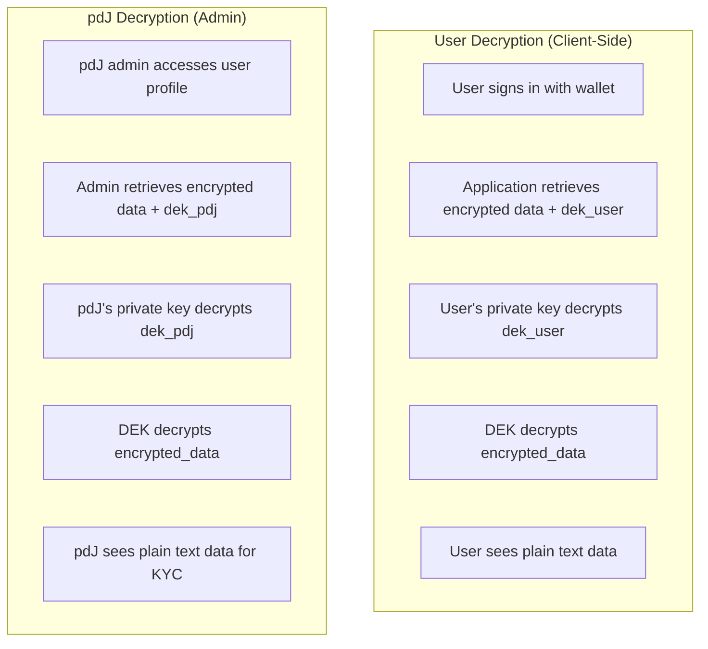
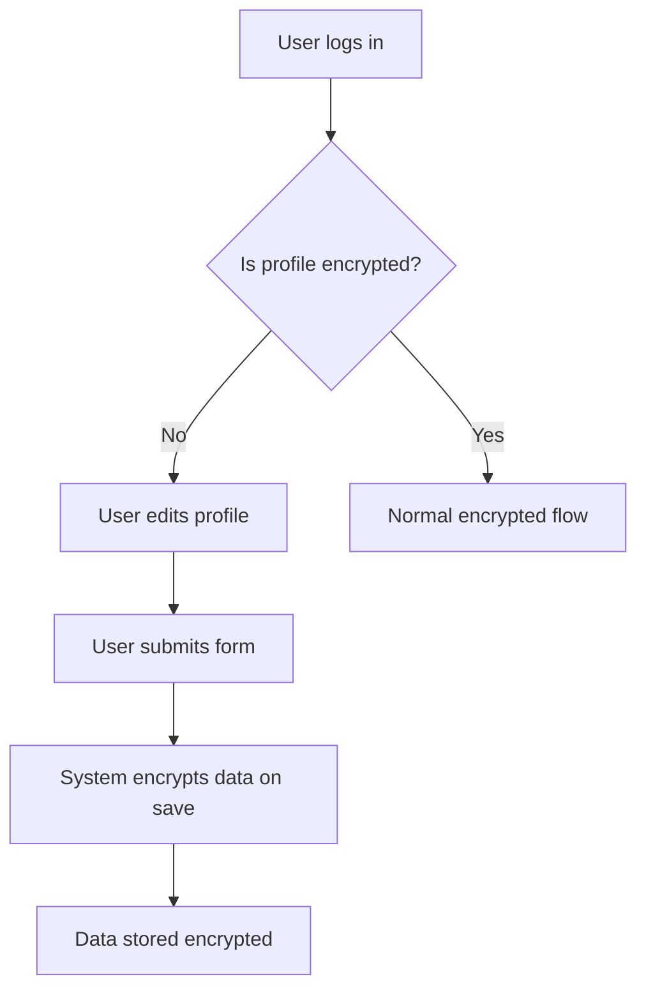

Implement encryption for sensitive user profile data so that:
1. Data is encrypted in the database at rest.
2. Only the user (with their private key) can decrypt their own data.
3. pdJ can decrypt data for KYC and support purposes using a separate key.

## Dependencies
- R-#152 (Profiles of Church / GD Cluster)
- Existing wallet system (SIWE, OneKey/OKX)
- eth-crypto or similar library for encryption/decryption

---

## 1. Scope

### 1.1 Sensitive Fields to Encrypt

| Field | Source | Notes |
|-------|--------|-------|
| Pastor name | User profile | |
| Pastor WhatsApp | User profile | |
| ID document (front/back) | User profile (SL only) | |
| Government registration | Church registration | |
| Church registration document | Church registration | |
| Pastor wallet (if provided) | User profile | Optional |

### 1.2 Non-Sensitive Fields (Keep in Plain Text)

| Field | Source | Notes |
|-------|--------|-------|
| Geographic location | User profile | Country/city |
| Church name | User profile/church | Public |
| Denomination | Church registration | Public |
| Role (Pastor/Leader/Member) | User profile | Public |
| Persecution checkbox | User profile | Preference |
| Interview date proposals | User profile | Scheduling data |

---

## 2. Encryption Architecture

### 2.1 Key Generation

| Key | Owner | Purpose |
|-----|-------|---------|
| **DEK (Data Encryption Key)** | System-generated | Unique key per user/record for encrypting sensitive data |
| **User's public key** | User | Encrypt DEK so only user can decrypt |
| **User's private key** | User | Decrypt DEK (used client-side) |
| **pdJ's public key** | pdJ | Encrypt DEK so pdJ can decrypt for KYC |
| **pdJ's private key** | pdJ | Decrypt DEK (used server-side/admin) |

### 2.2 Encryption Flow



### 2.3 Decryption Flow



---

## 3. Implementation Plan

### 3.1 Phase 1: Database Schema Changes

| Table | New Columns | Type | Notes |
|-------|-------------|------|-------|
| `usuario` | `encrypted_data` | JSONB | All sensitive fields in one encrypted JSON blob |
| `usuario` | `dek_user` | TEXT | DEK encrypted with user's public key |
| `usuario` | `dek_pdj` | TEXT | DEK encrypted with pdJ's public key |
| `usuario` | `encryption_version` | INTEGER | For future key rotation (default: 1) |

### 3.2 Phase 2: User Public Key Storage

| Table | New Columns | Type | Notes |
|-------|-------------|------|-------|
| `billetera_usuario` | `public_key` | TEXT | User's public key for encryption |

**Note:** The user's public key can be derived from their wallet address using `eth-crypto` or similar library.

### 3.3 Phase 3: Encryption/Decryption Service

| Component | Description |
|-----------|-------------|
| `lib/encryption.ts` | Encryption/decryption utilities |
| `lib/encryption.ts` | `encryptSensitiveData(data, userAddress)` |
| `lib/encryption.ts` | `decryptSensitiveData(encryptedData, privateKey)` |
| `lib/encryption.ts` | `decryptForPdJ(encryptedData)` |

### 3.4 Phase 4: Profile Update Flow

| Step | Description |
|------|-------------|
| **1** | User submits profile form with sensitive data |
| **2** | Frontend retrieves user's public key from wallet |
| **3** | Backend generates DEK and encrypts sensitive data |
| **4** | Backend encrypts DEK with user's public key and pdJ's public key |
| **5** | Backend stores encrypted data + both encrypted DEKs |

### 3.5 Phase 5: Profile Display Flow

| Step | Description |
|------|-------------|
| **1** | User signs in with wallet (SIWE) |
| **2** | Frontend retrieves encrypted data from backend |
| **3** | Frontend uses user's private key (from wallet) to decrypt DEK |
| **4** | Frontend uses DEK to decrypt sensitive data |
| **5** | Frontend displays plain text data to user |

### 3.6 Phase 6: pdJ Admin Access

| Step | Description |
|------|-------------|
| **1** | pdJ admin navigates to user profile in admin panel |
| **2** | Backend retrieves encrypted data + dek_pdj |
| **3** | Backend uses pdJ's private key (environment variable) to decrypt DEK |
| **4** | Backend uses DEK to decrypt sensitive data |
| **5** | Backend displays plain text data to admin |

---

## 4. Migration: Existing Data

### 4.1 Strategy: Gradual Migration

| Approach | Description | Recommendation |
|----------|-------------|----------------|
| **Lazy migration** | Encrypt data on next profile update | ✅ **Recommended for MVP** |
| **Batch migration** | Encrypt all existing data in one script | Risk of errors; can be done later |
| **Manual migration** | pdJ manually re-enters data for existing users | Time-consuming; not recommended |

### 4.2 Lazy Migration Flow



### 4.3 Migration Script (if needed)

```sql
-- Add columns with NULL allowed initially
ALTER TABLE usuario ADD COLUMN encrypted_data JSONB;
ALTER TABLE usuario ADD COLUMN dek_user TEXT;
ALTER TABLE usuario ADD COLUMN dek_pdj TEXT;
ALTER TABLE usuario ADD COLUMN encryption_version INTEGER DEFAULT 1;

-- Add public_key column to billetera_usuario
ALTER TABLE billetera_usuario ADD COLUMN public_key TEXT;

-- Note: Existing data remains in plain text columns until user updates profile
-- Sensitive columns can be kept but marked deprecated
```

---

## 5. User Experience

### 5.1 User Profile Page

| Element | Description |
|---------|-------------|
| **Sensitive fields** | Displayed in plain text when decrypted |
| **Loading state** | "Decrypting your data..." while decrypting |
| **Error state** | "Unable to decrypt data. Please try again." |
| **Consent** | User must sign a message to encrypt/decrypt (SIWE) |

### 5.2 Admin Panel (pdJ)

| Element | Description |
|---------|-------------|
| **Sensitive fields** | Displayed in plain text after decryption |
| **Access log** | pdJ access is logged for audit |
| **Consent check** | Verify that user has consented to KYC |

---

## 6. Security Considerations

| Consideration | Implementation |
|---------------|----------------|
| **Private keys never leave user's device** | Decryption happens client-side |
| **pdJ's private key in environment** | Never in code or database |
| **DEK is unique per user** | Compromising one DEK doesn't compromise others |
| **Key rotation** | `encryption_version` field for future rotation |
| **Audit log** | All pdJ decryption access logged |
| **Rate limiting** | Limit decryption attempts |

---

## 7. Acceptance Criteria

- [ ] Sensitive profile fields are encrypted in the database
- [ ] User can decrypt and view their own data using their wallet
- [ ] pdJ can decrypt and view user data for KYC using pdJ's key
- [ ] Migration strategy for existing data is defined (lazy migration)
- [ ] Encryption/decryption works for:
  - [ ] User profile (pastor name, WhatsApp, ID photos)
  - [ ] Church registration (government registration, documents)
- [ ] Non-sensitive fields remain in plain text
- [ ] Admin panel displays decrypted data for pdJ
- [ ] Access logs are recorded for pdJ decryption

---

## 8. Out of Scope

- Key rotation system (can be added later)
- End-to-end encrypted messaging between users
- Hardware wallet support for encryption/decryption

---

> *"The prudent see danger and take refuge, but the simple keep going and pay the penalty."* (Proverbs 22:3)


---

**Created:** 2026-06-29
**Status:** Pendiente
