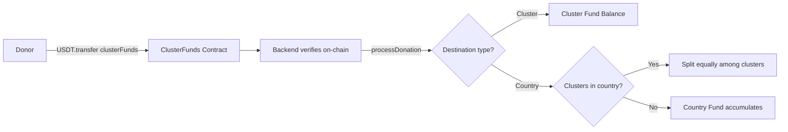
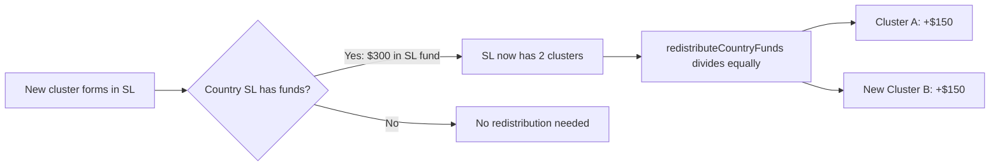
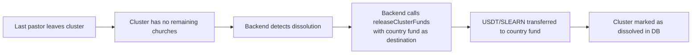

# R-#155: Implement Contract for Cluster/Country Funds

Implement a smart contract that manages funds (USDT and SLEARN) for clusters and countries. Country donations are split equally among existing clusters in that country. When no clusters exist, funds accumulate in the country fund and are distributed when the first cluster forms.

**Donation UX principle:** Anyone can donate to a country by simply selecting it from a dropdown — no knowledge of GD, clusters, or church structure required. The platform handles the equal distribution transparently.

## Dependencies
- R-#152 (Profiles of Church / GD Cluster)
- R-#154 (Ranking de Clústeres y Países)
- R-#156 (Donation system — calldata encoding contract)
- Existing SLEARN and USDT contracts
- SLEARN contract: `ClusterFunds` MUST be whitelisted in SLEARN (restricted transfers)
- Existing LearnTGVaultsV3 contract

---

## 1. Contract Design

### 1.1 Contract Name
`ClusterFunds.sol`

### 1.2 Purpose
- Receive and manage USDT and SLEARN donations for clusters and countries
- **Country donations:** If clusters exist in the country → split equally among them. If no clusters → accumulate in country fund for future distribution
- When a new cluster forms in a country with accumulated funds → redistribute country funds equally among all clusters (including the new one)
- Provide transparency through events

### 1.3 Relationship with Existing Contracts

| Contract | Relationship |
|----------|--------------|
| `LearnTGVaultsV3` | Receives SLEARN from vaults for scholarships |
| `SLEARN.sol` | Can mint SLEARN for donations to clusters |
| `USDT` | Receives USDT donations for clusters |

---

## 2. Contract Functions

### 2.1 Donation Functions

Donations follow the calldata-stuffing pattern from R-#156: users send USDT/SLEARN via `transfer()` to the contract. The backend verifies on-chain and calls `processDonation()` to allocate.

| Function | Description |
|----------|-------------|
| `processDonation(bytes32 txHash, address clusterWallet, uint8 pdjPercentage)` | Process a verified incoming donation: split USDT/SLEARN between cluster and pdJTreasury |
| `processCountryDonation(bytes32 txHash, string countryCode, uint8 pdjPercentage)` | Process a verified incoming donation to a country fund |

**pdjPercentage:** Integer 0-30, steps of 5. Validated with `require(pdjPercentage <= 30 && pdjPercentage % 5 == 0, "Invalid pdJ percentage")`.

**Replay protection:** Each `txHash` is recorded on-chain after processing. `require(!processedTx[txHash], "Already processed")`.

### 2.2 Transfer Functions

| Function | Modifier | Description |
|----------|----------|-------------|
| `redistributeCountryFunds(string countryCode)` | `onlyAdmin` | Distribute country fund equally among all clusters in that country. Called when: a) a new cluster forms (from R-#152 cluster creation), or b) a donation arrives for a country that already has clusters |
| `releaseClusterFunds(address clusterWallet, uint256 usdtAmount, uint256 slearnAmount)` | `onlyAdmin` | Transfer USDT/SLEARN from contract to cluster's `multisig_address`. Called by learn.tg backend (signed with `PRIVATE_KEY`). Admin is `NEXT_PUBLIC_ADDRESS`. |

**Note:** No `withdrawFunds` function. `releaseClusterFunds` transfers directly to the cluster's `multisig_address`. No two-step release+withdraw needed.

### 2.3 Admin Functions

| Function | Modifier | Description |
|----------|----------|-------------|
| `setPdJTreasury(address pdjTreasury)` | `onlyAdmin` | Set pdJ treasury wallet — pdJ's portion of donations is sent here |
| `setClusterVerification(address clusterWallet, bool verified)` | `onlyAdmin` | Mark cluster as verified |

### 2.4 View Functions

| Function | Description |
|----------|-------------|
| `getClusterBalance(address clusterWallet)` | Get USDT and SLEARN balance of a cluster |
| `getCountryBalance(string countryCode)` | Get USDT and SLEARN balance of a country |
| `getClusterFunds(address clusterWallet)` | Get all fund information for a cluster |
| `getCountryFunds(string countryCode)` | Get all fund information for a country |

---

## 3. Events

| Event | Description |
|-------|-------------|
| `ClusterDonation(address indexed donor, address indexed clusterWallet, uint256 usdtAmount, uint256 slearnAmount)` | Donation to cluster |
| `CountryDonation(address indexed donor, string countryCode, uint256 usdtAmount, uint256 slearnAmount)` | Donation to country |
| `CountryFundsRedistributed(string countryCode, uint256 usdtAmount, uint256 slearnAmount, uint8 clusterCount)` | Country funds distributed equally among clusters |
| `ClusterFundsReleased(address indexed clusterWallet, uint256 usdtAmount, uint256 slearnAmount)` | Funds released to cluster |
| `FundsReleased(address indexed clusterWallet, uint256 usdtAmount, uint256 slearnAmount)` | Funds transferred to cluster's multisig wallet |

---

## 4. Fund Flow

### 4.1 Donation Flow



**Country donation with existing clusters:** If country "SL" has 3 clusters, a 300 USDT donation is split 100 USDT to each cluster immediately. The donor just selects "Sierra Leone" — no cluster selection needed.

**Note:** Users never call `donateToCluster()` directly. They send USDT/SLEARN via ERC-20 `transfer()` with calldata stuffing (see R-#156 §10.2). The backend monitors Transfer events, extracts params from calldata, and calls `processDonation()` / `processCountryDonation()`.

### 4.3 Country Fund Distribution on Cluster Formation

When a new cluster forms in a country (R-#152), the backend calls `redistributeCountryFunds()`:



**Admin-only.** Called automatically by the backend when a cluster is created via R-#152.

### 4.5 Cluster Dissolution — Fund Handling

**Rule:** When a cluster dissolves (last pastor leaves via R-#152), all funds held by the cluster in `ClusterFunds` are **transferred to the country fund** of the cluster's country.



**Implementation:**
1. R-#152 backend detects cluster has 0 remaining churches after a pastor leaves
2. Backend reads `cluster.country_id` from the `clustergd` table
3. Backend calls `ClusterFunds.releaseClusterFunds(countryFundAddress, usdtAmount, slearnAmount)` — where destination is the **country fund address**, not a cluster wallet
4. Fund transferred from cluster balance to country balance within the contract
5. Backend records the transfer in the `transaction` table (`type = 'dissolution'`, `subcategoria = 'cluster'`)
6. Cluster record is deleted from `clustergd` and related history

**Note:** If no country fund exists yet, the backend creates one first (via `processCountryDonation` with a zero-amount initialization or a new admin function).

---

## 5. Storage

### 5.1 Structs

```solidity
struct ClusterFunds {
    uint256 usdtBalance;
    uint256 slearnBalance;
    bool exists;
    bool verified;
    uint256 lastUpdated;
}

struct CountryFunds {
    uint256 usdtBalance;
    uint256 slearnBalance;
    bool exists;
    uint256 lastUpdated;
}

struct DonationRecord {
    address donor;
    uint256 usdtAmount;
    uint256 slearnAmount;
    uint256 timestamp;
}
```

### 5.3 Mappings

```solidity
mapping(address => ClusterFunds) public clusterFunds;
mapping(string => CountryFunds) public countryFunds;
mapping(address => DonationRecord[]) public donorHistory;
```

---

## 6. Donation Distribution

The `pdjPercentage` parameter (0-30, steps of 5) controls the split. Default: 85% destination, 15% pdJ.

| Recipient | % | Destination |
|-----------|-----|-------------|
| Cluster / Country Fund | `100 - pdjPercentage` (85% default) | Stays in `ClusterFunds` contract |
| pdJTreasury | `pdjPercentage` (15% default) | Sent immediately to `pdjTreasury` address |

**Implementation:** `processDonation()` transfers `pdjPercentage` of the USDT/SLEARN to `pdjTreasury` in the same transaction. The remainder stays in the contract allocated to the cluster/country.

---

## 7. Country Fund Distribution Rules

| Rule | Description |
|------|-------------|
| **Donation to country with clusters** | Split equally among all clusters in that country immediately |
| **Donation to country without clusters** | Accumulate in country fund |
| **Cluster forms in country with funds** | `redistributeCountryFunds()` distributes country fund equally among all clusters (including the new one) |
| **Cluster forms in country without funds** | No distribution needed — cluster starts at zero |
| **All clusters leave a country** | Remaining funds stay in country fund for future clusters |

**Implementation:** `redistributeCountryFunds(countryCode)` is called by the backend:
1. When `processCountryDonation()` detects existing clusters in the target country
2. When a new cluster is created via R-#152 backend

---

## 8. Security

### 8.1 Roles

| Role | Permissions |
|------|-------------|
| **Admin** | learn.tg backend wallet (`NEXT_PUBLIC_ADDRESS`). Signs with `PRIVATE_KEY`. Can: `processDonation`, `processCountryDonation`, `releaseClusterFunds`, `redistributeCountryFunds`, `setPdJTreasury`, `setClusterVerification`. |
| **Donor** | Sends USDT/SLEARN via ERC-20 `transfer()` to contract. No direct contract calls. |

### 8.2 Checks

| Check | Description |
|-------|-------------|
| **Amount > 0** | Donation amounts must be positive |
| **Cluster exists** | Cluster must be registered in the platform (has `multisig_address`) |
| **Country exists** | Country must be valid ISO code |
| **pdjPercentage valid** | Integer 0-30, steps of 5 (`pdjPercentage % 5 == 0`) |
| **Funds available** | Sufficient funds for transfer |
| **Verification** | Cluster must be verified for release |
| **Replay protection** | `txHash` not already processed on-chain |

---

## 9. Interface

### 9.1 Donation Interface

```typescript
// For frontend donation
interface DonationRequest {
    amount: number;
    currency: 'USDT' | 'SLEARN' | 'BOTH';
    destination: {
        type: 'cluster' | 'country' | 'general';
        address?: string;
        countryCode?: string;
    };
    pdJPercentage: number; // 0-30
}
```

### 9.2 Balance Display

```typescript
interface BalanceResponse {
    usdt: number;
    slearn: number;
    totalUsdValue: number;
}
```

---

## 10. Integration with Ranking

Contract emits events → backend records donation in `transaction` + `donationreceipt` tables → DB triggers update `clusterscorecache` (see ARCHITECTURE.md §Cache Update Triggers).

| Feature | Description |
|---------|-------------|
| **Cluster rank update** | Trigger on `donationreceipt` INSERT recalculates cluster fund score |
| **Country rank update** | Trigger on `donationreceipt` INSERT recalculates country fund score |
| **Donation events** | Events provide on-chain transparency; ranking reads from DB cache |

---

## 11. Acceptance Criteria

- [ ] Contract can receive USDT via ERC-20 `transfer()` and SLEARN via ERC-20 `transfer()` (whitelisted)
- [ ] `processDonation()` splits funds: `(100 - pdjPercentage)%` to cluster, `pdjPercentage%` to `pdjTreasury`
- [ ] `processCountryDonation()` splits funds: `(100 - pdjPercentage)%` to country, `pdjPercentage%` to `pdjTreasury`
- [ ] `pdjPercentage` validated: integer 0-30, steps of 5
- [ ] Country donations: split equally among existing clusters in that country
- [ ] Country donations: accumulate in country fund when no clusters exist
- [ ] `redistributeCountryFunds()` distributes country funds equally when a new cluster forms
- [ ] Anyone can donate to a country by selecting it from a dropdown (no GD/cluster knowledge needed)
- [ ] Funds are released to clusters after GD confirmation (or 15 days)
- [ ] `releaseClusterFunds()` transfers USDT/SLEARN directly to destination address — no two-step release+withdraw
- [ ] On cluster dissolution (last pastor leaves), all cluster funds are transferred to the country fund
- [ ] Country fund is auto-created if it doesn't exist when dissolution occurs
- [ ] All events emitted with `pdjPercentage`, `pdjUsdt`, `pdjSlearn` for transparency
- [ ] Replay protection: each `txHash` processed only once
- [ ] `ClusterFunds` contract whitelisted in SLEARN
- [ ] `pdjTreasury` configurable via `onlyAdmin`
- [ ] `onlyAdmin` on `releaseClusterFunds`, `redistributeCountryFunds`, `setPdJTreasury`, `setClusterVerification`
- [ ] Ranking cache updated via DB triggers (not direct contract calls)

---

## 12. Out of Scope

- Automated transfer from country to cluster (requires admin approval)
- Integration with Aave (separate contract)

---

> *"For which of you, intending to build a tower, does not sit down first and count the cost, whether he has enough to finish it?"* (Luke 14:28)


---

**Created:** 2026-06-29
**Status:** Pendiente
