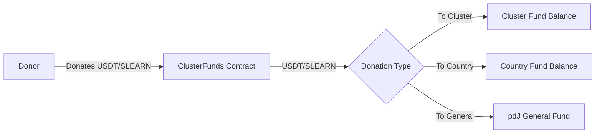
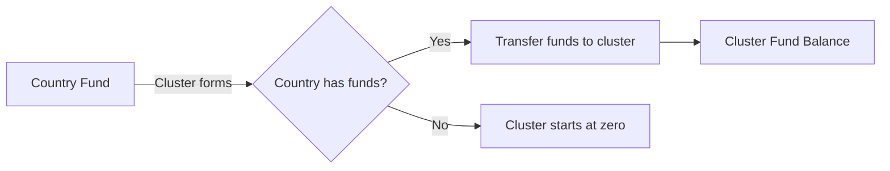
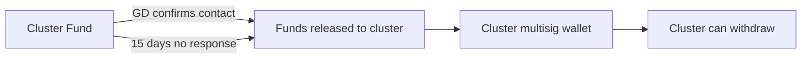

Implement a smart contract that manages funds (USDT and SLEARN) for clusters and countries, with rules for transferring country funds to clusters when they form.

## Dependencies
- R-#152 (Profiles of Church / GD Cluster)
- R-#154 (Ranking de Clústeres y Países)
- Existing SLEARN and USDT contracts
- Existing LearnTGVaultsV3 contract

---

## 1. Contract Design

### 1.1 Contract Name
`ClusterFunds.sol`

### 1.2 Purpose
- Receive and manage USDT and SLEARN donations for clusters and countries
- Transfer country funds to clusters when a cluster forms in that country
- Track fund balances per cluster and per country
- Provide transparency through events

### 1.3 Relationship with Existing Contracts

| Contract | Relationship |
|----------|--------------|
| `LearnTGVaultsV3` | Receives SLEARN from vaults for scholarships |
| `SLEARN.sol` | Can mint SLEARN for donations to clusters |
| `USDT` | Receives USDT donations for clusters |

---

## 2. Contract Functions

### 2.1 Donation Functions

| Function | Description |
|----------|-------------|
| `donateToCluster(address clusterWallet, uint256 usdtAmount, uint256 slearnAmount)` | Donate USDT/SLEARN to a specific cluster |
| `donateToCountry(string countryCode, uint256 usdtAmount, uint256 slearnAmount)` | Donate USDT/SLEARN to a specific country |
| `donateToGeneralFund(uint256 usdtAmount, uint256 slearnAmount)` | Donate to general fund (pdJ portion) |

### 2.2 Transfer Functions

| Function | Description |
|----------|-------------|
| `transferCountryFundsToCluster(string countryCode, address clusterWallet)` | Transfer country funds to a cluster when it forms |
| `releaseClusterFunds(address clusterWallet, uint256 usdtAmount, uint256 slearnAmount)` | Release funds to cluster after GD confirmation |
| `withdrawFunds(address clusterWallet, uint256 usdtAmount, uint256 slearnAmount)` | Cluster withdraws funds after release |

### 2.3 Admin Functions

| Function | Description |
|----------|-------------|
| `setRankingContract(address rankingAddress)` | Set the ranking contract for score validation |
| `setPdJWallet(address pdjWallet)` | Set pdJ wallet for fee distribution |
| `setClusterVerification(address clusterWallet, bool verified)` | Mark cluster as verified |

### 2.4 View Functions

| Function | Description |
|----------|-------------|
| `getClusterBalance(address clusterWallet)` | Get USDT and SLEARN balance of a cluster |
| `getCountryBalance(string countryCode)` | Get USDT and SLEARN balance of a country |
| `getClusterFunds(address clusterWallet)` | Get all fund information for a cluster |
| `getCountryFunds(string countryCode)` | Get all fund information for a country |

---

## 3. Events

| Event | Description |
|-------|-------------|
| `ClusterDonation(address indexed donor, address indexed clusterWallet, uint256 usdtAmount, uint256 slearnAmount)` | Donation to cluster |
| `CountryDonation(address indexed donor, string countryCode, uint256 usdtAmount, uint256 slearnAmount)` | Donation to country |
| `CountryFundsTransferred(string countryCode, address indexed clusterWallet, uint256 usdtAmount, uint256 slearnAmount)` | Country funds transferred to cluster |
| `ClusterFundsReleased(address indexed clusterWallet, uint256 usdtAmount, uint256 slearnAmount)` | Funds released to cluster |
| `FundsWithdrawn(address indexed clusterWallet, uint256 usdtAmount, uint256 slearnAmount)` | Cluster withdraws funds |

---

## 4. Fund Flow

### 4.1 Donation Flow



### 4.2 Transfer from Country to Cluster



### 4.3 Release Flow



---

## 5. Storage

### 5.1 Structs

```solidity
struct ClusterFunds {
    uint256 usdtBalance;
    uint256 slearnBalance;
    bool exists;
    bool verified;
    uint256 lastUpdated;
}

struct CountryFunds {
    uint256 usdtBalance;
    uint256 slearnBalance;
    bool exists;
    uint256 lastUpdated;
}

struct DonationRecord {
    address donor;
    uint256 usdtAmount;
    uint256 slearnAmount;
    uint256 timestamp;
}
```

### 5.2 Mappings

```solidity
mapping(address => ClusterFunds) public clusterFunds;
mapping(string => CountryFunds) public countryFunds;
mapping(address => DonationRecord[]) public donorHistory;
```

---

## 6. Donation Distribution

### 6.1 Donation to Cluster

| Recipient | % | Description |
|-----------|-----|-------------|
| Cluster Fund | 85% (default) | Goes to cluster fund |
| pdJ Fund | 15% (default) | Goes to pdJ general fund |

**Configurable:** 0-30% for pdJ

### 6.2 Donation to Country

| Recipient | % | Description |
|-----------|-----|-------------|
| Country Fund | 85% (default) | Goes to country fund |
| pdJ Fund | 15% (default) | Goes to pdJ general fund |

---

## 7. Rules for Transferring Country Funds to Clusters

| Rule | Description |
|------|-------------|
| **When** | When a cluster is formed in a country with a country fund |
| **How much** | All USDT and SLEARN in the country fund |
| **Who** | Only pdJ can trigger the transfer (with confirmation) |
| **Why** | Country funds are meant to support clusters in that country |

---

## 8. Security

### 8.1 Roles

| Role | Permissions |
|------|-------------|
| **Admin (pdJ)** | Set ranking contract, set pdJ wallet, verify clusters, trigger country-to-cluster transfers, release funds |
| **Cluster** | Withdraw funds after release |
| **Donor** | Donate to clusters and countries |

### 8.2 Checks

| Check | Description |
|-------|-------------|
| **Amount > 0** | Donation amounts must be positive |
| **Cluster exists** | Cluster must be registered in the platform |
| **Country exists** | Country must be valid |
| **Funds available** | Sufficient funds for transfer/withdrawal |
| **Verification** | Cluster must be verified for release |

---

## 9. Interface

### 9.1 Donation Interface

```typescript
// For frontend donation
interface DonationRequest {
    amount: number;
    currency: 'USDT' | 'SLEARN' | 'BOTH';
    destination: {
        type: 'cluster' | 'country' | 'general';
        address?: string;
        countryCode?: string;
    };
    pdJPercentage: number; // 0-30
}
```

### 9.2 Balance Display

```typescript
interface BalanceResponse {
    usdt: number;
    slearn: number;
    totalUsdValue: number;
}
```

---

## 10. Integration with Ranking

| Feature | Description |
|---------|-------------|
| **Cluster rank update** | Rank updates when funds change |
| **Country rank update** | Rank updates when funds change |
| **Donation events** | Events trigger rank recalculation |

---

## 11. Acceptance Criteria

- [ ] Contract can receive USDT and SLEARN donations
- [ ] Donations to clusters go to cluster fund (85% default, 15% pdJ)
- [ ] Donations to countries go to country fund (85% default, 15% pdJ)
- [ ] Country funds transfer to clusters when a cluster forms
- [ ] Funds are released to clusters after GD confirmation (or 15 days)
- [ ] Clusters can withdraw funds after release
- [ ] All events are emitted for transparency
- [ ] Ranking updates when funds change
- [ ] pdJ can verify clusters
- [ ] All functions work with USDT and SLEARN

---

## 12. Out of Scope

- Automated transfer from country to cluster (requires admin approval)
- Integration with Aave (separate contract)

---

> *"For which of you, intending to build a tower, does not sit down first and count the cost, whether he has enough to finish it?"* (Luke 14:28)


---

**Created:** 2026-06-29
**Status:** Pendiente
