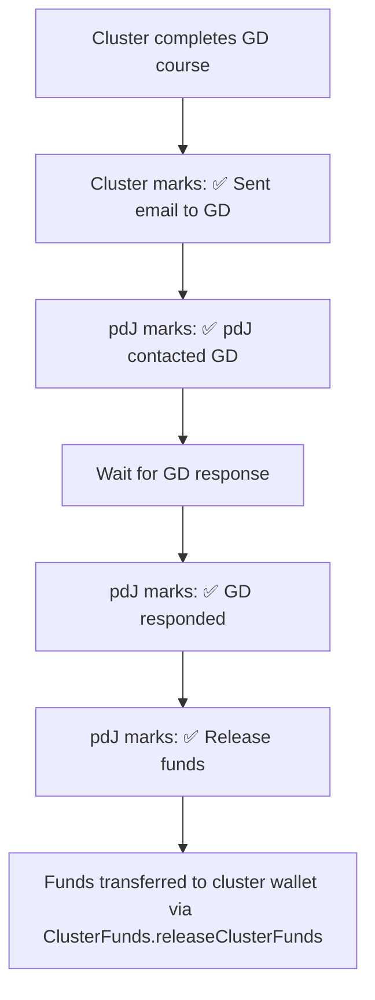

# #155: Cluster/Country Funds & Operations (Actualizado)

Unified implementation for cluster/country funds, donations, GD contact tracking, and yield strategy for idle funds.

## Dependencies
- #152 (Profiles of Church / GD Cluster — includes `cluster` table)
- #154 (Ranking de Clústeres y Países)
- #161 (GD course — prerequisite for contact)
- Existing SLEARN and USDT contracts
- SLEARN contract: `ClusterFunds` MUST be whitelisted in SLEARN (restricted transfers)
- Existing LearnTGVaultsV4 contract
- `transaction` table (existing) — records all value movements. CHECK constraint must accept:
  - `subcategoria` values `'cluster'` and `'country'` for `type='donation'`
  - `type` values `'aave_deposit'` and `'aave_withdrawal'` (Phase 2)
- `m_hdi` table — Human Development Index by country and year (used for donation metrics)

**Note on SLEARN:** `ClusterFunds` needs:
- `MINTER_ROLE` on SLEARN (required for `mintAndReserve` — donor cashback). Granted via `setClusterFundsFees.ts` migration.
- Added to `authorizedTransfers` in SLEARN (restricted transfers). Without this, SLEARN transfers to/from ClusterFunds will fail.

---

## 1. Contract Design: `ClusterFunds.sol`

### 1.1 Purpose
- Receive and manage USDT and SLEARN donations for clusters and countries
- **Country donations:** If clusters exist in the country → split equally among them. If no clusters → accumulate in country fund for future distribution
- When a new cluster forms in a country with accumulated funds → redistribute country funds equally among all clusters (including the new one)
- **Yield (Phase 2):** pdJ can deposit idle USDT in AAVE V3 while funds wait for GD contact; yield stays with the fund (70% cluster, 30% pdJ)
- Provide transparency through events

**Phase 2 note:** AAVE yield implementation (Section 4) is Phase 2 — not required for the Global Disciples pilot. The contract will be upgraded to support AAVE after the pilot.

### 1.2 Relationship with Existing Contracts

| Contract | Relationship |
|----------|--------------|
| `LearnTGVaultsV4` | Receives SLEARN from vaults for scholarships |
| `SLEARN.sol` | Can mint SLEARN for donations to clusters |
| `USDT` | Receives USDT donations for clusters |
| `AAVE V3 on Celo` | Yield generation for idle funds (Phase 2) |

### 1.3 Contract Functions

#### Donation Functions

Donations follow the calldata-stuffing pattern: users send USDT/SLEARN via `transfer()` to the backend wallet. The backend verifies on-chain and calls `processDonation()` to allocate.

| Function | Description |
|----------|-------------|
| `processDonation(bytes32 txHash, address clusterWallet, address donor, uint256 usdtAmount, uint256 slearnAmount)` | Process a verified incoming donation: distribute fees via `feeWallets`, remainder to cluster |
| `processCountryDonation(bytes32 txHash, string countryCode, address donor, uint256 usdtAmount, uint256 slearnAmount)` | Process a verified incoming donation to a country fund |

**Fee system (2026-08-10):** Reemplaza el antiguo `pdjTreasury` + `pdjPercentage` fijo. Ahora usa arrays configurables:

| Función | Descripción |
|---------|-------------|
| `setFeeConfig(address[] wallets, uint8[] percentages)` | Configura billeteras destino y porcentajes. Suma debe ser ≤ 100%. Resto va al cluster/país |
| `getFeeConfig()` | Retorna `(wallets, percentages)` actuales |

**Cashback (2026-08-10):** El contrato maneja el cashback directamente:
- USDT → `slearn.mintAndReserve(donor, 10%)` (requiere MINTER_ROLE en SLEARN)
- SLEARN → `slearn.transfer(donor, 10%)`

| Función | Descripción |
|---------|-------------|
| `setDonorCashbackPct(uint8 pct)` | Configura % de cashback (0-50). Default: 10% |
| `donorCashbackPct()` | Retorna % actual de cashback |

**Replay protection:** Each `txHash` is recorded on-chain after processing. `require(!processedTx[txHash], "Already processed")`.

#### Transfer Functions

| Function | Modifier | Description |
|----------|----------|-------------|
| `redistributeCountryFunds(string countryCode, address[] clusters)` | `onlyOwner` | Called by backend when a new cluster forms. Distributes country fund equally among all clusters in that country. Max 100 clusters per call. |
| `releaseClusterFunds(address clusterWallet)` | `onlyOwner` | Transfer ALL accumulated USDT/SLEARN from contract to cluster's wallet. Requires `clusterFunds[clusterWallet].verified == true`. |
| `releaseCountryFunds(string countryCode, address recipient)` | `onlyOwner` | Transfer ALL accumulated USDT/SLEARN from country fund to a recipient. |

**Note:** No `withdrawFunds` function. `releaseClusterFunds` transfers directly to the cluster's `multisig_address`. No two-step release+withdraw needed.

#### Admin Functions

| Function | Modifier | Description |
|----------|----------|-------------|
| `setFeeConfig(address[] wallets, uint8[] percentages)` | `onlyOwner` | Configure fee recipients and percentages. Sum ≤ 100%. Rest to cluster/country. |
| `setClusterVerification(address clusterWallet, bool verified)` | `onlyOwner` | Mark cluster as verified (required before `releaseClusterFunds`) |

#### View Functions

| Function | Description |
|----------|-------------|
| `getClusterBalance(address clusterWallet)` | Get USDT and SLEARN balance of a cluster |
| `getCountryBalance(string countryCode)` | Get USDT and SLEARN balance of a country |
| `getClusterFunds(address clusterWallet)` | Get all fund information for a cluster |
| `getCountryFunds(string countryCode)` | Get all fund information for a country |
| `getFeeConfig()` | Get current fee wallets and percentages |

### 1.4 Events

| Event | Description |
|-------|-------------|
| `ClusterDonation(address donor, address clusterWallet, uint256 usdt, uint256 slearn)` | Donation processed for a cluster |
| `CountryDonation(address donor, string countryCode, uint256 usdt, uint256 slearn)` | Donation processed for a country |
| `FeeConfigUpdated(address[] wallets, uint8[] percentages)` | Fee configuration changed |
| `FeeDistributed(address recipient, uint256 usdt, uint256 slearn)` | Fee sent to a recipient |
| `DonorCashback(address donor, uint256 usdtBacking, uint256 slearnReturned)` | Cashback sent to donor |
| `DonorCashbackPctUpdated(uint8 newPct)` | Cashback percentage changed |
| `ClusterFundsReleased(address clusterWallet, uint256 usdt, uint256 slearn)` | Funds released to cluster |
| `ClusterRemoved(address clusterWallet, string countryCode, uint256 usdt, uint256 slearn)` | Cluster dissolved, funds → country |
| `ClusterVerified(address clusterWallet, bool verified)` | Cluster verification status changed |

**Removed events (2026-08-10):** `PdjTreasuryUpdated`, `PdjPercentageUpdated`, `PdjFeeDeducted` — replaced by `FeeConfigUpdated` + `FeeDistributed`.

### 1.5 Constructor

```solidity
constructor(address _usdt, address _slearn, address _pdjTreasury, address initialOwner)
```

**Defaults (2026-08-10):** `feeWallets = [_pdjTreasury]`, `feePercentages = [10]`, `donorCashbackPct = 10`. El contrato sale listo con 10% pdJ + 10% cashback + 80% cluster.

**Post-deploy:** `hardhat/scripts/setClusterFundsFees.ts` otorga `MINTER_ROLE` a ClusterFunds en SLEARN (requerido para `mintAndReserve`).

---

## 2. Donation System

### 2.1 Entry Points: Ranking Pages

Donations are initiated from the **ranking pages** (#154), not from a standalone donation page.

```
## Ranking de Países

| Pos | País | Clústeres | Fondo USDT | Puntaje |         |
|-----|------|-----------|------------|---------|---------|
| 1   | 🇸🇱 Sierra Leona | 3 | $450 | 1,200 | [Donar] |
| 2   | 🇨🇴 Colombia      | 1 | $250 | 590   | [Donar] |

## Ranking de Clústeres

| Pos | Clúster | País | Fondo USDT | Puntaje |         |
|-----|---------|------|------------|---------|---------|
| 1   | Clúster Esperanza | 🇸🇱 SL | $320 | 1,245 | [Donar] |
| 2   | Clúster Luz       | 🇨🇴 CO | $250 | 890   | [Donar] |
```

- **[Donar]** en fila de país → destino pre-llenado: país (sin clúster específico). Fondos se reparten entre todos los clústeres de ese país.
- **[Donar]** en fila de clúster → destino pre-llenado: clúster específico.

### 2.2 Donation Modal

```
┌──────────────────────────────────────────┐
│  Donar a [Destino]                  ✕   │
│                                          │
│  Tu saldo: 50.00 USDT | 120 SLEARN      │
│                                          │
│  USDT:  [____]              [Max] [✕]   │
│  SLEARN:[____]              [Max] [✕]   │
│                                          │
│                                          │
│  Resumen:                                │
│  → Cluster/País: 80%                     │
│  → pdJ: 10%                              │
│  → Tu cashback: 10% SLEARN               │
│                                          │
│              [Cancelar]  [Donar]         │
└──────────────────────────────────────────┘
```

### 2.3 Donation Distribution

| Recipient | % | Description |
|-----------|-----|-------------|
| Cluster / Country Fund | 80% | Después de fees (10%) y cashback (10%). Vía `ClusterFunds` |
| pdJ Treasury | 10% | Vía `feeWallets[0]`. Configurable con `setFeeConfig` |
| Donor cashback | 10% | USDT→`mintAndReserve`, SLEARN→`transfer`. Vía `donorCashbackPct` |

---

## 3. Contact with Global Disciples

### 3.1 Checkbox-Based Tracking

Contact with GD happens outside the platform. The platform tracks progress via **checkboxes** that cluster members and pdJ mark manually.


```mermaid
flowchart TB
    A[Cluster completes GD course] --> B[Cluster marks: ✅ Sent email to GD]
    B --> C[pdJ marks: ✅ pdJ contacted GD]
    C --> D[Wait for GD response]
    D --> E[pdJ marks: ✅ GD responded]
    E --> F[pdJ marks: ✅ Release funds]
    F --> G[Funds transferred to cluster wallet via ClusterFunds.releaseClusterFunds]
```

### 3.2 Checkbox Permissions

| Checkbox | Who can mark | Description |
|----------|-------------|-------------|
| ✅ Cluster sent email to GD | Cluster (any pastor) | Cluster confirms they contacted GD |
| ✅ pdJ contacted GD | pdJ (admin) | pdJ confirms parallel contact |
| ✅ GD responded | pdJ (admin) | GD confirmed contact with cluster |
| ✅ Release funds | pdJ (admin) | Triggers `releaseClusterFunds()` on-chain |

### 3.3 Status Display (derived, not stored)

Status is derived from checkboxes — no `status` column:

| Checkboxes marked | Display in Ranking |
|-------------------|-------------------|
| None | "⏳ Pendiente" |
| Cluster sent only | "✅ Clúster envió" |
| Cluster + pdJ sent | "✅ Ambos enviaron" |
| + GD responded | "✅ Contacto confirmado" |
| + Released | "💰 Fondos liberados" |

### 3.4 Contact Tracking Storage

```sql
CREATE TABLE gdcontact (
    id SERIAL PRIMARY KEY,
    cluster_id INTEGER REFERENCES cluster(id) UNIQUE,
    cluster_sent_at TIMESTAMP,        -- cluster marked: "we sent email"
    pdj_sent_at TIMESTAMP,            -- pdJ marked: "pdJ contacted GD"
    gd_responded_at TIMESTAMP,        -- pdJ marked: "GD responded"
    released_at TIMESTAMP,            -- pdJ marked: "release funds" → triggers releaseClusterFunds()
    release_reason VARCHAR(50),       -- 'gd_confirmed' (Phase 1) or 'timeout' (Phase 2)
    course_completed_at TIMESTAMP,    -- When cluster completed GD course
    created_at TIMESTAMP DEFAULT CURRENT_TIMESTAMP,
    updated_at TIMESTAMP DEFAULT CURRENT_TIMESTAMP
);

CREATE INDEX idx_gdcontact_cluster_id ON gdcontact(cluster_id);
```

### 3.5 Fund Release

When pdJ marks the ✅ Release funds checkbox:

1. Backend calls `ClusterFunds.releaseClusterFunds(clusterWallet, usdtAmount, slearnAmount)`
2. If funds were in AAVE (Phase 2), contract withdraws first, distributes 30% yield to pdJ Treasury and 70% to cluster
3. Contract transfers USDT/SLEARN to the cluster's `multisig_address`
4. `gdcontact.released_at` is set to NOW
5. Event logged in `userevent` (`funds_released`)

### 3.6 Who Calls `redistributeCountryFunds`?

`redistributeCountryFunds` is called by the **learn.tg backend** (signing with `PRIVATE_KEY`) **after** a new cluster is successfully created in the database (via #152). The backend detects that the cluster belongs to a country that has accumulated funds and calls the function.

---

## 4. Yield Strategy for Idle Funds (Phase 2 — Post-Pilot)

This section is **Phase 2** and will be implemented **after** the Global Disciples pilot, not before. The contract will be upgraded to support AAVE in Phase 2.

### 4.1 Overview

Funds in `ClusterFunds` sit idle while waiting for GD contact + release (weeks to months). Since pdJ custodies these funds, pdJ can put them to work safely.

**Yield Distribution:**

| Recipient | % | Purpose |
|-----------|-----|---------|
| Cluster/Country Fund | 70% | Added to the same fund, visible in ranking |
| pdJ Treasury | 30% | Covers operational costs (servers, APIs, development) |

**Design principle:** Most yield stays with the cluster that generated it. pdJ takes a smaller share to cover real operational costs — transparent and visible in the dashboard.

### 4.2 Implementation

| Aspect | Decision |
|--------|----------|
| **Protocol** | AAVE V3 on Celo (USDT only) |
| **Who deposits** | pdJ admin (backend signed with `PRIVATE_KEY`) |
| **Who holds aUSDT** | `ClusterFunds` contract (not a separate wallet) |
| **When to deposit** | After donation, before release (admin-triggered or automatic) |
| **When to withdraw** | Automatically when `releaseClusterFunds()` is called |
| **Yield tracking** | On-chain balance difference tracked per cluster/country |

### 4.3 Transaction Table for AAVE

All AAVE operations are recorded in the existing `transaction` table:

```sql
-- AAVE deposit
INSERT INTO transaction (
    usuario_id, wallet, crypto, type, amount, balance_impact, date, hash,
    categoria, subcategoria, metadata
) VALUES (
    :usuario_id, :wallet, 'USDT', 'aave_deposit', :amount, -:amount, NOW(), :hash,
    'aave', 'deposit', '{"cluster_id": 1}'
);

-- AAVE withdrawal
INSERT INTO transaction (...) VALUES (
    :usuario_id, :wallet, 'USDT', 'aave_withdrawal', :amount, :amount, NOW(), :hash,
    'aave', 'withdrawal', '{"cluster_id": 1, "yield": 0.15}'
);
```

**Note:** Requires adding `'aave_deposit'` and `'aave_withdrawal'` to the `transaction` type CHECK constraint.

### 4.4 Events

| Event | Description |
|-------|-------------|
| `YieldGenerated(address indexed clusterWallet, uint256 yieldUsdt)` | Yield earned from idle funds |
| `YieldDistributed(address indexed clusterWallet, uint256 clusterShare, uint256 pdjShare)` | Yield split between cluster and pdJ |
| `ClusterDonation(address indexed donor, address indexed clusterWallet, uint256 usdtAmount, uint256 slearnAmount)` | Donation to cluster |
| `CountryDonation(address indexed donor, string countryCode, uint256 usdtAmount, uint256 slearnAmount)` | Donation to country |
| `CountryFundsRedistributed(string countryCode, uint256 usdtAmount, uint256 slearnAmount, uint8 clusterCount)` | Country funds distributed equally |
| `ClusterFundsReleased(address indexed clusterWallet, uint256 usdtAmount, uint256 slearnAmount)` | Funds released to cluster |

---

## 5. Fund Flow Summary

### 5.1 Complete Fund Flow

```mermaid
flowchart TB
    subgraph Donaciones["1. Donaciones"]
        D[Usuario dona desde ranking] --> E[Contrato recibe USDT/SLEARN]
        E --> F[Backend verifica tx on-chain]
        F --> G[Fondos asignados a clúster/pais]
    end

    subgraph Fondo["2. Fondo + Yield (Phase 2)"]
        G --> H[ClusterFunds contrato]
        H --> I[Fondos acumulados]
        I --> J[pdJ deposita en AAVE - Phase 2]
        J --> K[Yield generado: 70% cluster, 30% pdJ]
        K --> I
    end

    subgraph Contacto["3. Contacto GD"]
        L[Clúster completa curso] --> M[Clúster marca: "envió a GD"]
        M --> N[pdJ marca: "contactó GD"]
        N --> O[GD responde → pdJ marca]
        O --> P[pdJ libera fondos]
    end

    subgraph Liberacion["4. Liberación"]
        P --> Q[releaseClusterFunds]
        Q --> R[Fondos transferidos al cluster]
        R --> S[Fin del flujo]
    end

    I --> L
    P --> Q
```

---

## 6. Storage

### 6.1 Contract Structs

```solidity
struct ClusterFunds {
    uint256 usdtBalance;
    uint256 slearnBalance;
    bool exists;
    bool verified;
    uint256 lastUpdated;
    uint256 aUsdtBalance;        // aUSDT held in AAVE (Phase 2)
    uint256 yieldGenerated;      // Accumulated yield for this cluster (Phase 2)
}

struct CountryFunds {
    uint256 usdtBalance;
    uint256 slearnBalance;
    bool exists;
    uint256 lastUpdated;
    uint256 aUsdtBalance;        // aUSDT held in AAVE (Phase 2)
    uint256 yieldGenerated;      // Accumulated yield for this country (Phase 2)
}
```

### 6.2 Database Tables

```sql
-- GD contact tracking only
CREATE TABLE gdcontact (
    id SERIAL PRIMARY KEY,
    cluster_id INTEGER REFERENCES cluster(id) UNIQUE,
    cluster_sent_at TIMESTAMP,
    pdj_sent_at TIMESTAMP,
    gd_responded_at TIMESTAMP,
    released_at TIMESTAMP,
    release_reason VARCHAR(50),
    course_completed_at TIMESTAMP,
    created_at TIMESTAMP DEFAULT CURRENT_TIMESTAMP,
    updated_at TIMESTAMP DEFAULT CURRENT_TIMESTAMP
);

CREATE INDEX idx_gdcontact_cluster_id ON gdcontact(cluster_id);
```

**Note:** No `donationreceipt` table. All donation records are stored in the existing `transaction` table (single source of truth per ARCHITECTURE.md).

### 6.3 Transaction Table

Every completed donation and AAVE operation is recorded in the existing `transaction` table. One entry per crypto per donation.

```sql
-- Donation
INSERT INTO transaction (
    usuario_id, wallet, crypto, type, amount, balance_impact, date, hash,
    categoria, subcategoria, metadata
) VALUES (
    :usuario_id, :wallet, 'USDT', 'donation', :amount, -:amount, NOW(), :hash,
    'donation', 'cluster',  -- or 'country'
    '{"cluster_id": 1, "pdj_percentage": 15}'
);

-- AAVE deposit (Phase 2)
INSERT INTO transaction (
    usuario_id, wallet, crypto, type, amount, balance_impact, date, hash,
    categoria, subcategoria, metadata
) VALUES (
    :usuario_id, :wallet, 'USDT', 'aave_deposit', :amount, -:amount, NOW(), :hash,
    'aave', 'deposit', '{"cluster_id": 1}'
);
```

---

## 7. API Endpoints

| Endpoint | Method | Auth | Description | Status |
|----------|--------|------|-------------|--------|
| `/api/gdcluster/donations/verify` | POST | Yes | Verify on-chain + call ClusterFunds.processDonation | [x] |
| `/api/gd/donations/history` | GET | Yes | User donation history | [ ] |
| `/api/gd/contact/mark-sent` | POST | User | Cluster marks "we sent email to GD" | [ ] |
| `/api/gd/contact/mark-pdj-sent` | POST | Admin | pdJ marks "pdJ contacted GD" | [ ] |
| `/api/gd/contact/mark-responded` | POST | Admin | pdJ marks "GD responded" | [ ] |
| `/api/gd/contact/release` | POST | Admin | pdJ marks release → `releaseClusterFunds()` | [ ] |
| `/api/gd/contact/:clusterId` | GET | Public | Get contact status for a cluster | [ ] |

---

## 8. Implementation Phases

### Phase 1 — Contract + DB + Basic Donations

**Goal:** `ClusterFunds.sol` deployed and receiving donations.

| # | Task | Depends on | Status |
|---|---|---|---|
| 1.1 | Write & test `ClusterFunds.sol` | — | ✅ v2 con feeWallets + donorCashbackPct. 18 tests pasan. |
| 1.2 | Deploy `ClusterFunds` a celoSepolia + verify | 1.1 | ✅ `0xa9afE480a22aE215D42ca326a47b324f991cb1e8` — verificado |
| 1.3 | Grant MINTER_ROLE on SLEARN to ClusterFunds | 1.2 | ✅ via `scripts/setClusterFundsFees.ts` |
| 1.4 | Migration: `gdcontact` table | — | ✅ `20260805021849` |
| 1.5 | `/api/gdcluster/donations/verify` | 1.2 | ✅ Transfiere tokens al contrato + processDonation |
| 1.6 | Adapt `DonateModal` for clusters/countries | 1.2 | ✅ REQ #202 — PaymentModal integrado |
| 1.7 | Wire `[Donar]` button on cluster/country rows | #154 | ✅ RankingClient.tsx |
| 1.8 | `redistributeCountryFunds()` | 1.1 | ✅ En contrato. Falta backend que lo llame al crear cluster. |

**Delivers:** Donors can send USDT/SLEARN to clusters and countries. Funds accumulate on-chain.

---

### Phase 2 — GD Contact Tracking

**Goal:** Cluster pastors and pdJ admins track GD contact via checkboxes.

| # | Task | Depends on | Status |
|---|---|---|---|
| 2.1 | `/api/gd/contact/mark-sent` | 1.4, #152 | [ ] Pendiente |
| 2.2 | `/api/gd/contact/mark-pdj-sent` | 1.4 | [ ] Pendiente |
| 2.3 | `/api/gd/contact/mark-responded` | 1.4 | [ ] Pendiente |
| 2.4 | `/api/gd/contact/:clusterId` | 1.4 | [ ] Pendiente |
| 2.5 | GD contact status UI on cluster page | 2.1–2.4 | [ ] Pendiente |
| 2.6 | Ranking shows contact status per cluster | #154 | [ ] Pendiente |

**Delivers:** Contact pipeline visible. No funds move yet.

---

### Phase 3 — Fund Release

**Goal:** pdJ admin releases funds → on-chain transfer to cluster wallet.

| # | Task | Depends on | Status |
|---|---|---|---|
| 3.1 | `setClusterVerification()` — admin marks cluster as verified | 1.1 | [ ] Pendiente (función en contrato, sin UI/API) |
| 3.2 | `releaseClusterFunds()` — transfer USDT/SLEARN to cluster wallet | 1.1, 3.1 | [ ] Pendiente (función en contrato, sin endpoint) |
| 3.3 | `releaseCountryFunds()` — transfer from country fund to recipient | 1.1 | [ ] Pendiente |
| 3.4 | `/api/gd/contact/release` — triggers `releaseClusterFunds()` on-chain | 1.4, 3.2 | [ ] Pendiente |
| 3.5 | Release funds UI (admin checkbox → on-chain tx → confirmation) | 3.4 | [ ] Pendiente |
| 3.6 | `course_completed_at` auto-set when cluster finishes GD course | #161 | [ ] Pendiente |

**Delivers:** Full pipeline: donate → contact → release. Funds reach clusters.

---

### Phase 4 — Ranking Integration

**Goal:** Cluster/country funds visible in rankings, HDI metrics.

| # | Task | Depends on | Status |
|---|---|---|---|
| 4.1 | Ranking page shows cluster/country USDT balances from `ClusterFunds` | #154, 1.2 | [ ] Pendiente |
| 4.2 | `[Donar]` on country rows → `processCountryDonation()` | 1.8 | [x] Implementado |
| 4.3 | HDI data integration (`m_hdi` table) for donation impact metrics | #154 | [ ] Pendiente |

**Delivers:** Complete donation + ranking experience.

---

### Phase 5 — Yield (AAVE V3)

**Goal:** Idle USDT earns yield via AAVE. Post-pilot.

| # | Task | Depends on | Status |
|---|---|---|---|
| 5.1 | Add `aUSDT` tracking to `ClusterFunds` | 1.1 | [ ] Phase 2 — post-pilot |
| 5.2 | Add `aave_deposit`/`aave_withdrawal` to `transaction` CHECK | — | [ ] Phase 2 |
| 5.3 | Auto-withdrawal on `releaseClusterFunds()` | 3.2, 5.1 | [ ] Phase 2 |
| 5.4 | Yield display in ranking and cluster page | #154 | [ ] Phase 2 |

**Delivers:** Yield generation for idle funds.

---

## 9. What's Already Done

| Component | Status |
|---|---|
| `cluster` + `church_clustergd` tables | ✅ Migration `20260704103305` |
| `/api/cluster` CRUD (create, join, leave, detail) | ✅ |
| `/api/church` (register, search) | ✅ |
| `transaction` table (with donation + scholarship types) | ✅ |
| `userevent` table | ✅ |
| `m_hdi` table | ✅ Migration `20260804121336_hdi` |
| #194 (zionist detection) — core | ✅ |
| #161 (GD course) — DB records + guides | ✅ Migration `20260804134734` / `20260805020910` |
| `ClusterFunds.sol` contract | ✅ v2 con feeWallets + donorCashbackPct. Verificado celoSepolia. |
| `MockUSDT.sol` (ERC20 + Ownable 5.x) | ✅ |
| `SLEARN.sol` | ✅ MINTER_ROLE otorgado a ClusterFunds |
| `gdcontact` table | ✅ Migration `20260805021849` |
| `/api/gdcluster/donations/verify` | ✅ Transfiere tokens al contrato + processDonation |
| DonateModal cluster/country | ✅ REQ #202 integrado |

---

## 10. Acceptance Criteria

### Contract
- [x] Contract can receive USDT via ERC-20 `transfer()` and SLEARN via ERC-20 `transfer()` (whitelisted in SLEARN)
- [x] `processDonation()` distributes: feeWallets + donorCashback + remainder to cluster
- [x] `processCountryDonation()` distributes: feeWallets + donorCashback + remainder to country
- [ ] Country donations: split equally among existing clusters in that country
- [ ] Country donations: accumulate in country fund when no clusters exist
- [ ] `redistributeCountryFunds()` called by backend when a new cluster forms
- [ ] `releaseClusterFunds()` transfers USDT/SLEARN directly to cluster wallet
- [ ] `releaseCountryFunds()` transfers USDT/SLEARN from country fund
- [ ] On cluster dissolution, all cluster funds → country fund
- [x] ClusterFunds deployed + verified on celoSepolia
- [x] Replay protection: each `txHash` processed only once
- [x] Fee config: `feeWallets=[pdjTreasury]` at 10%, `donorCashbackPct=10` → 80/10/10
- [x] MINTER_ROLE granted to ClusterFunds on SLEARN for mintAndReserve

### Donations
- [x] Users can donate USDT and SLEARN to clusters via single `transfer()` transaction (no approve)
- [x] `[Donar]` button on every country and cluster row in ranking
- [x] Every donation recorded in `transaction` table with `categoria='donation'`, `subcategoria='cluster'` or `'country'`

### Contact & Release
- [ ] Cluster can mark "we sent email to GD" checkbox (authenticated, cluster pastor only)
- [ ] pdJ can mark "pdJ contacted GD", "GD responded", and "release funds" checkboxes (admin)
- [ ] Contact status derived from checkboxes (no stored `status` column)
- [ ] Ranking shows contact status per cluster
- [ ] All checkbox actions logged in `userevent`
- [ ] Fund release creates `transaction` entry
- [ ] `releaseClusterFunds()` verifies cluster is verified before transfer

### Yield (Phase 2 — Post-Pilot)
- [ ] Idle USDT in ClusterFunds can be deposited into AAVE V3
- [ ] Yield is tracked per cluster/country fund
- [ ] 70% of yield stays with the cluster fund, 30% goes to pdJ Treasury
- [ ] Yield is visible in ranking and cluster page
- [ ] Auto-withdrawal on release sends principal + 70% yield to cluster

### General
- [x] No `donationreceipt` table — all records in `transaction`
- [ ] All events logged via `metrics-server.ts`
- [ ] Ranking cache updated via DB triggers (consistent with ARCHITECTURE.md)
- [ ] Index on `gdcontact.cluster_id` for performance

---

## 9. Out of Scope

- Automated donation matching
- Recurring donations
- Donation rewards/achievements
- Automated email sending (Phase 2)
- Automatic 15-day timeout release (Phase 2)
- AAVE for SLEARN (only USDT)
- AAVE deposits/withdrawals (Phase 2)

---

> *"For which of you, intending to build a tower, does not sit down first and count the cost, whether he has enough to finish it?"* (Luke 14:28)

---

**Created:** 2026-06-29
**Updated:** 2026-08-10 — Contract redesplegado con feeWallets + donorCashbackPct. Verificado en Blockscout. MINTER_ROLE otorgado. DonateModal integrado (REQ #202). Donation verify endpoint funcional.
**Status:** Phase 1: ✅ completado. Phases 2-5: pendientes. Contract deployed + verified. Donations funcionales.