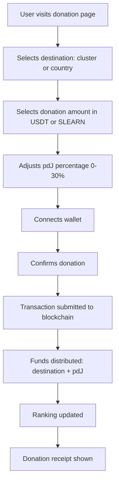

Implement a donation system that allows users to donate USDT and SLEARN to clusters and countries through the learn.tg platform, with configurable percentage to pdJ.

## Dependencies
- R-#155 (Contract for Cluster/Country Funds)
- R-#154 (Ranking de Clústeres y Países)
- Existing SLEARN and USDT contracts
- Existing wallet system (SIWE, OneKey/OKX)

---

## 1. Donation Flow

### 1.1 User Journey



### 1.2 Donation Types

| Type | Description | Interface |
|------|-------------|-----------|
| **USDT** | Donate USDT to cluster or country | Amount input with USDT balance display |
| **SLEARN** | Donate SLEARN to cluster or country | Amount input with SLEARN balance display |
| **Mixed** | Donate both USDT and SLEARN | Two amount inputs |

---

## 2. Donation Interface

### 2.1 Donation Page

```
## Donar a un Clúster o País

**Selecciona el destino:**
| Clúster | País |
|---------|------|
| [Seleccionar] | [Seleccionar] |

**Clúster seleccionado:** Clúster Esperanza (Sierra Leona)

**Monto a donar:**
| USDT | SLEARN |
|------|--------|
| [____] | [____] |

**Porcentaje para pdJ:** [15%] (0% - 30%)

**Resumen de la donación:**
- Destino: Clúster Esperanza
- USDT: 10.00 → 8.50 (85%)
- SLEARN: 0
- pdJ: 1.50 USDT (15%)

[Conectar Wallet] [Donar]
```

### 2.2 Donation Confirmation

```
## Donación Confirmada

✅ **¡Donación exitosa!**

- **Destino:** Clúster Esperanza (Sierra Leona)
- **USDT:** 8.50 (85% de 10.00 USDT)
- **pdJ:** 1.50 USDT (15%)
- **Transacción:** 0x1234...5678

**El ranking se ha actualizado.**

[Ver Ranking] [Donar de Nuevo]
```

---

## 3. Donation Options

### 3.1 Destination Selection

| Destination | Description | UI Element |
|-------------|-------------|------------|
| **Cluster** | Donate to a specific cluster | Dropdown with cluster list |
| **Country** | Donate to a country fund | Dropdown with country list |
| **General Fund** | Donate to pdJ general fund | Button (optional) |

### 3.2 Cluster Selection

| Option | Description |
|--------|-------------|
| **Top clusters** | Show top 10 clusters by score |
| **Search** | Search for a cluster by name |
| **Anonymous** | Donate to anonymous clusters (if any) |

### 3.3 Country Selection

| Option | Description |
|--------|-------------|
| **Top countries** | Show top 10 countries by score |
| **Search** | Search for a country by name |

---

## 4. Donation Distribution

### 4.1 Donation to Cluster

| Recipient | % | Description |
|-----------|-----|-------------|
| Cluster Fund | Variable (70-100%) | Goes to cluster fund |
| pdJ Fund | Variable (0-30%) | Goes to pdJ general fund |

**Default:** 85% cluster, 15% pdJ

### 4.2 Donation to Country

| Recipient | % | Description |
|-----------|-----|-------------|
| Country Fund | Variable (70-100%) | Goes to country fund |
| pdJ Fund | Variable (0-30%) | Goes to pdJ general fund |

**Default:** 85% country, 15% pdJ

---

## 5. Donation Validation

### 5.1 Validation Checks

| Check | Description |
|-------|-------------|
| **Amount > 0** | Donation amount must be positive |
| **Destination exists** | Cluster or country must exist |
| **Balance sufficient** | User must have enough USDT or SLEARN |
| **pdJ percentage valid** | 0-30% |
| **Wallet connected** | User must have connected wallet |

### 5.2 Error Messages

| Error | Message |
|-------|---------|
| Invalid amount | "Please enter a valid donation amount." |
| No destination | "Please select a cluster or country." |
| Insufficient balance | "You don't have enough USDT/SLEARN." |
| Invalid percentage | "Please select a valid percentage for pdJ." |

---

## 6. Donation Receipt

### 6.1 Receipt Content

| Field | Description |
|-------|-------------|
| **Transaction hash** | Blockchain transaction hash |
| **Destination** | Cluster name or country code |
| **USDT amount** | Amount donated in USDT |
| **SLEARN amount** | Amount donated in SLEARN |
| **pdJ percentage** | Percentage donated to pdJ |
| **Timestamp** | Date and time of donation |
| **Status** | Confirmed |

### 6.2 Receipt Storage

```sql
CREATE TABLE donation_receipts (
    id SERIAL PRIMARY KEY,
    donor_wallet VARCHAR(42) NOT NULL,
    destination_type VARCHAR(10) NOT NULL, -- 'cluster' or 'country'
    destination_id INTEGER, -- cluster_id or country_code
    usdt_amount DECIMAL(20,6) DEFAULT 0,
    slearn_amount INTEGER DEFAULT 0,
    pdj_percentage INTEGER DEFAULT 15,
    pdj_usdt DECIMAL(20,6) DEFAULT 0,
    pdj_slearn INTEGER DEFAULT 0,
    transaction_hash VARCHAR(66) NOT NULL,
    status VARCHAR(20) DEFAULT 'pending',
    created_at TIMESTAMP DEFAULT CURRENT_TIMESTAMP
);
```

---

## 7. Integration with Ranking

### 7.1 Ranking Update

| Action | Ranking Update |
|--------|----------------|
| Donation to cluster | Cluster ranking recalculated |
| Donation to country | Country ranking recalculated |

### 7.2 Donation History

```sql
-- Donation history on cluster page
SELECT * FROM donation_receipts 
WHERE destination_type = 'cluster' 
AND destination_id = :cluster_id 
ORDER BY created_at DESC;
```

---

## 8. API Endpoints

| Endpoint | Method | Description |
|----------|--------|-------------|
| `/api/donations/clusters` | GET | List of clusters for donation |
| `/api/donations/countries` | GET | List of countries for donation |
| `/api/donations/submit` | POST | Submit donation to blockchain |
| `/api/donations/history` | GET | User's donation history |
| `/api/donations/receipt/:hash` | GET | Get donation receipt |

---

## 9. User Experience

### 9.1 Donation Button

| Page | Button | Location |
|------|--------|----------|
| Cluster detail | "Donar a este clúster" | Below cluster info |
| Country detail | "Donar a este país" | Below country info |
| Ranking | "Donar" | Next to each cluster/country |

### 9.2 Donation History

```
## Mi Historial de Donaciones

| Fecha | Destino | USDT | SLEARN | pdJ % | Estado |
|-------|---------|------|--------|-------|--------|
| 2026-06-28 | Clúster Esperanza | 10.00 | 0 | 15% | ✅ Confirmado |
| 2026-06-27 | 🇸🇱 Sierra Leona | 0 | 100 | 15% | ✅ Confirmado |
| 2026-06-25 | Clúster Luz | 5.00 | 50 | 20% | ✅ Confirmado |
```

---

## 10. Security

### 10.1 Transaction Security

| Measure | Description |
|---------|-------------|
| **Wallet signature** | User must sign each donation transaction |
| **Amount validation** | Server validates amounts before transaction |
| **Destination validation** | Server validates destination exists |
| **Rate limiting** | Prevent spam donations |

### 10.2 Data Privacy

| Measure | Description |
|---------|-------------|
| **Wallet public** | Donor wallet is public on blockchain |
| **Identity private** | User's identity is not linked to donation unless user chooses |

---

## 11. Acceptance Criteria

- [ ] Users can donate USDT and SLEARN to clusters
- [ ] Users can donate USDT and SLEARN to countries
- [ ] Users can adjust pdJ percentage (0-30%)
- [ ] Donation distribution works correctly (destination + pdJ)
- [ ] Donation receipts are stored and displayed
- [ ] Ranking updates after donation
- [ ] Donation history is visible to users
- [ ] Donation buttons appear on cluster and country pages
- [ ] All transactions are validated
- [ ] All events are logged

---

## 12. Out of Scope

- Automated donation matching (can be added later)
- Recurring donations (can be added later)
- Donation rewards/achievements (can be added later)

---

> *"It is more blessed to give than to receive."* (Acts 20:35)


---

**Created:** 2026-06-29
**Status:** Pendiente
