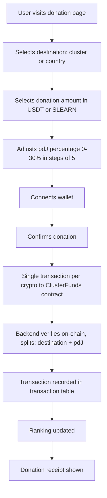

Implement a donation system that allows users to donate USDT and SLEARN to clusters and countries through the learn.tg platform, with configurable percentage to pdJ (Pasos de Jesús).

## Dependencies
- R-#155 (Contract for Cluster/Country Funds) — contract MUST accept `pdJPercentage` in donation functions
- R-#154 (Ranking de Clústeres y Países)
- Existing SLEARN and USDT contracts
- Existing wallet system (SIWE, OneKey/OKX)
- SLEARN contract: `ClusterFunds` MUST be added to the SLEARN whitelist (SLEARN has restricted transfers; even `approve`+`transferFrom` won't work without whitelist)
- Database: `transaction` table type CHECK constraint must accept `subcategoria` values `'cluster'` and `'country'` for `type='donation'` (migration required if constraint restricts subcategoria)

---

## 1. Donation Flow

### 1.1 User Journey



**Gas:** Each user pays their own gas (learn.tg provides CELO via learn.tg-UBI).

### 1.2 Donation Types

| Type | Description | Interface |
|------|-------------|-----------|
| **USDT** | Donate USDT to cluster or country | Amount input with USDT balance display |
| **SLEARN** | Donate SLEARN to cluster or country | Amount input with SLEARN balance display |
| **Mixed** | Donate both USDT and SLEARN | Two amount inputs, two separate transactions |

---

## 2. Donation Interface

### 2.1 Donation Page

```
## Donar a un Clúster o País

**Selecciona el destino:**
| Clúster | País |
|---------|------|
| [Seleccionar] | [Seleccionar] |

**Clúster seleccionado:** Clúster Esperanza (Sierra Leona)

**Monto a donar:**
| USDT | SLEARN |
|------|--------|
| [____] | [____] |

**Porcentaje para pdJ:** [15%] (0%, 5%, 10%, 15%, 20%, 25%, 30%) — pasos discretos de 5%

**Resumen de la donación:**
- Destino: Clúster Esperanza
- USDT: 10.00 → 8.50 (85%)
- SLEARN: 0
- pdJ: 1.50 USDT (15%)

[Conectar Wallet] [Donar]
```

### 2.2 Donation Confirmation

```
## Donación Confirmada

✅ **¡Donación exitosa!**

- **Destino:** Clúster Esperanza (Sierra Leona)
- **USDT:** 8.50 (85% de 10.00 USDT)
- **pdJ:** 1.50 USDT (15%)
- **Transacción:** 0x1234...5678

**El ranking se ha actualizado.**

[Ver Ranking] [Donar de Nuevo]
```

---

## 3. Donation Options

### 3.1 Destination Selection

| Destination | Description | UI Element |
|-------------|-------------|------------|
| **Cluster** | Donate to a specific cluster | Dropdown with cluster list |
| **Country** | Donate to a country fund | Dropdown with country list |

### 3.1.1 Cluster Wallet Address

Each cluster has a `multisig_address` (R-#154). This address identifies the cluster in the `ClusterFunds` contract:
- Ideally a multisig wallet, but can be a regular EOA wallet
- If a cluster doesn't have a `multisig_address` yet, it cannot receive donations
- The frontend obtains it from `GET /api/donations/clusters`

### 3.2 Cluster Selection

| Option | Description |
|--------|-------------|
| **Top clusters** | Show top 10 clusters by score |
| **Search** | Search for a cluster by name |
| **Anonymous** | Donate to anonymous clusters (if any) |

### 3.3 Country Selection

| Option | Description |
|--------|-------------|
| **Top countries** | Show top 10 countries by score |
| **Search** | Search for a country by name |

---

## 4. Donation Distribution

### 4.1 Donation to Cluster

| Recipient | % | Description |
|-----------|-----|-------------|
| Cluster Fund | Variable (70-100%) | Goes to cluster fund in `ClusterFunds` contract |
| pdJ Fund | Variable (0-30%) | Goes to pdJ general fund |

**Default:** 85% cluster, 15% pdJ. Percentages are integers in steps of 5 (0, 5, 10, 15, 20, 25, 30).

### 4.2 Donation to Country

| Recipient | % | Description |
|-----------|-----|-------------|
| Country Fund | Variable (70-100%) | Goes to country fund in `ClusterFunds` contract |
| pdJ Fund | Variable (0-30%) | Goes to pdJ general fund |

**Default:** 85% country, 15% pdJ. Percentages are integers in steps of 5 (0, 5, 10, 15, 20, 25, 30).

---

## 5. Donation Validation

### 5.1 Validation Checks

| Check | Description |
|-------|-------------|
| **Amount > 0** | Donation amount must be positive |
| **Destination exists** | Cluster must have `multisig_address`; country must be valid ISO code |
| **Balance sufficient (USDT)** | User must have enough USDT |
| **Balance sufficient (SLEARN)** | User must have enough SLEARN |
| **Balance sufficient (CELO)** | User must have enough CELO for gas |
| **pdJ percentage valid** | Integer 0-30, in steps of 5 |
| **Wallet connected** | User must have connected wallet |
| **ClusterFunds whitelisted** | `ClusterFunds` contract must be in SLEARN whitelist (validated server-side) |

### 5.2 Error Messages

| Error | Message |
|-------|---------|
| Invalid amount | "Please enter a valid donation amount." |
| No destination | "Please select a cluster or country." |
| Insufficient USDT | "You don't have enough USDT (balance: X, needed: Y)." |
| Insufficient SLEARN | "You don't have enough SLEARN (balance: X, needed: Y)." |
| Insufficient CELO | "You don't have enough CELO for gas (balance: X, estimated: Y)." |
| Invalid percentage | "Please select a valid percentage for pdJ (0, 5, 10, 15, 20, 25, or 30)." |
| No cluster wallet | "This cluster doesn't have a wallet address yet." |

---

## 6. Donation Receipt

### 6.1 Receipt Content

| Field | Description |
|-------|-------------|
| **Transaction hash** | Blockchain transaction hash |
| **Destination** | Cluster name or country code |
| **USDT amount** | Amount donated in USDT (net, to destination) |
| **SLEARN amount** | Amount donated in SLEARN (net, to destination) |
| **pdJ percentage** | Percentage donated to pdJ |
| **pdJ USDT** | USDT amount that went to pdJ |
| **pdJ SLEARN** | SLEARN amount that went to pdJ |
| **Timestamp** | Date and time of donation |
| **Status** | Confirmed |

### 6.2 Receipt Storage

Table `donationreceipt` (singular, no underscore — project convention):

```sql
CREATE TABLE donationreceipt (
    id SERIAL PRIMARY KEY,
    donor_wallet VARCHAR(42) NOT NULL,
    destination_type VARCHAR(10) NOT NULL,  -- 'cluster' or 'country'
    cluster_id INTEGER,                      -- NULL if destination_type = 'country'
    country_code VARCHAR(2),                 -- NULL if destination_type = 'cluster'
    usdt_amount DECIMAL(20,6) DEFAULT 0,
    slearn_amount INTEGER DEFAULT 0,
    pdj_percentage INTEGER DEFAULT 15,
    pdj_usdt DECIMAL(20,6) DEFAULT 0,
    pdj_slearn INTEGER DEFAULT 0,
    transaction_hash VARCHAR(66) NOT NULL,
    status VARCHAR(20) DEFAULT 'pending',
    created_at TIMESTAMP DEFAULT CURRENT_TIMESTAMP
);
```

### 6.3 Transaction Table

Every completed donation is also recorded in the existing `transaction` table (documented in `ARCHITECTURE.md` §Database Schema). This table is the single source of truth for all value movements — leaderboard, transparency dashboard, and user transaction history all query it.

**CHECK constraint update required:** The existing type CHECK allows `type = 'donation'`. No new type is needed — cluster/country donations use the same `type = 'donation'`, differentiated by `subcategoria`. If a `subcategoria` CHECK constraint exists, add `'cluster'` and `'country'`.

```sql
-- One entry per crypto per donation (e.g., if user donates USDT + SLEARN → 2 rows)
INSERT INTO transaction (
    usuario_id, wallet, crypto, type, amount, balance_impact, date, hash,
    categoria, subcategoria, metadata
) VALUES (
    :usuario_id, :wallet, 'USDT', 'donation', :amount, -:amount, NOW(), :hash,
    'donation', 'cluster',  -- or 'country'
    '{"cluster_id": 1, "pdj_percentage": 15, "pdj_amount": 1.50}'
);
```

---

## 7. Integration with Ranking

### 7.1 Ranking Update

| Action | Ranking Update |
|--------|----------------|
| Donation to cluster | Cluster ranking recalculated |
| Donation to country | Country ranking recalculated |

### 7.2 Donation History

```sql
-- Donation history on cluster page
SELECT * FROM donationreceipt 
WHERE destination_type = 'cluster' 
AND cluster_id = :cluster_id 
ORDER BY created_at DESC;
```

---

## 8. API Endpoints

All endpoints that modify data require authentication via `authenticateUser()` (wallet + token, see `doc/siwe-auth-flow.md`).

| Endpoint | Method | Auth | Description |
|----------|--------|------|-------------|
| `/api/donations/clusters` | GET | No | List of clusters eligible for donation (includes `multisig_address`) |
| `/api/donations/countries` | GET | No | List of countries for donation |
| `/api/donations/verify` | POST | Yes | Verify on-chain transaction and record donation (called after wallet tx) |
| `/api/donations/history` | GET | Yes | User's donation history |
| `/api/donations/receipt/:hash` | GET | Yes | Get donation receipt |

---

## 9. User Experience

### 9.1 Donation Button

| Page | Button | Location |
|------|--------|----------|
| Cluster detail | "Donar a este clúster" | Below cluster info |
| Country detail | "Donar a este país" | Below country info |
| Ranking | "Donar" | Next to each cluster/country |

### 9.2 Donation History

```
## Mi Historial de Donaciones

| Fecha | Destino | USDT | SLEARN | pdJ % | Estado |
|-------|---------|------|--------|-------|--------|
| 2026-06-28 | Clúster Esperanza | 10.00 | 0 | 15% | ✅ Confirmado |
| 2026-06-27 | 🇸🇱 Sierra Leona | 0 | 100 | 15% | ✅ Confirmado |
| 2026-06-25 | Clúster Luz | 5.00 | 50 | 20% | ✅ Confirmado |
```

---

## 10. Blockchain Interaction

### 10.1 No Approve — Direct Transfer Pattern

Following the sivel3 pattern (`doc/donation-flow.md` at sivel3), donations use a **single transaction per crypto, no `approve()` step**:

- USDT: `USDT.transfer(clusterFundsAddress, amount)` with destination + pdJPercentage encoded in calldata
- SLEARN: `SLEARN.transfer(clusterFundsAddress, amount)` — only works if `ClusterFunds` is whitelisted in SLEARN

**Why no approve:**
- MiniPay does not support the approve+call pattern
- Single transaction = less gas, simpler UX, fewer failure modes
- The `ClusterFunds` contract extracts destination and pdJPercentage from the transfer calldata

### 10.2 Calldata Encoding

```
┌──────────────────────────────────────────────────────────────────┐
│ 0xa9059cbb  │  transfer selector (4 bytes)                       │
│  0000...to  │  ClusterFunds contract address (32 bytes)           │
│  0000...amt │  amount in smallest unit (32 bytes)                 │
│  0000...dst │  cluster wallet address (32 bytes)                  │
│  0000...pct │  pdJPercentage as uint8 padded (32 bytes)           │
└──────────────────────────────────────────────────────────────────┘
```

For country donations, the destination field encodes the country code (e.g., `"SL"` as bytes).

### 10.3 Transaction Security

| Measure | Description |
|---------|-------------|
| **Wallet signature** | User must sign each donation transaction |
| **Server-side verification** | Backend verifies tx on-chain (Viem: `getTransaction` + `getTransactionReceipt`), extracts params from calldata — not from request body |
| **Amount validation** | Server validates amounts match on-chain receipt |
| **Destination validation** | Server validates destination exists and cluster has `multisig_address` |
| **No rate limiting** | A malicious actor wanting to harm the platform by donating is not a realistic threat |

### 10.4 Data Privacy

| Measure | Description |
|---------|-------------|
| **Wallet public** | Donor wallet is public on blockchain |
| **Identity private** | User's identity is not linked to donation unless user chooses |
| **Donation history** | Anonymous donations (to anonymous clusters) appear in user history but destination shows "Clúster Anónimo" or country only |

---

## 11. Events

All donation events are recorded server-side via `lib/metrics-server.ts` → `userevent` table.

|| Event | When | Data |
|-------|------|------|
| `donation_started` | User opens donation modal | `{ destination_type, destination_id }` |
| `donation_submitted` | Transaction sent to blockchain | `{ tx_hash, crypto, amount, pdj_percentage }` |
| `donation_confirmed` | Transaction confirmed + verified by backend | `{ tx_hash, crypto, net_amount, pdj_amount }` |
| `donation_failed` | Transaction reverted or verification failed | `{ tx_hash, crypto, error }` |

## 12. Acceptance Criteria

- [ ] Users can donate USDT to clusters via single `transfer()` transaction (no approve)
- [ ] Users can donate SLEARN to clusters via single `transfer()` transaction (no approve)
- [ ] Users can donate USDT and SLEARN to countries
- [ ] Users can adjust pdJ percentage (0, 5, 10, 15, 20, 25, 30%)
- [ ] Donation distribution works correctly (destination + pdJ split on-chain)
- [ ] `ClusterFunds` contract is whitelisted in SLEARN
- [ ] `ClusterFunds` contract accepts `pdJPercentage` parameter (R-#155)
- [ ] Donation receipts stored in `donationreceipt` table
- [ ] Every completed donation recorded in `transaction` table with `categoria='donation'`, `subcategoria='cluster'` or `'country'`
- [ ] `transaction` type CHECK constraint updated (if subcategoria constraint exists)
- [ ] Ranking updates after donation
- [ ] Donation history visible to users
- [ ] Donation buttons on cluster and country pages
- [ ] All transactions verified server-side (extract params from on-chain calldata, not request body)
- [ ] All events logged via `metrics-server.ts`
- [ ] Insufficient funds errors specify which crypto (USDT, SLEARN, or CELO)
- [ ] Backend verification retries up to 5 times with 2s intervals (tx may not be confirmed yet)

---

## 13. Out of Scope

- Automated donation matching (can be added later)
- Recurring donations (can be added later)
- Donation rewards/achievements (can be added later)
- Direct call to `ClusterFunds.donateToCluster()` (use `transfer()` with calldata encoding instead — MiniPay compatible)

---

> *"It is more blessed to give than to receive."* (Acts 20:35)


---

**Created:** 2026-06-29
**Status:** Pendiente
