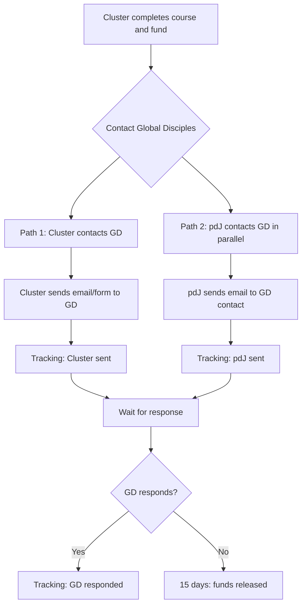
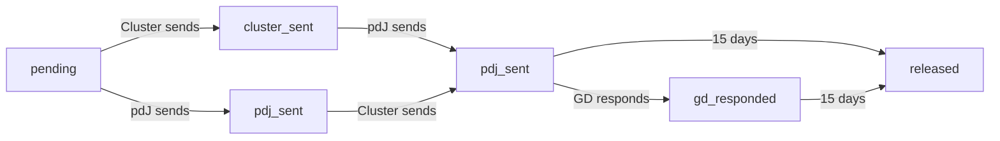

Implement a system for clusters to contact Global Disciples, with pdJ facilitating contact in parallel, and tracking follow-up status visible in the ranking.

## Dependencies
- R-#152 (Profiles of Church / GD Cluster)
- R-#154 (Ranking de Clústeres y Países)
- R-#155 (Contract for Cluster/Country Funds)

---

## 1. Contact Flow

### 1.1 Two-Path Contact



### 1.2 Status Tracking

| Status | Description | Visible in Ranking |
|--------|-------------|-------------------|
| Not started | Cluster hasn't contacted GD | "Pendiente" |
| Cluster sent | Cluster sent email/form to GD | "✅ Clúster envió correo" |
| pdJ sent | pdJ sent email to GD contact | "✅ pdJ envió correo" |
| GD responded | GD confirmed contact with cluster | "✅ Contacto confirmado" |
| No response | 15 days passed, funds released | "⏱️ Liberado (sin respuesta)" |

---

## 2. Contact Interface

### 2.1 Contact Form (for Cluster)

```
## Contactar a Global Disciples

**Clúster:** Clúster Esperanza

**Información del clúster:**
- País: Sierra Leona
- Iglesias: 3
- Director local: Pastor Juan Pérez
- Fondos recaudados: $320 USDT (64% de $500)

**Mensaje:**
```
Estimado Global Disciples,

El clúster Esperanza en Sierra Leona está listo para iniciar el proceso de formación.
Hemos completado el curso de "Herramientas para traer Global Disciples a tu clúster"
y hemos recaudado el 64% de los fondos necesarios.

Director local: Pastor Juan Pérez
Email: juan@iglesia.org
WhatsApp: +232 76 123 456

Esperamos su respuesta para continuar con el proceso.

Atentamente,
Clúster Esperanza
```

[Enviar a Global Disciples] [pdJ también contactará en paralelo]
```

### 2.2 Tracking Display (in Ranking)

```
## Ranking de Clústeres

| Posición | Clúster | País | Fondo | Contacto | Estado |
|----------|---------|------|-------|----------|--------|
| 1 | Clúster Esperanza | 🇸🇱 SL | $320 | ✅ Enviado | ✅ pdJ envió |
| 2 | Clúster Luz | 🇨🇴 Colombia | $250 | ⏳ Pendiente | ⏳ Pendiente |
| 3 | Clúster Fe | 🇸🇱 SL | $120 | ✅ Enviado | ⏳ Esperando |
```

### 2.3 Follow-up Display

```
## Seguimiento de Contacto

**Clúster:** Clúster Esperanza

**Contacto:**
- [x] Clúster envió correo a GD (2026-06-28)
- [x] pdJ envió correo a GD (2026-06-28)
- [ ] GD respondió

**Cronología:**
- 2026-06-28: Clúster envió correo
- 2026-06-28: pdJ envió correo
- 2026-06-29: Esperando respuesta...
- 2026-07-13: Liberación automática (15 días sin respuesta)

**Próximo paso:** Esperar respuesta de Global Disciples.
```

---

## 3. Contact Tracking Storage

### 3.1 Database Schema

```sql
CREATE TABLE gd_contact (
    id SERIAL PRIMARY KEY,
    cluster_id INTEGER REFERENCES cluster(id),
    cluster_email_sent TIMESTAMP,
    cluster_email_content TEXT,
    pdj_email_sent TIMESTAMP,
    pdj_email_content TEXT,
    gd_responded BOOLEAN DEFAULT FALSE,
    gd_response_date TIMESTAMP,
    gd_response_notes TEXT,
    status VARCHAR(20) DEFAULT 'pending', -- 'pending', 'cluster_sent', 'pdj_sent', 'gd_responded', 'released'
    release_date TIMESTAMP,
    release_reason VARCHAR(50), -- 'gd_confirmed' or 'timeout'
    created_at TIMESTAMP DEFAULT CURRENT_TIMESTAMP,
    updated_at TIMESTAMP DEFAULT CURRENT_TIMESTAMP
);
```

### 3.2 Status Transitions



---

## 4. GD Contact Information

### 4.1 Contact Methods

| Method | Description | Used By |
|--------|-------------|---------|
| **Email** | Send email to GD using the contact form | Cluster |
| **Email** | Send email to GD using pdJ's contact | pdJ |
| **Phone** | Call GD (if needed) | pdJ |

### 4.2 Email Templates

**Cluster to GD:**
```
Subject: New Cluster Ready for Training - [Cluster Name]

Dear Global Disciples Team,

The cluster of [Cluster Name] in [Country] is ready to begin the process of becoming a Global Disciples training program.

We have completed the "Bring Global Disciples to Your Cluster of Churches" course and have raised [percentage]% of the required funds.

Program Director: [Director Name]
Email: [Director Email]
WhatsApp: [Director WhatsApp]

Please let us know the next steps.

Sincerely,
[Cluster Name]
```

**pdJ to GD:**
```
Subject: Facilitated Contact - [Cluster Name] Ready for Training

Dear [GD Contact],

I am writing to connect you with a new cluster that has completed our course and is ready to begin the Global Disciples process.

Cluster: [Cluster Name]
Country: [Country]
Program Director: [Director Name]
Director Email: [Director Email]
Director WhatsApp: [Director WhatsApp]
Funds Raised: [Amount] USDT ([percentage]%)

This cluster has been formed and is committed to implementing the Global Disciples Approach. I would appreciate it if you could contact them directly to initiate the process.

Thank you for your support.

Sincerely,
[Your Name]
Pasos de Jesús
```

---

## 5. Timer and Release Logic

### 5.1 Timer Logic

```typescript
// 15-day timer from first contact sent
const contactRecord = await getContactRecord(clusterId);
const firstSentDate = contactRecord.cluster_email_sent || contactRecord.pdj_email_sent;
const isTimeout = Date.now() - firstSentDate.getTime() > 15 * 24 * 60 * 60 * 1000;

if (isTimeout && !contactRecord.gd_responded) {
    // Release funds to cluster
    await releaseFunds(clusterId, 'timeout');
}
```

### 5.2 Release Conditions

| Condition | Action |
|-----------|--------|
| **GD responded** | Funds released immediately |
| **15 days no response** | Funds released automatically |

### 5.3 Manual Override

| Action | Who | Description |
|--------|-----|-------------|
| Force release | pdJ | Manual release of funds |
| Extend timer | pdJ | Extend 15-day timer |
| Mark GD responded | pdJ | Manual confirmation of GD response |

---

## 6. Integration with Other Systems

### 6.1 Integration Points

| System | Integration |
|--------|-------------|
| **Ranking** | Contact status displayed in ranking |
| **Funds (R-#155)** | Funds released after GD confirmation or timeout |
| **Cluster page** | Contact status and timeline displayed |
| **Notifications** | Alerts for changes in contact status |

### 6.2 Notification Triggers

| Event | Notification | Recipient |
|-------|--------------|-----------|
| Cluster sends contact | Email | pdJ |
| pdJ sends contact | Email | Cluster |
| GD responds | Email | pdJ, Cluster |
| 15-day timeout | Email | pdJ, Cluster |
| Funds released | Email | Cluster |

---

## 7. API Endpoints

| Endpoint | Method | Description |
|----------|--------|-------------|
| `/api/gd/contact` | POST | Cluster sends contact to GD |
| `/api/gd/contact/pdj` | POST | pdJ sends contact to GD |
| `/api/gd/contact/status/:clusterId` | GET | Get contact status |
| `/api/gd/contact/:id` | PUT | Update contact record |
| `/api/gd/contact/:id/release` | POST | Release funds |
| `/api/gd/contact/:id/extend` | POST | Extend 15-day timer |

---

## 8. Acceptance Criteria

- [ ] Cluster can send contact email/form to GD
- [ ] pdJ can send contact email to GD in parallel
- [ ] Contact status is tracked and displayed
- [ ] Ranking shows contact status for each cluster
- [ ] 15-day timer starts after first contact sent
- [ ] Funds are released when GD responds
- [ ] Funds are released after 15 days without response
- [ ] pdJ can manually override release and timer
- [ ] Notifications are sent for key events
- [ ] Contact history is stored and visible

---

## 9. Out of Scope

- Automated email sending (requires SMTP setup)
- Two-way integration with GD email system
- SMS notifications
- Multi-language email templates

---

> *"Go into all the world and preach the gospel to every creature."* (Mark 16:15)


---

**Created:** 2026-06-29
**Status:** Pendiente
