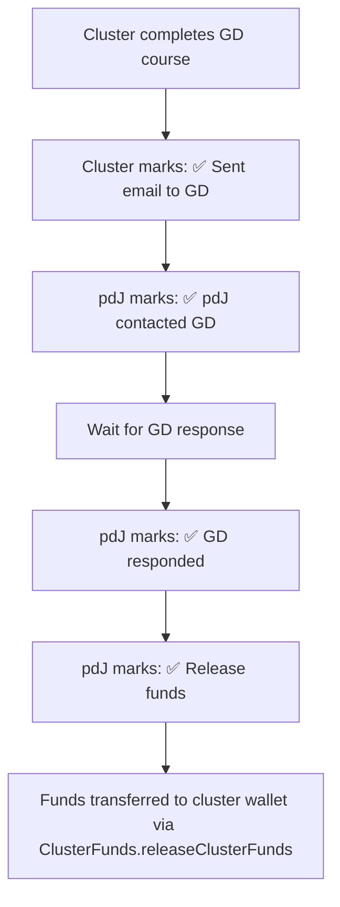

# R-#157: Implement Contact with Global Disciples and Follow-up

Implement a system for clusters and pdJ to track contact with Global Disciples via checkboxes, with manual fund release triggering the on-chain transfer, and follow-up status visible in the ranking.

## Dependencies
- R-#152 (Profiles of Church / GD Cluster)
- R-#154 (Ranking de Clústeres y Países)
- R-#155 (Contract for Cluster/Country Funds — `releaseClusterFunds`)
- R-#161 (GD course — prerequisite for contact)

---

## 1. Contact Flow

### 1.1 Checkbox-Based Tracking

The platform does NOT send emails. Contact with GD happens outside the platform (email, phone, WhatsApp). The platform tracks progress via **checkboxes** that cluster members and pdJ mark manually.



### 1.2 Checkbox Permissions

| Checkbox | Who can mark | Description |
|----------|-------------|-------------|
| ✅ Cluster sent email to GD | Cluster (any pastor) | Cluster confirms they contacted GD |
| ✅ pdJ contacted GD | pdJ (admin) | pdJ confirms parallel contact |
| ✅ GD responded | pdJ (admin) | GD confirmed contact with cluster |
| ✅ Release funds | pdJ (admin) | Triggers `releaseClusterFunds()` on-chain |

### 1.3 Status Display (derived, not stored)

Status is derived from checkboxes — no `status` column:

| Checkboxes marked | Display in Ranking |
|-------------------|-------------------|
| None | "⏳ Pendiente" |
| Cluster sent only | "✅ Clúster envió" |
| Cluster + pdJ sent | "✅ Ambos enviaron" |
| + GD responded | "✅ Contacto confirmado" |
| + Released | "💰 Fondos liberados" |

---

## 2. Contact Interface

### 2.1 Cluster View (Checkboxes)

```
## Contactar a Global Disciples

**Clúster:** Clúster Esperanza

**Información del clúster:**
- País: Sierra Leona
- Iglesias: 3
- Director local: Pastor Juan Pérez
- Fondos recaudados: $320 USDT (64% de $500)

**Acciones del clúster:**
- [x] ✅ Enviamos correo a Global Disciples (2026-06-28)

**Mensaje enviado (referencia):**
> Estimado Global Disciples, el clúster Esperanza en Sierra Leona está listo...
```

### 2.2 pdJ Admin View (Checkboxes)

```
## Seguimiento — Clúster Esperanza

**Acciones del clúster:**
- [x] ✅ Enviaron correo a GD (2026-06-28)

**Acciones de pdJ:**
- [x] ✅ pdJ contactó a GD (2026-06-29)
- [ ] ⬜ GD respondió
- [ ] ⬜ Liberar fondos

**Notas:** [___________________________]
```

### 2.3 Tracking Display (in Ranking)

```
## Ranking de Clústeres

| Posición | Clúster | País | Fondo | Contacto |
|----------|---------|------|-------|----------|
| 1 | Clúster Esperanza | 🇸🇱 SL | $320 | ✅ Ambos enviaron |
| 2 | Clúster Luz | 🇨🇴 Colombia | $250 | ⏳ Pendiente |
| 3 | Clúster Fe | 🇸🇱 SL | $120 | ✅ Clúster envió |
```

### 2.4 Follow-up Timeline

```
## Seguimiento de Contacto — Clúster Esperanza

- 2026-06-28: ✅ Clúster envió correo a GD
- 2026-06-29: ✅ pdJ contactó a GD
- ⬜ GD respondió
- ⬜ Fondos liberados

**Notas de pdJ:** Llamé a John de GD el 29, dijo que revisaría en 2 días.
```

---

## 3. Contact Tracking Storage

### 3.1 Database Schema

```sql
CREATE TABLE gdcontact (
    id SERIAL PRIMARY KEY,
    cluster_id INTEGER REFERENCES cluster(id) UNIQUE,  -- one record per cluster
    cluster_sent_at TIMESTAMP,        -- cluster marked: "we sent email"
    pdj_sent_at TIMESTAMP,            -- pdJ marked: "pdJ contacted GD"
    gd_responded_at TIMESTAMP,        -- pdJ marked: "GD responded"
    released_at TIMESTAMP,            -- pdJ marked: "release funds" → triggers releaseClusterFunds()
    release_reason VARCHAR(50),       -- 'gd_confirmed' (Phase 1) or 'timeout' (Phase 2)
    cluster_message TEXT,             -- message content for reference
    notes TEXT,                       -- pdJ notes
    created_at TIMESTAMP DEFAULT CURRENT_TIMESTAMP,
    updated_at TIMESTAMP DEFAULT CURRENT_TIMESTAMP
);
```

**Status is derived** — no `status` column. The display text is computed from which timestamps are set (see §1.3).

### 3.2 Status Display Logic (application code, not DB)

```typescript
function getContactStatus(c: GdContact): string {
  if (c.released_at) return '💰 Fondos liberados'
  if (c.gd_responded_at) return '✅ Contacto confirmado'
  if (c.pdj_sent_at && c.cluster_sent_at) return '✅ Ambos enviaron'
  if (c.cluster_sent_at) return '✅ Clúster envió'
  return '⏳ Pendiente'
}
```

---

## 4. Fund Release

### 4.1 Manual Release (Phase 1)

When pdJ marks the ✅ Release funds checkbox:

1. Backend calls `ClusterFunds.releaseClusterFunds(clusterWallet, usdtAmount, slearnAmount)`
2. Contract transfers USDT/SLEARN to the cluster's `multisig_address`
3. `gdcontact.released_at` is set to NOW
4. Event logged in `userevent` (`funds_released`)

### 4.2 Automatic Release (Phase 2)

In Phase 2, a cron job or DB trigger can auto-release after 15 days without GD response. Not in MVP.

### 4.3 Release Conditions

| Condition | Who triggers | Phase |
|-----------|-------------|-------|
| **GD responded** → pdJ marks release | pdJ (manual) | 1 |
| **Manual override** | pdJ | 1 |
| **15 days timeout** | Automatic | 2 |

### 4.4 Cancel Release

pdJ can cancel a release that has been marked but not yet executed (e.g., wrong cluster, GD contact fell through):

1. pdJ unmarks the release checkbox
2. `gdcontact.released_at` is set to NULL
3. `release_reason` is cleared
4. Event logged in `userevent` (`funds_release_cancelled`)

```sql
UPDATE gdcontact
SET released_at = NULL, release_reason = NULL, updated_at = NOW()
WHERE cluster_id = :clusterId
```

---

## 5. Integration with Other Systems

### 5.1 Integration Points

| System | Integration |
|--------|-------------|
| **Ranking (R-#154)** | Contact status displayed in ranking (derived from checkboxes) |
| **Funds (R-#155)** | `releaseClusterFunds()` called when pdJ marks release checkbox |
| **Cluster page** | Contact status and timeline displayed |
| **Events** | `userevent` entries for: `cluster_contact_sent`, `pdj_contact_sent`, `gd_responded`, `funds_released`, `funds_release_cancelled` |

### 5.2 Phase 2: Notifications

When checkboxes are marked in Phase 2, the platform can send actual emails. Not in MVP.

| Event | Email to | Phase |
|-------|----------|-------|
| Cluster marks sent | pdJ | 2 |
| pdJ marks sent | Cluster | 2 |
| GD responded | pdJ, Cluster | 2 |
| Funds released | Cluster | 2 |

---

## 6. API Endpoints

All endpoints that modify data require authentication via `authenticateUser()`. Admin-only endpoints additionally check the caller is pdJ.

| Endpoint | Method | Auth | Description |
|----------|--------|------|-------------|
| `/api/gd/contact/mark-sent` | POST | User | Cluster marks "we sent email to GD" |
| `/api/gd/contact/mark-pdj-sent` | POST | Admin | pdJ marks "pdJ contacted GD" |
| `/api/gd/contact/mark-responded` | POST | Admin | pdJ marks "GD responded" |
| `/api/gd/contact/release` | POST | Admin | pdJ marks release → triggers `releaseClusterFunds()` |
| `/api/gd/contact/cancel-release` | POST | Admin | pdJ cancels release (unmarks checkbox) |
| `/api/gd/contact/:clusterId` | GET | Public | Get contact status for a cluster |
| `/api/gd/contact/:id/notes` | PUT | Admin | Update pdJ notes |

---

## 7. Acceptance Criteria

- [ ] Cluster can mark "we sent email to GD" checkbox (authenticated, cluster pastor only)
- [ ] pdJ can mark "pdJ contacted GD" checkbox (admin)
- [ ] pdJ can mark "GD responded" checkbox (admin)
- [ ] pdJ can mark "release funds" checkbox → triggers `releaseClusterFunds()` on-chain
- [ ] pdJ can cancel a release (unmarks checkbox, clears `released_at`)
- [ ] Contact status is derived from checkboxes (no stored `status` column)
- [ ] Ranking shows contact status per cluster
- [ ] Contact timeline displayed on cluster page
- [ ] All checkbox actions logged in `userevent`
- [ ] Fund release creates `transaction` entry (handled by R-#155)
- [ ] Table named `gdcontact` (singular, no underscore)

---

## 8. Out of Scope

- Automated email sending (Phase 2: send emails when checkboxes are marked)
- Automatic 15-day timeout release (Phase 2: cron/trigger)
- SMS notifications
- Multi-language email templates

---

> *"Go into all the world and preach the gospel to every creature."* (Mark 16:15)


---

**Created:** 2026-06-29
**Status:** Pendiente
