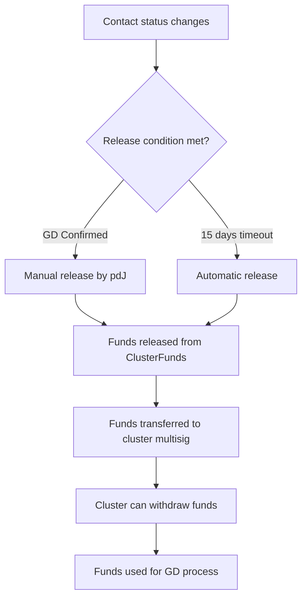

Implement the final step of the course: confirming that Global Disciples has contacted the cluster (or 15 days passed with no response), and releasing the funds from the ClusterFunds contract to the cluster's multisig wallet.

## Dependencies
- R-#155 (Contract for Cluster/Country Funds)
- R-#157 (Contact with Global Disciples and Follow-up)
- R-#152 (Profiles of Church / GD Cluster)
- Existing multisig wallet system (OneKey/OKX)

---

## 1. Release Flow

### 1.1 Release Conditions

| Condition | Description | Trigger |
|-----------|-------------|---------|
| **GD Confirmed** | Global Disciples has confirmed contact with the cluster | Manual (pdJ) |
| **Timeout (15 days)** | 15 days have passed since first contact sent | Automatic |

### 1.2 Release Process



---

## 2. Release Interface

### 2.1 pdJ Release Dashboard

```
## Liberación de Fondos

**Clúster:** Clúster Esperanza
**País:** Sierra Leona
**Fondo:** $320 USDT | 150 SLEARN

**Contacto:**
- [x] Clúster envió correo (2026-06-28)
- [x] pdJ envió correo (2026-06-28)
- [ ] GD respondió

**Tiempo desde primer contacto:** 12 días
**Liberación automática:** En 3 días (2026-07-13)

**Acciones:**
[Liberar Fondos Ahora] [Extender Plazo] [Cancelar Liberación]

**Liberación manual:**
Motivo: [GD confirmó contacto] [Otro]
[Confirmar Liberación]
```

### 2.2 Cluster Release Notification

```
## ¡Fondos Liberados!

**Clúster:** Clúster Esperanza

**Monto liberado:**
- USDT: $320
- SLEARN: 150

**Destino:** Billetera multisig del clúster

**Motivo:** ✅ Global Disciples confirmó contacto

**Próximo paso:** Los fondos están disponibles en tu billetera multisig. Úsalos para el siguiente paso del proceso.

[Ver Transacción] [Ir a Billetera]
```

---

## 3. Release Logic

### 3.1 Manual Release (pdJ)

| Step | Description | Who |
|------|-------------|-----|
| 1 | pdJ confirms GD has responded | pdJ |
| 2 | pdJ selects cluster for release | pdJ |
| 3 | pdJ confirms release | pdJ |
| 4 | System calls `releaseClusterFunds()` | System |
| 5 | Funds transferred to cluster multisig | Blockchain |

### 3.2 Automatic Release (Timeout)

| Step | Description | Who |
|------|-------------|-----|
| 1 | 15 days since first contact sent | System |
| 2 | System checks: GD has not responded | System |
| 3 | System automatically releases funds | System |
| 4 | Funds transferred to cluster multisig | Blockchain |

### 3.3 Release Function (Contract)

```solidity
function releaseClusterFunds(
    address clusterWallet,
    uint256 usdtAmount,
    uint256 slearnAmount,
    string memory reason
) external onlyAdmin {
    require(clusterFunds[clusterWallet].exists, "Cluster does not exist");
    require(usdtAmount > 0 || slearnAmount > 0, "No funds to release");
    require(clusterFunds[clusterWallet].usdtBalance >= usdtAmount, "Insufficient USDT");
    require(clusterFunds[clusterWallet].slearnBalance >= slearnAmount, "Insufficient SLEARN");
    
    // Update balances
    clusterFunds[clusterWallet].usdtBalance -= usdtAmount;
    clusterFunds[clusterWallet].slearnBalance -= slearnAmount;
    
    // Transfer USDT
    if (usdtAmount > 0) {
        require(usdt.transfer(clusterWallet, usdtAmount), "USDT transfer failed");
    }
    
    // Transfer SLEARN
    if (slearnAmount > 0) {
        require(slearn.transfer(clusterWallet, slearnAmount), "SLEARN transfer failed");
    }
    
    emit FundsReleased(clusterWallet, usdtAmount, slearnAmount, reason);
}
```

---

## 4. Fund Transfer Details

### 4.1 What Gets Released

| Component | Source | Destination |
|-----------|--------|-------------|
| **USDT** | ClusterFunds contract | Cluster multisig wallet |
| **SLEARN** | ClusterFunds contract | Cluster multisig wallet |

### 4.2 Transfer Method

| Method | Description |
|--------|-------------|
| **ERC-20 transfer** | USDT and SLEARN transferred to cluster multisig |
| **Event emission** | Transfer events logged for transparency |
| **Transaction receipt** | User receives transaction hash |

---

## 5. Post-Release Actions

### 5.1 Cluster Actions

| Action | Description |
|--------|-------------|
| **View balance** | Cluster sees funds in their multisig wallet |
| **Withdraw funds** | Cluster can withdraw funds for GD process |
| **Track usage** | Cluster tracks how funds are used |

### 5.2 System Actions

| Action | Description |
|--------|-------------|
| **Update status** | Cluster status changes to "Funds Released" |
| **Update ranking** | Cluster ranking recalculated |
| **Record release** | Release recorded in database |
| **Send notifications** | Notifications sent to pdJ and cluster |

---

## 6. Cancellation and Manual Override

### 6.1 Cancellation Conditions

| Condition | Description |
|-----------|-------------|
| **Cluster requests** | Cluster can request cancellation of release |
| **pdJ approves** | pdJ approves cancellation |
| **Funds returned** | Funds returned to ClusterFunds contract |

### 6.2 Manual Override

| Action | Who | Description |
|--------|-----|-------------|
| **Force release** | pdJ | Release funds immediately |
| **Extend timer** | pdJ | Extend 15-day timer |
| **Cancel release** | pdJ | Cancel release if funds should not be released |

---

## 7. Storage

### 7.1 Database Schema

```sql
CREATE TABLE fund_release (
    id SERIAL PRIMARY KEY,
    cluster_id INTEGER REFERENCES cluster(id),
    usdt_amount DECIMAL(20,6),
    slearn_amount INTEGER,
    release_reason VARCHAR(50), -- 'gd_confirmed' or 'timeout'
    release_date TIMESTAMP DEFAULT CURRENT_TIMESTAMP,
    transaction_hash VARCHAR(66),
    status VARCHAR(20) DEFAULT 'pending', -- 'pending', 'released', 'cancelled'
    approved_by INTEGER REFERENCES usuario(id),
    notes TEXT
);
```

### 7.2 Release History

```sql
-- Release history on cluster page
SELECT * FROM fund_release 
WHERE cluster_id = :cluster_id 
ORDER BY release_date DESC;
```

---

## 8. Integration Points

### 8.1 Systems Integration

| System | Integration |
|--------|-------------|
| **ClusterFunds (R-#155)** | Calls `releaseClusterFunds()` to transfer funds |
| **Contact (R-#157)** | Checks contact status for release conditions |
| **Ranking (R-#154)** | Updates cluster ranking after release |
| **Notifications** | Sends notifications on release |

### 8.2 Notification Triggers

| Event | Notification | Recipient |
|-------|--------------|-----------|
| Release pending | Email | pdJ |
| Release automatic (15 days) | Email | pdJ, Cluster |
| Release manual | Email | Cluster |
| Funds transferred | Email | Cluster |
| Cancellation | Email | pdJ, Cluster |

---

## 9. API Endpoints

| Endpoint | Method | Description |
|----------|--------|-------------|
| `/api/funds/release/:clusterId` | POST | Release funds to cluster |
| `/api/funds/release/:clusterId/status` | GET | Get release status |
| `/api/funds/release/:clusterId/extend` | POST | Extend 15-day timer |
| `/api/funds/release/:clusterId/cancel` | POST | Cancel release |
| `/api/funds/release/history` | GET | Get release history |

---

## 10. Security

### 10.1 Access Control

| Role | Permissions |
|------|-------------|
| **pdJ** | Manual release, extend timer, cancel release |
| **Cluster** | View release status, request cancellation |
| **System** | Automatic release (timeout) |

### 10.2 Validation

| Check | Description |
|-------|-------------|
| **Funds available** | Sufficient USDT and SLEARN in ClusterFunds |
| **Contact status** | GD confirmed or 15 days passed |
| **Cluster exists** | Cluster must be registered and verified |

---

## 11. Acceptance Criteria

- [ ] Funds are released when GD confirms contact
- [ ] Funds are released after 15 days without response
- [ ] pdJ can manually release funds
- [ ] pdJ can extend the 15-day timer
- [ ] pdJ can cancel a release
- [ ] Funds are transferred to cluster multisig wallet
- [ ] Release history is recorded and visible
- [ ] Ranking updates after release
- [ ] Notifications are sent for key events

---

## 12. Out of Scope

- Automated withdrawal from multisig (cluster controls this)
- Partial release (all funds released at once)
- Multi-step release (can be added later)

---

> *"A faithful man will abound with blessings."* (Proverbs 28:20)


---

**Created:** 2026-06-29
**Status:** Pendiente
