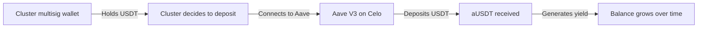
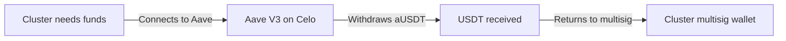
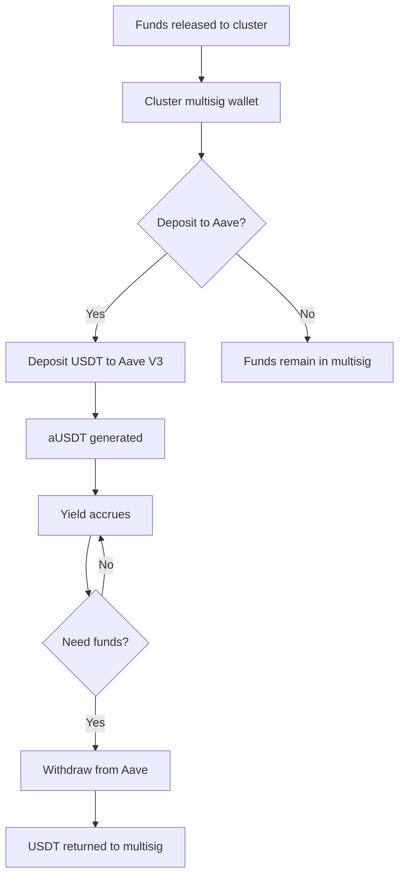

Enable clusters to deposit their released USDT funds into Aave V3 on Celo to generate yield while waiting for the visit from the Global Disciples director.

## Dependencies
- R-#155 (Contract for Cluster/Country Funds)
- R-#158 (Confirmación y Liberación de Fondos)
- R-#152 (Profiles of Church / GD Cluster)
- Existing multisig wallet system (OneKey/OKX)
- Aave V3 on Celo (protocol integration)

---

## 1. Aave Integration Overview

### 1.1 What is Aave V3?
Aave V3 is a decentralized lending protocol available on Celo. Users can deposit USDT into Aave pools and earn interest (APY) from borrowers. Deposits can be withdrawn at any time.

### 1.2 Why Aave for Clusters?

| Benefit | Description |
|---------|-------------|
| **Yield generation** | Funds grow while waiting for GD director visit |
| **No lock-up** | Funds can be withdrawn at any time |
| **Low risk** | USDT is a stablecoin; Aave is well-audited |
| **Transparency** | All transactions are on-chain |
| **Compatibility** | Works with existing Celo wallets (OneKey/OKX) |

### 1.3 Current Aave V3 APY (Celo)

| Asset | APY Range | Notes |
|-------|-----------|-------|
| USDT | ~0.5-2% APY | Variable, based on market conditions |
| USDC | ~0.5-2% APY | Variable, based on market conditions |

---

## 2. Aave Flow

### 2.1 Deposit Flow



### 2.2 Withdrawal Flow



### 2.3 Full Flow



---

## 3. User Interface

### 3.1 Aave Section on Cluster Page

```
## Ahorro en Aave

**Balance actual:**
- USDT en billetera: $0.00
- USDT en Aave: $320.00
- Rendimiento generado: $2.15

**Opciones:**
[Depositar en Aave] [Retirar de Aave] [Ver Historia]

**Rendimiento actual:**
- APY: ~0.68%
- Rendimiento mensual estimado: ~$0.18

**Próximos pasos:**
- Fondos creciendo mientras esperas la visita del director de GD
- Puedes retirar en cualquier momento
```

### 3.2 Deposit Modal

```
## Depositar en Aave

**Clúster:** Clúster Esperanza
**Billetera multisig:** 0x1234...5678

**Disponible para depositar:** $320.00 USDT

**Monto a depositar:**
| USDT |
|------|
| [320.00] |

**Resumen:**
- Monto: $320.00 USDT
- APY actual: ~0.68%
- Rendimiento mensual estimado: ~$0.18

[Confirmar Depósito]
```

### 3.3 Withdrawal Modal

```
## Retirar de Aave

**Clúster:** Clúster Esperanza
**Billetera multisig:** 0x1234...5678

**Balance en Aave:** $322.15 USDT (incluye $2.15 de rendimiento)

**Monto a retirar:**
| USDT |
|------|
| [322.15] |

**Resumen:**
- Monto a retirar: $322.15 USDT
- Rendimiento generado: $2.15

[Confirmar Retiro]
```

---

## 4. Technical Implementation

### 4.1 Aave Integration

| Component | Description |
|-----------|-------------|
| **Aave Pool** | USDT pool on Celo |
| **aUSDT** | Interest-bearing token received when depositing |
| **Deposit function** | `deposit(address asset, uint256 amount, address onBehalfOf, uint16 referralCode)` |
| **Withdraw function** | `withdraw(address asset, uint256 amount, address to)` |

### 4.2 Key Addresses (Celo)

| Contract | Address | Notes |
|----------|---------|-------|
| Aave V3 Pool | TBD | Main pool address on Celo |
| USDT | `0x...` | Existing USDT address on Celo |
| aUSDT | TBD | Interest-bearing token |

### 4.3 Deposit Logic

```typescript
// lib/aave/deposit.ts
import { ethers } from 'ethers';
import { AaveV3Pool } from './abi';

async function depositToAave(
    clusterId: number,
    amount: number,
    wallet: ethers.Wallet
): Promise<string> {
    // 1. Check that cluster has released funds
    // 2. Check that funds are in cluster multisig
    // 3. Approve USDT spending for Aave pool
    // 4. Call Aave deposit
    // 5. Record transaction
    // 6. Return transaction hash
}
```

### 4.4 Withdrawal Logic

```typescript
// lib/aave/withdraw.ts
async function withdrawFromAave(
    clusterId: number,
    amount: number,
    wallet: ethers.Wallet
): Promise<string> {
    // 1. Check that cluster has deposits in Aave
    // 2. Call Aave withdraw
    // 3. Record transaction
    // 4. Return transaction hash
}
```

---

## 5. Storage

### 5.1 Database Schema

```sql
CREATE TABLE aave_deposits (
    id SERIAL PRIMARY KEY,
    cluster_id INTEGER REFERENCES cluster(id),
    usdt_amount DECIMAL(20,6) NOT NULL,
    aUsdt_amount DECIMAL(20,6),
    tx_hash VARCHAR(66) NOT NULL,
    deposited_at TIMESTAMP DEFAULT CURRENT_TIMESTAMP
);

CREATE TABLE aave_withdrawals (
    id SERIAL PRIMARY KEY,
    cluster_id INTEGER REFERENCES cluster(id),
    usdt_amount DECIMAL(20,6) NOT NULL,
    aUsdt_amount DECIMAL(20,6),
    tx_hash VARCHAR(66) NOT NULL,
    withdrawn_at TIMESTAMP DEFAULT CURRENT_TIMESTAMP
);

CREATE TABLE aave_balance_cache (
    cluster_id INTEGER PRIMARY KEY REFERENCES cluster(id),
    usdt_balance DECIMAL(20,6),
    aUsdt_balance DECIMAL(20,6),
    yield_generated DECIMAL(20,6),
    updated_at TIMESTAMP DEFAULT CURRENT_TIMESTAMP
);
```

---

## 6. Aave Balance Tracking

### 6.1 Balance Update

| Method | Frequency | Description |
|--------|-----------|-------------|
| **On-chain query** | On demand | Query Aave contract for balance |
| **Cache update** | Hourly | Update cached balance for display |
| **Manual refresh** | User action | Refresh balance on cluster page |

### 6.2 Balance Display

```typescript
// Get cluster Aave balance
interface AaveBalance {
    usdtInAave: number;      // USDT deposited
    aUsdtBalance: number;    // aUSDT held
    yieldGenerated: number;  // Interest earned
    apy: number;             // Current APY
}
```

---

## 7. Risk and Security

### 7.1 Risks

| Risk | Description | Mitigation |
|------|-------------|------------|
| **Smart contract risk** | Aave contract could have vulnerabilities | Use well-audited Aave V3 |
| **Market risk** | APY can go down | Explain variable APY to users |
| **Gas costs** | Transaction fees on Celo | Celo gas is low |

### 7.2 Security Measures

| Measure | Description |
|---------|-------------|
| **Multisig** | Only cluster multisig can deposit/withdraw |
| **No transfer to unknown wallets** | Funds only go to/from cluster multisig |
| **Transaction logging** | All deposits/withdrawals logged |
| **Balance verification** | Verify Aave balance matches records |

---

## 8. User Education (Guide 7)

### 8.1 What Aave Is

> *"Aave es un protocolo que permite prestar tus USDT y ganar interés. Es como una cuenta de ahorros, pero en la blockchain. Puedes depositar y retirar cuando quieras."*

### 8.2 How to Use Aave

> *"Cuando hayas recibido los fondos de tu clúster, puedes depositarlos en Aave para que generen rendimiento mientras esperas la visita del director de Global Disciples."*

### 8.3 Risks to Understand

> *"El rendimiento en Aave es variable (puede subir o bajar). Los fondos en USDT son estables (no pierden valor). Los fondos pueden retirarse en cualquier momento."*

---

## 9. Integration Points

### 9.1 Systems Integration

| System | Integration |
|--------|-------------|
| **ClusterFunds (R-#155)** | Funds are released to cluster before Aave deposit |
| **Release (R-#158)** | After release, cluster can deposit to Aave |
| **Ranking (R-#154)** | Aave balance displayed in cluster page |
| **Cluster page** | Aave section on cluster page |

### 9.2 Notification Triggers

| Event | Notification | Recipient |
|-------|--------------|-----------|
| Deposit successful | Email | Cluster admin |
| Withdrawal successful | Email | Cluster admin |
| Low yield | Info | Cluster admin |

---

## 10. API Endpoints

| Endpoint | Method | Description |
|----------|--------|-------------|
| `/api/aave/deposit` | POST | Deposit USDT to Aave |
| `/api/aave/withdraw` | POST | Withdraw USDT from Aave |
| `/api/aave/balance/:clusterId` | GET | Get Aave balance |
| `/api/aave/history/:clusterId` | GET | Get deposit/withdrawal history |
| `/api/aave/apy` | GET | Get current APY |

---

## 11. Acceptance Criteria

- [ ] Clusters can deposit USDT to Aave V3 on Celo
- [ ] Clusters can withdraw USDT from Aave V3 on Celo
- [ ] Aave balance is displayed on cluster page
- [ ] Yield generated is tracked and displayed
- [ ] Current APY is displayed
- [ ] Transaction history is recorded and visible
- [ ] Only cluster multisig can deposit/withdraw
- [ ] Notifications sent for deposits and withdrawals
- [ ] Aave integration works with existing Celo wallets (OneKey/OKX)

---

## 12. Out of Scope

- **Automated deposits** (manual only)
- **Yield compounding** (Aave handles this automatically)
- **Deposit of SLEARN** (only USDT supported)
- **Investment advisory** (APY is informational only)

---

> *"Do not store up for yourselves treasures on earth... but store up for yourselves treasures in heaven."* (Matthew 6:19-20)


---

**Created:** 2026-06-29
**Status:** Pendiente
