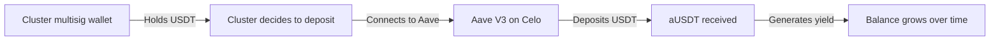
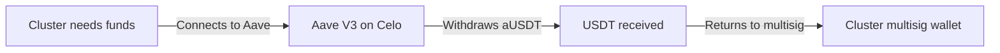
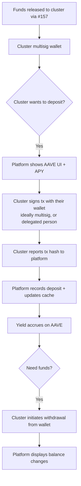

# R-#159: AAVE Yield Interface for Clusters

Enable clusters to deposit their released USDT funds into Aave V3 on Celo to generate yield while waiting for the GD director visit. The platform provides the UI and on-chain data — the cluster signs transactions with their own wallet (ideally multisig, or delegated to a trusted person for technical simplicity).

## Dependencies
- R-#157 (GD Contact + Fund Release — funds must be released before AAVE)
- R-#155 (Contract for Cluster/Country Funds)
- R-#152 (Profiles of Church / GD Cluster)
- Existing multisig wallet system (OneKey/OKX)
- Aave V3 on Celo (protocol integration)

---

## 1. Aave Integration Overview

### 1.1 What is Aave V3?
Aave V3 is a decentralized lending protocol available on Celo. Users can deposit USDT into Aave pools and earn interest (APY) from borrowers. Deposits can be withdrawn at any time.

### 1.2 Why Aave for Clusters?

| Benefit | Description |
|---------|-------------|
| **Yield generation** | Funds grow while waiting for GD director visit |
| **No lock-up** | Funds can be withdrawn at any time |
| **Low risk** | USDT is a stablecoin; Aave is well-audited |
| **Transparency** | All transactions are on-chain |
| **Compatibility** | Works with existing Celo wallets (OneKey/OKX) |

### 1.3 Current Aave V3 APY (Celo)

| Asset | APY Range | Notes |
|-------|-----------|-------|
| USDT | ~0.5-2% APY | Variable, based on market conditions |
| USDC | ~0.5-2% APY | Variable, based on market conditions |

---

## 2. Aave Flow

### 2.1 Deposit Flow



### 2.2 Withdrawal Flow



### 2.3 Full Flow



**Who signs:** The cluster's wallet (ideally multisig like OneKey/OKX, or a trusted individual if multisig is technically infeasible). The platform never holds or controls the cluster's private key.

---

## 3. User Interface

### 3.1 Aave Section on Cluster Page

```
## Ahorro en Aave

**Balance actual:**
- USDT en billetera: $0.00
- USDT en Aave: $320.00
- Rendimiento generado: $2.15

**Opciones:**
[Depositar en Aave] [Retirar de Aave] [Ver Historia]

**Rendimiento actual:**
- APY: ~0.68%
- Rendimiento mensual estimado: ~$0.18

**Próximos pasos:**
- Fondos creciendo mientras esperas la visita del director de GD
- Puedes retirar en cualquier momento
```

### 3.2 Deposit Modal

```
## Depositar en Aave

**Clúster:** Clúster Esperanza
**Billetera multisig:** 0x1234...5678

**Disponible para depositar:** $320.00 USDT

**Monto a depositar:**
| USDT |
|------|
| [320.00] |

**Resumen:**
- Monto: $320.00 USDT
- APY actual: ~0.68%
- Rendimiento mensual estimado: ~$0.18

[Confirmar Depósito]
```

### 3.3 Withdrawal Modal

```
## Retirar de Aave

**Clúster:** Clúster Esperanza
**Billetera multisig:** 0x1234...5678

**Balance en Aave:** $322.15 USDT (incluye $2.15 de rendimiento)

**Monto a retirar:**
| USDT |
|------|
| [322.15] |

**Resumen:**
- Monto a retirar: $322.15 USDT
- Rendimiento generado: $2.15

[Confirmar Retiro]
```

---

## 4. Technical Implementation

### 4.1 Aave Integration

| Component | Description |
|-----------|-------------|
| **Aave Pool** | USDT pool on Celo |
| **aUSDT** | Interest-bearing token received when depositing |
| **Deposit function** | `deposit(address asset, uint256 amount, address onBehalfOf, uint16 referralCode)` |
| **Withdraw function** | `withdraw(address asset, uint256 amount, address to)` |

### 4.2 Key Addresses (Celo)

| Contract | Address | Notes |
|----------|---------|-------|
| Aave V3 Pool | TBD | Main pool address on Celo |
| USDT | `0x...` | Existing USDT address on Celo |
| aUSDT | TBD | Interest-bearing token |

### 4.3 Platform Role

The platform does NOT sign AAVE transactions. It provides:
- **Balance display:** reads `aUSDT` balance and current APY from Aave on-chain
- **Transaction parameters:** shows the AAVE contract address, function signature, and suggested amount
- **Record keeping:** cluster reports the tx hash after signing in their own wallet

The cluster signs with their wallet (OneKey/OKX) directly — ideally multisig, or a trusted delegate if multisig is technically infeasible.

---

## 5. Storage

### 5.1 Database Schema

```sql
CREATE TABLE aavedeposit (
    id SERIAL PRIMARY KEY,
    cluster_id INTEGER REFERENCES cluster(id),
    usdt_amount DECIMAL(20,6) NOT NULL,
    aUsdt_amount DECIMAL(20,6),
    tx_hash VARCHAR(66) NOT NULL,         -- reported by cluster after signing
    deposited_at TIMESTAMP DEFAULT CURRENT_TIMESTAMP
);

CREATE TABLE aavewithdrawal (
    id SERIAL PRIMARY KEY,
    cluster_id INTEGER REFERENCES cluster(id),
    usdt_amount DECIMAL(20,6) NOT NULL,
    aUsdt_amount DECIMAL(20,6),
    tx_hash VARCHAR(66) NOT NULL,         -- reported by cluster after signing
    withdrawn_at TIMESTAMP DEFAULT CURRENT_TIMESTAMP
);

CREATE TABLE aavebalancecache (
    cluster_id INTEGER PRIMARY KEY REFERENCES cluster(id),
    usdt_balance DECIMAL(20,6),
    aUsdt_balance DECIMAL(20,6),
    yield_generated DECIMAL(20,6),
    updated_at TIMESTAMP DEFAULT CURRENT_TIMESTAMP
);
```

**Cache policy:** `aavebalancecache` updated via DB triggers on `aavedeposit` and `aavewithdrawal`. Balance also refreshable on-demand from on-chain query. Consistent with `ARCHITECTURE.md` §Cache Update Triggers.

---

## 6. Aave Balance Tracking

### 6.1 Balance Update

| Method | Frequency | Description |
|--------|-----------|-------------|
| **On-chain query** | On demand | Query Aave contract for live balance |
| **Trigger** | On `aavedeposit`/`aavewithdrawal` INSERT | Update `aavebalancecache` |
| **Manual refresh** | User action | Refresh balance on cluster page from on-chain |

### 6.2 Balance Display

```typescript
// Get cluster Aave balance
interface AaveBalance {
    usdtInAave: number;      // USDT deposited
    aUsdtBalance: number;    // aUSDT held
    yieldGenerated: number;  // Interest earned
    apy: number;             // Current APY
}
```

---

## 7. Risk and Security

### 7.1 Risks

| Risk | Description | Mitigation |
|------|-------------|------------|
| **Smart contract risk** | Aave contract could have vulnerabilities | Use well-audited Aave V3 |
| **Market risk** | APY can go down | Explain variable APY to users |
| **Gas costs** | Transaction fees on Celo | Celo gas is low |

### 7.2 Security Measures

| Measure | Description |
|---------|-------------|
| **Multisig** | Only cluster multisig can deposit/withdraw |
| **No transfer to unknown wallets** | Funds only go to/from cluster multisig |
| **Transaction logging** | All deposits/withdrawals logged |
| **Balance verification** | Verify Aave balance matches records |

---

## 8. User Education (Guide 7)

### 8.1 What Aave Is

> *"Aave es un protocolo que permite prestar tus USDT y ganar interés. Es como una cuenta de ahorros, pero en la blockchain. Puedes depositar y retirar cuando quieras."*

### 8.2 How to Use Aave

> *"Cuando hayas recibido los fondos de tu clúster, puedes depositarlos en Aave para que generen rendimiento mientras esperas la visita del director de Global Disciples."*

### 8.3 Risks to Understand

> *"El rendimiento en Aave es variable (puede subir o bajar). Los fondos en USDT son estables (no pierden valor). Los fondos pueden retirarse en cualquier momento."*

---

## 9. Integration Points

### 9.1 Systems Integration

| System | Integration |
|--------|-------------|
| **ClusterFunds (R-#155)** | Funds are released to cluster before Aave deposit |
| **Release (R-#157)** | After release, cluster can deposit to Aave |
| **Ranking (R-#154)** | Aave balance displayed in cluster page |
| **Cluster page** | Aave section on cluster page |

### 9.2 Notification Triggers (Phase 2 — via R-#162)

| Event | Notification | Recipient |
|-------|--------------|-----------|
| Deposit successful | In-app | Cluster admin |
| Withdrawal successful | In-app | Cluster admin |

---

## 10. API Endpoints

| Endpoint | Method | Description |
|----------|--------|-------------|
| `/api/aave/deposit` | POST | User | Record deposit (cluster reports tx hash after signing externally) |
| `/api/aave/withdraw` | POST | User | Record withdrawal (cluster reports tx hash after signing externally) |
| `/api/aave/balance/:clusterId` | GET | Public | Get Aave balance, current APY, and yield |
| `/api/aave/history/:clusterId` | GET | Public | Get deposit/withdrawal history |

---

## 11. Acceptance Criteria

- [ ] Platform displays AAVE balance, APY, and yield on cluster page
- [ ] Cluster can report deposit/withdrawal tx hashes to platform (signing happens externally in their wallet)
- [ ] Deposit/withdrawal history is recorded and visible
- [ ] `aavebalancecache` updated via DB triggers (consistent with ARCHITECTURE.md)
- [ ] Aave integration works with existing Celo wallets (OneKey/OKX)
- [ ] Tables named `aavedeposit`, `aavewithdrawal`, `aavebalancecache` (singular, no underscore)
- [ ] Notifications deferred to Phase 2 (R-#162)

---

## 12. Out of Scope

- **Automated deposits** (manual only)
- **Yield compounding** (Aave handles this automatically)
- **Deposit of SLEARN** (only USDT supported)
- **Investment advisory** (APY is informational only)

---

> *"Do not store up for yourselves treasures on earth... but store up for yourselves treasures in heaven."* (Matthew 6:19-20)


---

**Created:** 2026-06-29
**Status:** Pendiente
