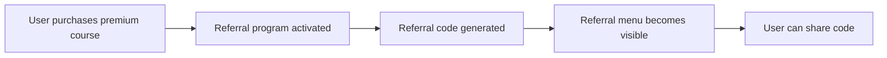

Implement a general referral program for the learn.tg platform that:
1. Activates when a user purchases **any premium course** (including Global Disciples)
2. Rewards referrers when referred users complete courses (gratuitos, misionales, or premium)
3. Provides a dedicated referral menu with: code, balance, history, and referral status

## Dependencies
- Existing course system
- Existing USDT and SLEARN contracts
- R-#160 (Global Disciples Course)
- R-#155 (Contract for Cluster/Country Funds) - for referral fund availability

---

## 1. Referral Program Overview

### 1.1 Activation
The referral program is activated when a user **purchases any premium course**. Premium courses include:
- Global Disciples Course
- Any other premium course added in the future

### 1.2 Course Tiers

| Tier | Course Type | Examples | Reward Level |
|------|-------------|----------|--------------|
| **Tier 1** | Free courses | "Web3 & UBI", "Ahorra en dólares en OKX" | Nivel 1 |
| **Tier 1 + Bonus** | Missional courses | "Una relación con Jesús", "A relationship with Jesus" | Nivel 1 + Bono |
| **Tier 2** | Premium courses | "Global Disciples" | Nivel 2 |

---

## 2. Reward Structure

### 2.1 Nivel 1 (Free Course Completion)

| Recipient | USDT | SLEARN |
|-----------|------|--------|
| **Referrer** | 0.30 | 2 |
| **Referred** | 0.20 | 2 |
| **Total** | 0.50 | 4 |

### 2.2 Nivel 1 + Bonus (Missional Course Completion)

| Recipient | USDT | SLEARN |
|-----------|------|--------|
| **Referrer** | 0.50 | 4 |
| **Referred** | 0.30 | 4 |
| **Total** | 0.80 | 8 |

### 2.3 Nivel 2 (Premium Course Completion)

| Recipient | USDT | SLEARN |
|-----------|------|--------|
| **Referrer** | 0.50 | 10 |
| **Referred** | 0.50 | 10 |
| **Total** | 1.00 | 20 |

---

## 3. Reward Conditions

### 3.1 Payment Conditions

| Condition | Description |
|-----------|-------------|
| **Course completion** | The referred user must complete the course |
| **Fund availability** | Rewards are subject to fund availability |
| **One time** | Each referral relationship pays only once per course |

### 3.2 Fund Availability

| Aspect | Implementation |
|--------|----------------|
| **Display** | Available balance shown in referral menu |
| **Warning** | "Las recompensas están sujetas a disponibilidad del fondo" |
| **Payment order** | Rewards are paid in order of completion |
| **Insufficient funds** | Pending rewards are queued until funds are available |

---

## 4. Referral Code and Tracking

### 4.1 Code Generation
- Each user receives a **unique referral code** upon purchasing a premium course
- The code is visible in the referral menu
- The code can be shared via link, QR code, or text

### 4.2 Referral Link Format
```
https://learn.tg/ref/{CODE}
```

### 4.3 Tracking
When a new user connects their wallet for the first time:
- If they used a referral link, the referrer is recorded
- If not, they can enter a referral code manually
- The referral relationship is stored in the database

---

## 5. Referral Menu

### 5.1 Menu Access
- **Desktop:** Visible in the main navigation (expanded)
- **Mobile:** Visible in the dropdown menu
- **Visibility:** Only visible after the user has activated the referral program

### 5.2 Menu Sections

#### 5.2.1 Referral Code
```
## Tu código de referido
`GD-ABC123`

[Compartir código] [Copiar enlace] [Ver QR]
```

#### 5.2.2 Fund Availability
```
## Disponibilidad del fondo
USDT: $1,250.00 disponible
SLEARN: 2,800 disponible

⚠️ Las recompensas están sujetas a disponibilidad del fondo.
```

#### 5.2.3 Referral History
```
## Historial de referidos

| Fecha | Referido | Curso completado | Recompensa | Estado |
|-------|----------|------------------|------------|--------|
| 2026-06-28 | Juan Pérez | Web3 & UBI | 0.30 USDT + 2 SLEARN | ✅ Pagado |
| 2026-06-27 | María Gómez | Una relación con Jesús | 0.50 USDT + 4 SLEARN | ⏳ Pendiente |
```

#### 5.2.4 Referral Status
```
## Estado de mis referidos

| Referido | Código | Curso completado | Estado |
|----------|--------|------------------|--------|
| Juan Pérez | REF-001 | Web3 & UBI | ✅ Completado |
| María Gómez | REF-002 | — | ⏳ Pendiente |
| Pedro López | REF-003 | — | ❌ No completado |
```

---

## 6. Activation and Visibility

### 6.1 Activation Flow



### 6.2 Global Disciples Course Integration

| Feature | Implementation |
|---------|----------------|
| **Referral activation** | Automatically activated when user pays for the GD course |
| **Mini-help** | A collapsible help section explaining the referral program |
| **Menu visibility** | Referral menu appears after activation |

### 6.3 Feature Unlocking

| Guide Completed | Feature Unlocked |
|-----------------|------------------|
| Guide 1 | Understanding GD |
| Guide 2 | Cluster formation |
| Guide 3 | Multisig configuration |
| Guide 4 | Fundraising |
| Guide 5 | Contact GD |
| Guide 6 | Fund release |
| Guide 7 | Aave savings |

---

## 7. Database Schema

### 7.1 Referral Codes

```sql
CREATE TABLE referral_codes (
    id SERIAL PRIMARY KEY,
    usuario_id INTEGER REFERENCES usuario(id) NOT NULL,
    code VARCHAR(20) UNIQUE NOT NULL,
    activated_at TIMESTAMP DEFAULT CURRENT_TIMESTAMP,
    active BOOLEAN DEFAULT TRUE
);
```

### 7.2 Referral Relationships

```sql
CREATE TABLE referral_relationships (
    id SERIAL PRIMARY KEY,
    referrer_id INTEGER REFERENCES usuario(id) NOT NULL,
    referred_id INTEGER REFERENCES usuario(id) NOT NULL,
    referral_code VARCHAR(20),
    created_at TIMESTAMP DEFAULT CURRENT_TIMESTAMP,
    status VARCHAR(20) DEFAULT 'pending' -- 'pending', 'completed', 'paid'
);
```

### 7.3 Referral Rewards

```sql
CREATE TABLE referral_rewards (
    id SERIAL PRIMARY KEY,
    relationship_id INTEGER REFERENCES referral_relationships(id),
    reward_type VARCHAR(20), -- 'usdt', 'slearn'
    amount DECIMAL(20,6),
    recipient_type VARCHAR(10), -- 'referrer', 'referred'
    course_id INTEGER REFERENCES courses(id),
    paid BOOLEAN DEFAULT FALSE,
    paid_at TIMESTAMP,
    transaction_hash VARCHAR(66)
);
```

### 7.4 Referral Fund Balance

```sql
-- Real balance is on-chain (USDT and SLEARN wallets)
-- Cache for display
CREATE TABLE referral_fund_cache (
    id SERIAL PRIMARY KEY,
    usdt_balance DECIMAL(20,6) DEFAULT 0,
    slearn_balance INTEGER DEFAULT 0,
    updated_at TIMESTAMP DEFAULT CURRENT_TIMESTAMP
);
```

---

## 8. Fund Sources

| Source | Description |
|--------|-------------|
| **Course revenue** | A percentage of premium course revenue allocated to referrals |
| **Donations** | Donations directed to the referral fund |
| **pdJ treasury** | Initial seed fund |

---

## 9. Referral Declaration

### 9.1 First Wallet Connection
When a user connects their wallet for the first time, they can:
1. Enter a referral code (if they were referred)
2. Skip (if they were not referred)

### 9.2 Manual Entry
Users can also enter a referral code later from the referral menu.

---

## 10. API Endpoints

| Endpoint | Method | Description |
|----------|--------|-------------|
| `/api/referral/code` | GET | Get user's referral code |
| `/api/referral/stats` | GET | Get referral statistics |
| `/api/referral/history` | GET | Get referral history |
| `/api/referral/fund` | GET | Get fund availability |
| `/api/referral/claim` | POST | Enter referral code |
| `/api/referral/share` | POST | Generate shareable link |

---

## 11. Security

### 11.1 Validation Checks

| Check | Description |
|-------|-------------|
| **Code uniqueness** | Each referral code must be unique |
| **Valid course** | The completed course must be valid |
| **Fund availability** | Rewards are paid only if funds are available |
| **One time per relationship** | Each referral relationship pays only once per course |

### 11.2 Anti-Fraud Measures

| Measure | Description |
|---------|-------------|
| **Unique wallets** | A user cannot refer themselves |
| **Course completion** | Rewards only paid after course completion |
| **Manual review** | Suspicious activity flagged for review |
| **Rate limiting** | Limited referral claims per day |

---

## 12. Acceptance Criteria

- [ ] Referral program activates when user purchases a premium course
- [ ] Unique referral code is generated upon activation
- [ ] Referral menu is visible after activation
- [ ] Referral menu shows: code, fund availability, history, status
- [ ] Referral rewards are paid according to the tier structure
- [ ] Users can enter a referral code on first wallet connection
- [ ] Fund availability is displayed with a warning
- [ ] Mini-help is available in the GD course
- [ ] All events are logged
- [ ] All validation checks work

---

## 13. Out of Scope

- Automatic email notifications for referral status changes
- Referral leaderboard
- Referral competitions
- WhatsApp notifications

---

> *"Freely you have received; freely give."* (Matthew 10:8)

---

**Created:** 2026-06-29
**Status:** Pendiente
