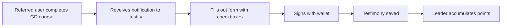

# R-#163: Referral Program for learn.tg (Actualizado)

Implement a general referral program for the learn.tg platform with **two reward forms**:

1. **Form 1 — course purchases:** the referrer earns 10% of the course price when a referred user buys **any premium course** (including Global Disciples).
2. **Form 2 — missional scholarships:** the referrer earns 10% of the scholarship value when a referred user completes a crossword in a **missional course** (only "Una relación con Jesús"); the student keeps 100% of their scholarship.
3. Provides a dedicated referral menu with: code, balance, history, and referral status.
4. Includes a **testimony system** for Global Disciples course completers to attest to their leader's impact.

**Funding rule:** both forms are paid **from the referral wallet** (`NEXT_PUBLIC_REFERRAL_WALLET_ADDRESS`), never from scholarships. If the wallet has no funds, the referrer receives nothing.

## Dependencies
- Existing course system (`cor1440_gen_proyectofinanciero`)
- Existing USDT and SLEARN contracts
- #161 (Global Disciples Course — activates referrals on premium purchase)
- #155 (Contract for Cluster/Country Funds — referral fund source)
- `transaction` table — referral rewards are value movements, must be recorded
- **LearnTGVaultsV5** — modified contract with flexible split (#196)

**Note:** Referral rewards are paid off-chain from the referral wallet (`PRIVATE_KEY_REFERRAL_WALLET`), not calculated by the contract. The `SLEARN.processPayment` only routes the 10% (from pdJ) into the referral wallet; the backend then attributes and pays each referrer.

---

## 1. Referral Program Overview

### 1.1 Activation
The referral program is activated when a user **purchases any premium course**. Premium courses include:
- Global Disciples Course
- Any other premium course added in the future

### 1.2 Referral Reward Source

**The reward is paid from the referral wallet, never from the student's scholarship.**

| Aspect | Decision |
|--------|----------|
| **Source** | Referral wallet (`NEXT_PUBLIC_REFERRAL_WALLET_ADDRESS`), funded by 10% of premium purchases (from pdJ reduction 55% → 50%) |
| **Form 1** | 10% of the course price on premium purchase, paid 50% USDT + 50% SLEARN |
| **Form 2** | 10% of the scholarship value on missional crossword; student keeps 100% |
| **No funds** | If the referral wallet is empty, the referrer receives nothing |
| **Atomicity** | Off-chain attribution: read `ReferralReward` event, credit referrer, pay from referral wallet |

### 1.3 Reward Formula

```
If the referred user earns scholarship USDT = 1.00 and SLEARN = 5 (missional course):

Referrer receives (paid from the referral wallet):
  USDT: 0.10 (10% of 1.00)
  SLEARN: 0.50 (10% of 5)

Student receives (100% of their scholarship — no deduction):
  USDT: 1.00
  SLEARN: 5.00
```

### 1.4 Example by Course

| Course | Scholarship per guide | Referrer (10%, from wallet) | Student (100%) |
|--------|-----------------------|----------------------------|----------------|
| **Web3 & UBI** | 1 USDT + 1 SLEARN | 0.10 USDT + 0.10 SLEARN | 1.00 USDT + 1.00 SLEARN |
| **Global Disciples (missional)** | 1 USDT + 5 SLEARN | 0.10 USDT + 0.50 SLEARN | 1.00 USDT + 5.00 SLEARN |
| **Other missional course** | 1 USDT + 1 SLEARN | 0.10 USDT + 0.10 SLEARN | 1.00 USDT + 1.00 SLEARN |

---

## 2. Referral Code and Tracking

### 2.1 Code Generation
- Each user receives a **unique referral code** upon purchasing a premium course
- The code is generated using `crypto.randomUUID()` and takes the first 8 characters
- The code is visible in the referral menu
- The code can be shared via link, QR code, or text
- Codes do not expire (`expires_at` can be NULL)

### 2.2 Referral Link Format
```
https://learn.tg/ref/{CODE}
```

### 2.3 Tracking
When a new user connects their wallet for the first time:
- If they used a referral link, the referrer is recorded
- If not, they can enter a referral code manually
- The referral relationship is stored in the database
- Each user can only claim a referral code once (`referral_claimed_at` tracks this)

---

## 3. Testimony System (For Global Disciples Only)

### 3.1 Purpose

When a referred user completes the Global Disciples course, they can fill out a **testimony form** attesting to the leader's impact. This is used to:
1. Calculate the leader's score for the **Program Director** role
2. Verify the leader's missionary activity
3. Reward leaders with additional points

### 3.2 Testimony Form

When a referred student completes the Global Disciples course, they receive a notification to "Testify for your leader."

**Fields:**

| Field | Type | Description |
|-------|------|-------------|
| `presented_christ` | Checkbox | The leader introduced me to Christ for the first time |
| `discipled` | Checkbox | The leader discipled me (taught me to follow Christ) |
| `came_mission` | Checkbox | The leader came on a mission trip to my area |
| `invited_event` | Checkbox | The leader invited me to a Bible study/event |
| `helped_faith` | Checkbox | The leader helped me grow in my faith |
| `relationship` | Select | Pastor, Group Leader, Friend, Family, Other |
| `other_relationship` | Text | If "Other" is selected |
| `comments` | Textarea | Additional comments (optional) |

### 3.3 Testimony Flow


```mermaid
flowchart LR
    A[Referred user completes GD course] --> B[Receives notification to testify]
    B --> C[Fills out form with checkboxes]
    C --> D[Signs with wallet]
    D --> E[Testimony saved]
    E --> F[Leader accumulates points]
```

### 3.4 Testimony Database

```sql
CREATE TABLE testimonies (
    id SERIAL PRIMARY KEY,
    leader_id INTEGER REFERENCES usuario(id) NOT NULL,
    witness_id INTEGER REFERENCES usuario(id) NOT NULL,
    course_id INTEGER,                      -- Which GD course (for future multi-course support)
    presented_christ BOOLEAN DEFAULT FALSE,
    discipled BOOLEAN DEFAULT FALSE,
    came_mission BOOLEAN DEFAULT FALSE,
    invited_event BOOLEAN DEFAULT FALSE,
    helped_faith BOOLEAN DEFAULT FALSE,
    relationship VARCHAR(50),
    other_relationship TEXT,
    comments TEXT,
    signature_wallet VARCHAR(42) NOT NULL,
    created_at TIMESTAMP DEFAULT CURRENT_TIMESTAMP,
    UNIQUE(leader_id, witness_id)
);
```

### 3.5 Testimony Score (For Program Director Selection)

| Criterion | Points |
|-----------|--------|
| Presented Christ | +10 |
| Discipled | +8 |
| Came on mission | +6 |
| Invited to event | +4 |
| Helped grow in faith | +4 |
| Is my pastor | +5 |
| Is my group leader | +3 |

```typescript
// lib/leader-score.ts
export function calculateLeaderScore(testimonies: Testimony[]): number {
  let score = 0
  for (const t of testimonies) {
    if (t.presented_christ) score += 10
    if (t.discipled) score += 8
    if (t.came_mission) score += 6
    if (t.invited_event) score += 4
    if (t.helped_faith) score += 4
    if (t.relationship === 'pastor') score += 5
    if (t.relationship === 'group_leader') score += 3
  }
  return score
}
```

---

## 4. Reward Payment (off-chain, supersedes V5 approach)

> **Superseded:** the earlier design routed referral rewards through
> `LearnTGVaultsV5` (`referrer`, `referrerUSDT`, `referrerSlearn`). The new
> design pays off-chain from the referral wallet — no contract change needed.

The `SLEARN.processPayment` sends `percentageReferral=10` to the single
`referralWallet` (50% USDT + 50% SLEARN minted via `mintAndReserve`). The backend
then:
1. Reads the `ReferralReward(referralWallet, usdtAmount, slearnAmount)` event.
2. Attributes the reward to the referrer of the paying user (from the DB).
3. Transfers the USDT + SLEARN from the referral wallet to the referrer using
   `PRIVATE_KEY_REFERRAL_WALLET`.

The contract does not calculate the per-referrer split; the backend handles all
attribution and payouts.

---

## 5. Referral Menu

### 5.1 Menu Access
- **Desktop:** Visible in the main navigation (expanded)
- **Mobile:** Visible in the dropdown menu
- **Visibility:** Only visible after the user has activated the referral program

### 5.2 Menu Sections

#### 5.2.1 Referral Code
```
## Tu código de referido
`GD-ABC123`

[Compartir código] [Copiar enlace] [Ver QR]
```

#### 5.2.2 Referral History
```
## Historial de referidos

| Fecha | Referido | Curso completado | Recompensa | Estado |
|-------|----------|------------------|------------|--------|
| 2026-06-28 | Juan Pérez | Web3 & UBI | 0.10 USDT + 0.10 SLEARN | ✅ Pagado |
| 2026-06-27 | María Gómez | Global Disciples | 0.50 USDT + 0.50 SLEARN | ✅ Pagado |
```

#### 5.2.3 Referral Status
```
## Estado de mis referidos

| Referido | Código | Curso completado | Estado |
|----------|--------|------------------|--------|
| Juan Pérez | REF-001 | Web3 & UBI | ✅ Completado |
| María Gómez | REF-002 | Global Disciples | ✅ Completado |
| Pedro López | REF-003 | — | ⏳ Pendiente |
```

#### 5.2.4 Testimony Requests (for GD leaders)
```
## Atestiguamientos pendientes

| Referido | Curso completado | Acción |
|----------|------------------|--------|
| María Gómez | Global Disciples | [Solicitar atestiguamiento] |
| Carlos Ruiz | Global Disciples | [Solicitar atestiguamiento] |
```

---

## 6. Database Schema

### 6.1 Referral Codes

```sql
CREATE TABLE referralcode (
    id SERIAL PRIMARY KEY,
    usuario_id INTEGER REFERENCES usuario(id) NOT NULL,
    code VARCHAR(20) UNIQUE NOT NULL,
    activated_at TIMESTAMP DEFAULT CURRENT_TIMESTAMP,
    expires_at TIMESTAMP,                     -- NULL = never expires
    active BOOLEAN DEFAULT TRUE
);
```

### 6.2 Referral Relationships

```sql
CREATE TABLE referralrelationship (
    id SERIAL PRIMARY KEY,
    referrer_id INTEGER REFERENCES usuario(id) NOT NULL,
    referred_id INTEGER REFERENCES usuario(id) NOT NULL,
    referral_code VARCHAR(20),                -- The code used
    referral_claimed_at TIMESTAMP,            -- When the code was claimed
    created_at TIMESTAMP DEFAULT CURRENT_TIMESTAMP,
    status VARCHAR(20) DEFAULT 'pending'     -- 'pending', 'completed', 'paid'
);
```

### 6.3 Testimonies

```sql
CREATE TABLE testimonies (
    id SERIAL PRIMARY KEY,
    leader_id INTEGER REFERENCES usuario(id) NOT NULL,
    witness_id INTEGER REFERENCES usuario(id) NOT NULL,
    course_id INTEGER,                        -- Which GD course (for future multi-course support)
    presented_christ BOOLEAN DEFAULT FALSE,
    discipled BOOLEAN DEFAULT FALSE,
    came_mission BOOLEAN DEFAULT FALSE,
    invited_event BOOLEAN DEFAULT FALSE,
    helped_faith BOOLEAN DEFAULT FALSE,
    relationship VARCHAR(50),
    other_relationship TEXT,
    comments TEXT,
    signature_wallet VARCHAR(42) NOT NULL,
    created_at TIMESTAMP DEFAULT CURRENT_TIMESTAMP,
    UNIQUE(leader_id, witness_id)
);
```

### 6.4 Transaction Table

Every referral reward payment creates entries in the `transaction` table:

```sql
-- One entry per crypto per recipient per reward
INSERT INTO transaction (
    usuario_id, wallet, crypto, type, amount, balance_impact, date, hash,
    categoria, subcategoria, metadata
) VALUES (
    :referrer_id, :wallet, 'USDT', 'referral_reward', 0.10, 0.10, NOW(), :hash,
    'referral', 'referrer',
    '{"referred_id": 456, "course_id": 1, "guide_id": 2}'
);
```

**CHECK constraint update:** Add `'referral_reward'` to the `transaction` type CHECK constraint.

---

## 7. API Endpoints

| Endpoint | Method | Description |
|----------|--------|-------------|
| `/api/referral/code` | GET | Get user's referral code |
| `/api/referral/stats` | GET | Get referral statistics |
| `/api/referral/history` | GET | Get referral history |
| `/api/referral/claim` | POST | Enter referral code (first wallet connection) |
| `/api/referral/share` | POST | Generate shareable link |
| `/api/testimony` | POST | Submit testimony for a leader |
| `/api/testimony/:id` | GET | Get testimony details |

---

## 8. Events

All referral events are logged in `userevent`:

| Event | When | Data |
|-------|------|------|
| `referral_activated` | User purchases premium course | `{ user_id, code }` |
| `referral_claimed` | New user enters referral code | `{ referrer_id, referred_id, code }` |
| `referral_reward_paid` | Referrer receives reward | `{ referrer_id, referred_id, course_id, guide_id, usdt_amount, slearn_amount }` |
| `testimony_submitted` | User submits testimony | `{ leader_id, witness_id }` |

---

## 9. Security

### 9.1 Validation Checks

| Check | Description |
|-------|-------------|
| **Code uniqueness** | Each referral code must be unique |
| **Valid course** | The completed course must be valid |
| **One time per relationship** | Each referral relationship pays only once per course |
| **No self-referral** | A user cannot refer themselves (enforced by backend) |
| **Referral claimed once** | A user can only claim one referral code |

### 9.2 Anti-Fraud Measures

| Measure | Description |
|---------|-------------|
| **Unique wallets** | A user cannot refer themselves |
| **Course completion** | Rewards only paid after course completion |
| **Manual review** | Suspicious activity flagged for review |
| **Rate limiting** | Limited referral claims per day |

---

## 11. Implementation Phases

### Phase 0 — Landing page + fund visibility (done)

| # | Task | Status |
|---|---|---|
| 0.1 | `GET /api/referrals/fund` — referral wallet balance (USDT + SLEARN) | ✅ |
| 0.2 | Landing page `/referrals` (EN/ES) + header nav link | ✅ |
| 0.3 | Env: `NEXT_PUBLIC_REFERRAL_WALLET_ADDRESS` + `PRIVATE_KEY_REFERRAL_WALLET` | ✅ |

**Delivers:** The program is explained and the referral wallet balance is visible.

#### Phase 0 follow-ups — landing page CTA (UX feedback, 2026-08-16)

The current `/referrals` CTA is a static "Sign up on learn.tg" link to `/{lang}`.
Two problems:

1. **Button label invisible until hover** — the CTA `text-white` on `bg-primary`
   renders with no visible text until hovered (contrast/theme issue).
2. **There is no sign-up flow**, so a static link to `/{lang}` is wrong. The
   CTA / next step must depend on the visitor's situation:

| State | Next step (CTA) |
|---|---|
| No wallet connected | Link to the **Web3 & UBI** course (Guide 2 covers installing a wallet), in the same language as the landing page |
| Wallet connected, profile score < 90 | Link to **/profile** + prompt to complete profile info and schedule a verification interview to raise the score |
| Wallet connected, profile score > 90 | Show the referral link/code + explanation of what to do |

Implementation notes: read `useAuthAddress()` for wallet status and the profile
score (`/api/profile`), then render the CTA accordingly. This gating overlaps
with the Phase 1 referral menu (same wallet/score conditions).

### Phase 1 — DB + Core Logic

**Goal:** Tables and API for referral codes and relationships. No rewards yet.

| # | Task | Depends on |
|---|---|---|
| 1.1 | Migration: `referralcode` + `referralrelationship` tables | — |
| 1.2 | `/api/referral/code` — generate & return user's referral code | 1.1, premium purchase trigger |
| 1.3 | `/api/referral/claim` — new user enters referral code on first wallet connect | 1.1 |
| 1.4 | `/api/referral/stats` — referral statistics (count, pending, completed) | 1.1 |
| 1.5 | `/api/referral/history` — referral history for the referrer | 1.1 |
| 1.6 | `/api/referral/share` — generate shareable link + QR | 1.2 |
| 1.7 | Referral menu UI (code, share, history, status) | 1.2–1.6 |

**Delivers:** Users can get referral codes, share them, and track referrals. No payments.

---

### Phase 2 — Rewards (off-chain from referral wallet)

**Goal:** Automatic 10% referral rewards paid from the referral wallet.

| # | Task | Depends on |
|---|---|---|
| 2.1 | Add `'referral_reward'` to `transaction` type CHECK constraint | — |
| 2.2 | Form 1: raise `PREMIUM_PCT.referral` 5% → 10% (and `pdJ` 55% → 50%) in `app/api/courses/premium/purchase/route.ts` | — |
| 2.3 | Form 1: after purchase, read `ReferralReward` event and credit the referrer | 1.1, 2.2 |
| 2.4 | Form 2: hook the missional crossword scholarship flow and credit the referrer (student keeps 100%) | 1.1 |
| 2.5 | Payout: transfer USDT + SLEARN from `NEXT_PUBLIC_REFERRAL_WALLET_ADDRESS` (signed with `PRIVATE_KEY_REFERRAL_WALLET`); skip if no funds | 2.3, 2.4 |
| 2.6 | Idempotency: no double payout (DB constraint); log `referral_reward` in `transaction` | 2.5 |
| 2.7 | Update referral history UI to show rewards paid | 2.5 |

**Delivers:** Referrers earn 10% automatically on referred purchases and missional scholarships, paid from the referral wallet.

---

### Phase 3 — Testimony System

**Goal:** GD course completers can testify about their leader.

| # | Task | Depends on |
|---|---|---|
| 3.1 | Migration: `testimonies` table | — |
| 3.2 | `/api/testimony` — submit testimony (wallet-signed) | 3.1, #161 |
| 3.3 | `/api/testimony/:id` — get testimony details | 3.1 |
| 3.4 | `lib/leader-score.ts` — calculate leader score from testimonies | 3.1 |
| 3.5 | Testimony form UI (checkboxes + relationship + comments) | 3.2 |
| 3.6 | Testimony notification after GD course completion | #161 |
| 3.7 | Leader dashboard showing testimonies + score | 3.4 |

**Delivers:** Complete testimony pipeline for GD leaders.

---

## 12. What's Already Done

- `GET /api/referrals/fund` — returns the referral wallet balance (USDT + SLEARN).
- Landing page `/referrals` (EN/ES) explaining the two forms + fund balance, linked from the header menu.
- Env vars: `NEXT_PUBLIC_REFERRAL_WALLET_ADDRESS` (existing) and `PRIVATE_KEY_REFERRAL_WALLET` (added).
- The `SLEARN` contract already routes `percentageReferral` to the single `referralWallet` (50% USDT + 50% SLEARN minted).

Pending: DB tables (`referralcode`, `referralrelationship`), attribution, payouts, stats UI, and the testimony system.

---

## 13. Acceptance Criteria

### Referral Program
- [x] Landing page `/referrals` (EN/ES) explains the program + shows referral wallet balance
- [x] `GET /api/referrals/fund` returns referral wallet balance (USDT + SLEARN)
- [ ] Referrals CTA is state-dependent: no wallet → Web3 & UBI course link (same lang); score < 90 → profile + verification interview; score > 90 → referral link/code + explanation
- [ ] Referrals CTA button label is visible without hover
- [ ] Referrer → referred relationship tracked at signup (code/link)
- [ ] Unique referral code is generated per user (UUID first 8 chars)
- [ ] Referral menu is visible (code, share, history, status)
- [ ] Form 1: referrer earns 10% of the course price on a referred premium purchase (50% USDT + 50% SLEARN)
- [ ] Form 2: referrer earns 10% of the scholarship value on a referred missional crossword (student keeps 100%)
- [ ] Rewards paid from the referral wallet (`NEXT_PUBLIC_REFERRAL_WALLET_ADDRESS` / `PRIVATE_KEY_REFERRAL_WALLET`); skip if no funds
- [ ] Users can enter a referral code on first wallet connection
- [ ] Referral rewards recorded in `transaction` table with `type='referral_reward'`
- [ ] `transaction` CHECK constraint updated to include `'referral_reward'`
- [ ] All validation checks work
- [ ] Referral claimed once per user (`referral_claimed_at`)
- [ ] No self-referral

### Testimony System
- [ ] Referred users who complete Global Disciples can fill out testimony form
- [ ] Testimony form includes checkboxes, relationship select, and comments
- [ ] Testimony is signed with wallet
- [ ] Leader accumulates points based on testimonies
- [ ] Leader score is calculated correctly
- [ ] Leaders can view their testimonies and score
- [ ] All testimony events logged in `userevent`
- [ ] `course_id` included in testimonies (for future multi-course support)

### Reward Payment (off-chain)
- [ ] Form 1: raise `PREMIUM_PCT.referral` 5% → 10% (and `pdJ` 55% → 50%)
- [ ] Read `ReferralReward` event after purchase to attribute the reward
- [ ] Transfer USDT + SLEARN from the referral wallet to the referrer (idempotent, no double payout)
- [ ] Works with all course types (free, missional, premium)

---

## 14. Out of Scope

- Automatic email notifications for referral status changes
- Referral leaderboard
- Referral competitions
- WhatsApp notifications
- Multi-level referrals (only direct referrals)

---

> *"Freely you have received; freely give."* (Matthew 10:8)

---

## Course Card Display

The student's scholarship card shows the **full amount** (`amountPerGuide`) —
the referral reward is paid from the referral wallet, NOT deducted from the
student's scholarship. No card adjustment is needed for the referral program.

---

**Created:** 2026-06-29
**Updated:** 2026-08-06 — Divided into 3 phases. Nothing implemented (blocked by #161, #196, #155).
**Updated:** 2026-08-14 — Redesigned: two reward forms (purchases + missional scholarships) paid from the referral wallet (never from scholarships). Added Phase 0 (landing page + fund endpoint + env vars). Rewards now off-chain (supersedes V5).
**Status:** Phase 0 done (landing + fund visibility). Phase 1 (codes/relationships) and Phase 2 (rewards) pending. Phase 3 (testimony) pending.