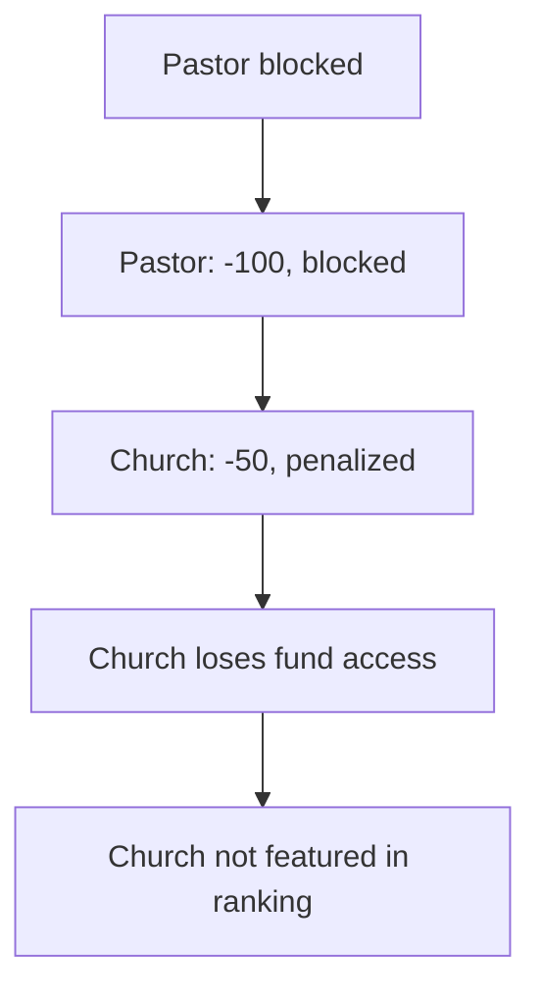

# R-#164: Church and Pastor Reputation System

Implement a reputation system for churches and pastors based on their activities and conduct within the community, including negative reputation for serious offenses.

## Dependencies
- R-#152 (Profiles of Church / GD Cluster)
- R-#154 (Ranking de Clústeres y Países)
- R-#161 (Global Disciples Course)
- R-#163 (Referral Program)

---

## 1. Reputation Overview

### 1.1 Two Types of Reputation

| Type | Affects | Purpose |
|------|---------|---------|
| **Positive reputation** | Churches and pastors | Rewards activity and engagement |
| **Negative reputation** | Pastors (and churches by extension) | Penalizes serious offenses |

### 1.2 Negative Reputation Causes

| Cause | Description | AFFECTS | Penalty |
|-------|-------------|---------|---------|
| **Zionism** | Evidence of zionist symbols in church or zionist preaching | Pastor | -100 (blocked) |
| **Dishonesty** | Proven dishonesty (e.g., failure to account for funds) | Pastor | -100 (blocked) |
| **Sexual abuse** | Proven sexual abuse | Pastor | -100 (blocked) |
| **Future causes** | Other offenses as identified | Pastor | TBD |

---

## 2. Positive Reputation Metrics

### 2.1 Church Reputation (Positive)

| Activity | Points | Frequency |
|----------|--------|-----------|
| Church registered | +10 | One time |
| Pastor verified | +20 | One time |
| Course completed by member | +2 each | Per member |
| Cluster formed | +30 | One time |
| Referral (church to another) | +15 | Per referral |
| Donation received | +1 per $10 USDT | Ongoing |
| AEE participation | +20 | Per event |
| Report submitted | +5 | Per report |

### 2.2 Pastor Reputation (Positive)

| Activity | Points | Frequency |
|----------|--------|-----------|
| Pastor verified | +10 | One time |
| Course completed | +5 per course | Per course |
| Church members active | +1 per member | Per active member |
| Leadership role | +10 | Per cluster |
| Referral (pastor to another) | +20 | Per referral |

### 2.3 Inactivity Penalty

**Definition of "active":** A pastor or church is active in a given month if at least one of the following occurs:

- Completes a guide/course
- Submits a crossword
- Makes or receives a donation
- Participates in an AEE event
- Submits a report
- Any action logged in `userevent`

A month without any of the above = inactive.

| Inactive period | Penalty |
|-----------------|---------|
| 1 month | -2 |
| 3 months | -10 |
| 6 months | -30 |
| 12 months | Reset to 0 |

---

## 3. Negative Reputation (Serious Offenses)

### 3.1 Effects of Negative Reputation

| Reputation Level | Effect on Pastor | Effect on Church |
|------------------|------------------|------------------|
| **-100 (blocked)** | Cannot register on learn.tg; cannot be pastor of any church | Church becomes orphaned |
| **-50 (penalized)** | — | No church fund access; not featured in ranking |

### 3.2 Blocked Pastor Flow



### 3.3 Change of Pastor

| Scenario | Effect on Church |
|-----------|------------------|
| **Pastor removed (blocked)** | Church reputation resets to 0 (neutral) |
| **New pastor assumes** | Church adopts the new pastor's reputation |
| **Church becomes orphaned** | Reputation: 0 (no pastor) |

### 3.4 Appeal Process

| Step | Description |
|------|-------------|
| **1. Request** | Affected pastor submits appeal |
| **2. Evidence** | Pastor presents evidence of change or accountability |
| **3. Review** | pdJ reviews the case |
| **4. Decision** | pdJ decides to restore reputation (to 0 or positive) |

---

## 4. Reputation Tiers

| Tier | Points Range | Badge |
|------|--------------|-------|
| Bronze | 1-49 | 🥉 |
| Silver | 50-99 | 🥈 |
| Gold | 100-199 | 🥇 |
| Platinum | 200+ | 💎 |

---

## 5. Reputation Display

### 5.1 Church Page
```
## Iglesia Centro de Paz
**Reputación:** 85 (🥈 Silver)
**Pastor:** Juan Pérez
**Miembros activos:** 12
**Clúster:** Clúster Esperanza
```

### 5.2 Ranking
```
## Ranking de Iglesias
| Posición | Iglesia | Reputación | Nivel | País |
|----------|---------|------------|-------|------|
| 1 | Centro de Paz | 85 | 🥈 Silver | 🇸🇱 |
| 2 | Esperanza Viva | 72 | 🥈 Silver | 🇸🇱 |
```

### 5.3 Blocked Display
```
## Iglesia del Pastor Infractor
**Reputación:** -50 (⚠️ Penalizada)
**Pastor:** Bloqueado
**Estado:** No recibe fondos del fondo de iglesias
```

---

## 6. Database Schema

### 6.1 Pastor Reputation

```sql
CREATE TABLE pastorreputation (
    id SERIAL PRIMARY KEY,
    usuario_id INTEGER REFERENCES usuario(id) NOT NULL,
    reputation_score INTEGER DEFAULT 0,
    is_blocked BOOLEAN DEFAULT FALSE,
    block_reason VARCHAR(50), -- 'zionism', 'dishonesty', 'sexual_abuse', 'other'
    block_notes TEXT,
    blocked_at TIMESTAMP,
    unblocked_at TIMESTAMP,
    updated_at TIMESTAMP DEFAULT CURRENT_TIMESTAMP
);
```

### 6.2 Church Reputation

```sql
CREATE TABLE churchreputation (
    id SERIAL PRIMARY KEY,
    iglesia_id INTEGER REFERENCES iglesia(id) NOT NULL,
    reputation_score INTEGER DEFAULT 0,
    is_penalized BOOLEAN DEFAULT FALSE,
    penalized_reason VARCHAR(50), -- 'zionism', 'dishonesty', 'sexual_abuse', 'other'
    penalized_at TIMESTAMP,
    updated_at TIMESTAMP DEFAULT CURRENT_TIMESTAMP
);
```

### 6.3 Reputation History

```sql
CREATE TABLE reputationhistory (
    id SERIAL PRIMARY KEY,
    entity_type VARCHAR(20), -- 'pastor', 'church'
    entity_id INTEGER NOT NULL,
    previous_score INTEGER,
    new_score INTEGER,
    change_reason VARCHAR(100),
    changed_by INTEGER REFERENCES usuario(id),
    changed_at TIMESTAMP DEFAULT CURRENT_TIMESTAMP
);
```

---

## 7. Algorithm

### 7.1 Church Reputation Calculation

Aggregated from the metrics defined in §2.1 (church registration, pastor verified, courses completed, cluster formed, referrals, donations, AEE participation, reports) minus inactivity penalty (§2.3) and pastor penalty if pastor is blocked (§3.1).

### 7.2 Pastor Reputation Calculation

Aggregated from the metrics defined in §2.2 (pastor verified, courses completed, active members, leadership role, referrals) minus inactivity penalty (§2.3). Returns -100 immediately if pastor is blocked (§3.1).

---

## 8. API Endpoints

| Endpoint | Method | Description |
|----------|--------|-------------|
| `/api/reputation/pastor/:id` | GET | Public | Get pastor reputation |
| `/api/reputation/church/:id` | GET | Public | Get church reputation |
| `/api/reputation/pastor/:id/block` | POST | Admin | Block a pastor (serious offense) |
| `/api/reputation/pastor/:id/unblock` | POST | Admin | Unblock a pastor (appeal approved) |
| `/api/reputation/pastor/:id/appeal` | POST | User | Submit appeal |
| `/api/reputation/history/:type/:id` | GET | Public | Get reputation history |

---

## 9. Acceptance Criteria

- [ ] Positive reputation metrics are tracked
- [ ] Negative reputation can be applied for serious offenses
- [ ] Reputation tiers are displayed
- [ ] Church inherits pastor's negative reputation
- [ ] Church resets to 0 when pastor is removed
- [ ] Blocked pastors cannot register or be pastors
- [ ] Appeal process works
- [ ] Reputation history is logged
- [ ] Inactivity penalties are applied

---

## 10. Out of Scope

- Reputation-based rewards
- Reputation appeals automation (manual review)
- Real-time reputation updates

---

> *"But the fruit of the Spirit is love, joy, peace, forbearance, kindness, goodness, faithfulness, gentleness and self-control."* (Galatians 5:22-23)


---

**Created:** 2026-06-29
**Status:** Pendiente
