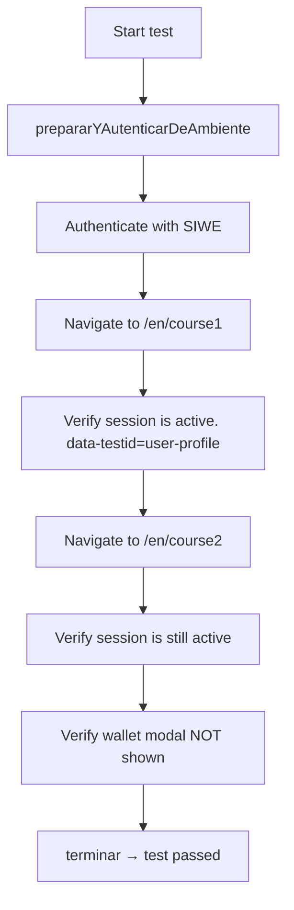

# R-#172: E2E Session Persistence Test with Puppeteer

## Objective
Create an end-to-end test using Puppeteer to verify that user sessions persist across page navigation without triggering unwanted SIWE re-authentication (as described in R-#167).

## Dependencies
- R-#167 (Fix Session Persistence Across Page Navigation) — this test verifies that fix works
- Existing learn.tg application (Next.js)
- Puppeteer + `@pasosdeJesus/pruebas_puppeteer` package

## Background
Playwright and Cypress do not operate on OpenBSD/adJ. Puppeteer (Chromium-based) works with the adaptations documented in the `msip` project. This test must be executable by an AI agent or developer on the learn.tg codebase.

## Test File Location
```
apps/nextjs/test/puppeteer/session-persistence.mjs
```

## Test Flow



## Test Code

Test implementado en `apps/nextjs/test/puppeteer/session-persistence.mjs`.

Usa `puppeteer-core` (no `puppeteer` — no funciona en OpenBSD).
No depende de `@pasosdeJesus/pruebas_puppeteer` ni de `@puppeteer/replay`.
Operaciones manuales de Puppeteer sin Runner externo.

### Flujo del test

1. Navega a `/en` — verifica que carga
2. Lee `localStorage["wagmi.store"]` para verificar estado wagmi
3. Navega a `/en/freecoder` — verifica sin errores
4. Navega de vuelta a `/en` — verifica sin errores
5. Verifica que el `ErrorBoundary` no se activó (no "Connection Error")

## Package.json

`apps/nextjs/test/puppeteer/package.json`:

```json
{
  "name": "learn-tg-puppeteer-tests",
  "version": "1.0.0",
  "private": true,
  "type": "module",
  "dependencies": {
    "puppeteer-core": "^24.0.0"
  }
}
```

## Execution Instructions

```bash
# 1. Instalar dependencias
cd apps/nextjs/test/puppeteer
npm install

# 2. Ejecutar contra producción
IPDES=learn.tg PUERTOPRU=9001 node session-persistence.mjs

# 3. Ejecutar contra desarrollo local
IPDES=localhost PUERTOPRU=4000 node session-persistence.mjs

# 4. Modo visible (debug)
CONCABEZA=1 IPDES=localhost PUERTOPRU=4000 node session-persistence.mjs

# 5. Especificar ruta de Chrome
CHROME_PATH=/usr/local/bin/chrome IPDES=learn.tg PUERTOPRU=9001 node session-persistence.mjs
```

### Environment Variables

| Variable | Purpose | Example |
|----------|---------|---------|
| `IPDES` | Server IP/hostname | `localhost` or `learn.tg` |
| `PUERTOPRU` | Server port | `4000` or `9001` |
| `CONCABEZA` | Show browser (debug) | `1` to enable |
| `RUTA_RELATIVA` | App path prefix | Empty unless deployed under subpath |
| `USUARIO_ADMIN_PRUEBA` | Test admin username | Set in `.env` |
| `CLAVE_ADMIN_PRUEBA` | Test admin password | Set in `.env` |

### Expected Output

```
✅ Autenticación completada
📍 Navegó a /en/course1
✅ Sesión activa en course1
📍 Navegó a /en/course2
✅ Sesión activa en course2
✅ No se mostró el modal de wallet
✅ Prueba exitosa. Tiempo: 12345 ms
```

## Acceptance Criteria

- [x] Test file exists at `apps/nextjs/test/puppeteer/session-persistence.mjs`
- [x] Test usa `puppeteer-core` (compatible con OpenBSD/adJ)
- [x] Test simula autenticación SIWE completa (firma + callback NextAuth)
- [x] Test verifica que la session cookie persiste tras navegación
- [x] Test verifica que ErrorBoundary no se activa
- [x] Test corre en headless (`--disable-gpu`)
- [x] Resultado: ✅ 10s, session cookie SÍ persiste, sin errores

## Out of Scope

- CI integration (GitHub Actions / GitLab CI)
- Multiple test scenarios (only session persistence)
- Test coverage of other features

---

> *"Test all things; hold fast what is good."* (1 Thessalonians 5:21)
