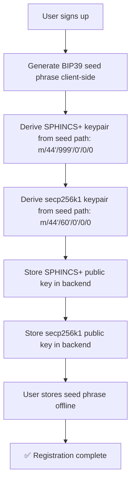
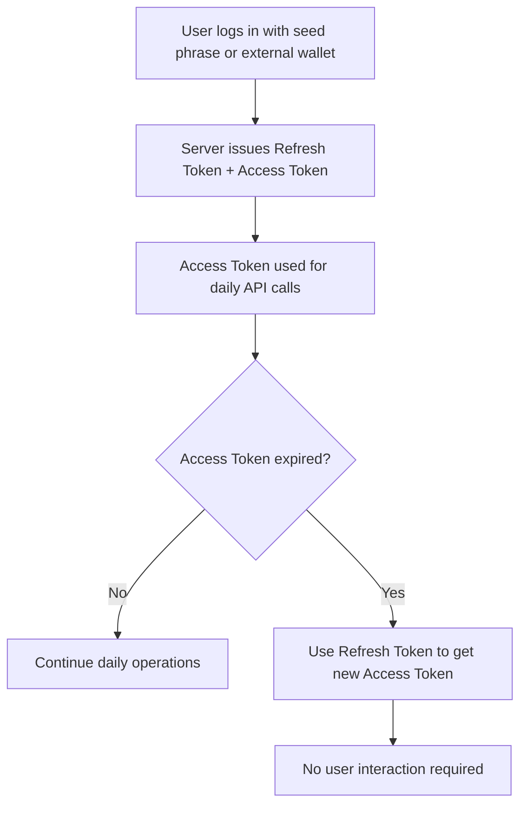

# R-#176: Unified Post-Quantum Identity & Wallet for pdJ Ecosystem

## Objective

Replace the dependency on `personal_sign` for encryption and authentication by introducing a unified, post-quantum‑ready identity system. A single BIP39 seed phrase derives both:

- A **SPHINCS+ keypair** (NIST‑standardized, hash‑based) for:
  - **Encryption of profile data** (replacing the ECDSA‑derived DEK in R‑#153)
  - **Authentication** (replacing SIWE for daily login, in combination with long‑lived tokens)
- A **secp256k1 keypair** for **on‑chain transactions** (wallet functionality).

This creates a single, self‑sovereign identity that works **with or without an external wallet** (OneKey, MetaMask, MiniPay) and is **post‑quantum secure**.

---

## Motivation

- **R‑#153 (Encrypted Profile Data)** depends on `personal_sign` (ECDSA over secp256k1), which is:
  - **Not post‑quantum safe** (Shor’s algorithm can recover the private key).
  - **Not supported by MiniPay**, creating a blocking dependency for users in Sierra Leone.
- **R‑#167 (Session Persistence)** highlights the fragility of SIWE + NextAuth + RainbowKit.
- **MiniPay** is the primary wallet for Sierra Leone; it does not support `personal_sign`, but it does support standard `write` transactions.
- **Passkeys (R‑#140)** are not compatible with MiniPay and add complexity without solving the root problem.
- **External wallets** (OneKey, MetaMask) are not universally available and create friction for new users.
- **Post‑quantum cryptography** is a long‑term requirement; SPHINCS+ (NIST‑standardized) is a conservative, well‑understood choice.

---

## Design Overview

### Core Principle

**A single BIP39 seed phrase derives both the user’s post‑quantum identity (SPHINCS+) and their standard blockchain wallet (secp256k1).** This eliminates the need to store or encrypt one key with another — both are deterministically derived from the same seed.

### Who Uses What

| User Scenario | External Wallet (OneKey/MiniPay) | pdJ‑Integrated Wallet |
| :--- | :--- | :--- |
| **Has external wallet** | ✅ Uses it for on‑chain transactions. | ❌ Not activated. The system uses the external wallet's secp256k1 address for on‑chain operations. |
| **No external wallet** | ❌ Cannot use. | ✅ The system generates a secp256k1 wallet from the seed phrase, giving the user a full wallet for the pdJ ecosystem. |

**In both cases**, the user’s **SPHINCS+ keypair** is always generated from the seed phrase, providing post‑quantum encryption and authentication independent of any external wallet.

---

## Detailed Technical Design

### 1. Registration & Key Generation

#### 1.1 User Signs Up

When a user creates an account (with or without an external wallet), the system generates a **BIP39 seed phrase** (12 or 24 words) client‑side.



#### 1.2 External Wallet Linking (Optional)

If the user already has an external wallet, the system can also:
1.  **Derive the secp256k1 address** from the seed phrase and store it.
2.  **Link the external wallet address** to the user account. The user executes a `write` transaction (MiniPay‑compatible) to register the secp256k1 public key derived from the seed phrase, **linking** the external wallet to the same identity.

---

### 2. SPHINCS+ Keypair

#### 2.1 Purpose
- **Authentication:** The user signs a challenge (nonce) with the private key; the backend verifies with the stored public key.
- **Encryption:** The user’s DEK (Data Encryption Key) is encrypted with their public key. The private key is used to decrypt it locally.

#### 2.2 Key Generation
- **Algorithm:** SLH‑DSA (SPHINCS+) — NIST‑standardized, hash‑based, conservative.
- **Path:** `m/44'/999'/0'/0/0` (using a custom purpose index to avoid collision with standard wallet paths).
- **Implementation:** `@noble/post-quantum` (JavaScript, ~15 KB gzipped) or `mldsa-wasm` (if speed is prioritized for signatures).

#### 2.3 Storage
- **Public Key:** Stored in the backend (`billetera_usuario.spx_public_key`).
- **Private Key:** Never stored; derived on‑demand from the seed phrase on the user’s device.

#### 2.4 Size & Performance
- **SPHINCS+‑128s:** ~8 KB signature, ~32 bytes public key.
- **SPHINCS+‑128f:** ~17 KB signature, faster verification.
- **Lazy loading:** The library is loaded only when the user needs to register or authenticate.

---

### 3. secp256k1 Keypair (Wallet)

#### 3.1 Purpose
- **On‑chain transactions:** The standard Ethereum/Celo wallet used for donations, premium course payments, and any future on‑chain interactions.
- **No external wallet required:** If the user does not have an external wallet (OneKey, MiniPay), this keypair **becomes their wallet**.

#### 3.2 Key Generation
- **Algorithm:** secp256k1 (ECDSA) — the Ethereum/Celo standard.
- **Path:** `m/44'/60'/0'/0/0` (standard Ethereum BIP44 path).
- **Implementation:** `viem/accounts` or `ethers` for key derivation and signing.

#### 3.3 Storage
- **Public Key / Address:** Stored in the backend (`billetera_usuario.wallet_address`).
- **Private Key:** Never stored; derived on‑demand from the seed phrase on the user’s device.

#### 3.4 Address Derivation
The user’s address is the standard Ethereum/Celo address derived from the secp256k1 public key. This address can be used in all existing pdJ contracts (LearnTGVaults, SLEARN, PasosDeJesusCredentials).

---

### 4. Authentication Flow (Daily Login)

The system uses a **token‑based approach** to avoid signing with SPHINCS+ on every request.



#### 4.1 Refresh Token
- **Duration:** 30 days (configurable).
- **Storage:** HttpOnly cookie (secure, not accessible via JavaScript).
- **Revocation:** Can be revoked by the user or admin.

#### 4.2 Access Token
- **Duration:** 24 hours (configurable).
- **Storage:** Memory (React state) or localStorage.
- **Renewal:** Automatically refreshed using the Refresh Token.

#### 4.3 Signing with SPHINCS+
The user only signs a challenge with their SPHINCS+ private key:
- **On initial registration** (to prove they control the seed phrase).
- **When their Refresh Token is revoked** (e.g., they log out manually or on a new device).

All other operations use the token system.

---

### 5. Encryption of Profile Data (Replaces R‑#153)

#### 5.1 Sensitive Data
- Pastor name, WhatsApp, ID documents, government registration, etc.

#### 5.2 Encryption Flow (Server-Side)
1.  **Server generates a DEK** (Data Encryption Key) using `crypto.randomBytes(32)`.
2.  **User’s SPHINCS+ public key** (stored in the backend) is used to encrypt the DEK.
3.  The **data is encrypted** with the DEK (AES‑256‑GCM).
4.  The encrypted data and the encrypted DEK are stored in the `usuario` table.

#### 5.3 Decryption Flow (Client-Side)
1.  User authenticates with their seed phrase (or PIN/biometric).
2.  The application **derives the SPHINCS+ private key** locally.
3.  The private key decrypts the DEK.
4.  The DEK decrypts the profile data.

**This eliminates the dependency on `personal_sign` and is post‑quantum secure.**

---

### 6. Database Changes

```sql
-- Add to usuario table
ALTER TABLE usuario ADD COLUMN spx_public_key TEXT;
ALTER TABLE usuario ADD COLUMN encrypted_data JSONB;
ALTER TABLE usuario ADD COLUMN encrypted_dek TEXT;
ALTER TABLE usuario ADD COLUMN encryption_version INTEGER DEFAULT 1;

-- Add wallet address for integrated wallet (if user has no external wallet)
ALTER TABLE billetera_usuario ADD COLUMN wallet_address TEXT; -- secp256k1 address

-- Add to billetera_usuario (for linking external wallets)
ALTER TABLE billetera_usuario ADD COLUMN external_wallet_address TEXT;
ALTER TABLE billetera_usuario ADD COLUMN wallet_type VARCHAR(20); -- 'external' or 'integrated'
```

---

### 7. API Endpoints (New)

| Endpoint | Method | Description |
| :--- | :--- | :--- |
| `/api/auth/seed/register` | POST | Register a new seed phrase (generates SPHINCS+ and secp256k1 keypairs) |
| `/api/auth/seed/login` | POST | Authenticate with seed phrase; issues Refresh + Access Tokens |
| `/api/auth/seed/recover` | POST | Recover identity from seed phrase (derives keys and restores session) |
| `/api/auth/seed/link-wallet` | POST | Link external wallet to the existing identity (MiniPay‑compatible `write` transaction) |
| `/api/auth/refresh` | POST | Refresh Access Token using Refresh Token |

---

### 8. Security Considerations

| Threat | Mitigation |
| :--- | :--- |
| **Loss of seed phrase** | No recovery possible. User must store it securely offline (same as any crypto wallet). |
| **Compromised Access Token** | Short expiration (24h) and ability to revoke. |
| **Compromised Refresh Token** | HttpOnly cookie, can be revoked by user or admin. |
| **Compromised device** | All keys are derived from the seed phrase, which is never stored. An attacker would need the seed phrase itself. |
| **Phishing** | SPHINCS+ authentication is bound to the domain; seed phrase entry is only requested for recovery or login. |
| **Post‑quantum** | SPHINCS+ is NIST‑standardized and considered secure against quantum attacks. |

---

### 9. Acceptance Criteria

- [ ] A user can register without an external wallet.
- [ ] A single BIP39 seed phrase generates both a SPHINCS+ keypair and a secp256k1 wallet.
- [ ] The secp256k1 wallet can be used for on‑chain transactions (donations, payments) without an external wallet.
- [ ] Users with an external wallet (MiniPay, OneKey) can link it to the same identity.
- [ ] Profile data encryption uses SPHINCS+ instead of `personal_sign`.
- [ ] Authentication uses Refresh + Access Tokens; SPHINCS+ signature is only required for registration and token renewal.
- [ ] All operations work in PWA mode and on mobile browsers (Chrome, Safari).
- [ ] The system is compatible with MiniPay (uses `write` transactions for linking).
- [ ] The seed phrase is shown once and the user must acknowledge they have saved it.
- [ ] Recovery flow works: entering the seed phrase restores both keys and access.

---

## 10. Out of Scope

- **Post‑quantum signatures on‑chain:** This design uses secp256k1 for on‑chain transactions; SPHINCS+ is used off‑chain for encryption and authentication.
- **Migrating existing users:** A separate migration path will be designed in a follow‑up issue.
- **Support for other post‑quantum algorithms (e.g., ML‑DSA):** Initially, only SPHINCS+ is used; other algorithms can be added later.

---

### 11. Dependencies

- **Libraries:** `@noble/post-quantum`, `viem/accounts`, `bip39`
- **Backend:** NextAuth.js (for token management), PostgreSQL (for key storage)
- **Frontend:** React, PWA support

---

### 12. References

- [R‑#140: Passkey Authentication](#) (replaced by this design)
- [R‑#153: Encrypted Profile Data](#) (upgraded to use SPHINCS+)
- [R‑#166: Post‑Quantum Key Management](#) (merged into this design)
- [R‑#167: Session Persistence](#) (resolved by token‑based authentication)
- [R‑#168: RainbowKit QR crash](#) (resolved by removing dependency on RainbowKit for daily authentication)

---

### 13. Status

**Status:** Draft / Ready for Review  
**Phase:** Phase 2+ (after MVP, but before scaling)

---

> *"Behold, I am doing a new thing; now it springs forth, do you not perceive it?"* (Isaiah 43:19)
