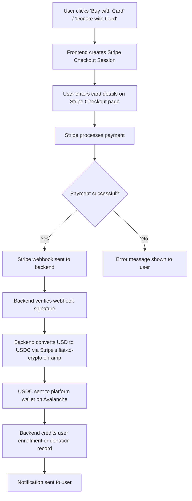

# R-#178: Integrate Stripe for Fiat Payments (Premium Courses & Donations)

## Objective

Integrate Stripe to accept fiat payments (credit/debit cards) for premium courses on learn.tg and donations for both learn.tg and sivel.xyz. This enables donors and students who do not use cryptocurrencies to participate in the ecosystem, while automatically converting fiat to stablecoins (USDC) on a low-cost blockchain (Avalanche) for on-chain distribution.

## Motivation

- **Expand donor base:** Many potential supporters (especially in the US) prefer using credit cards and do not want to interact with cryptocurrencies.
- **Premium course revenue:** Users who do not have SLEARN or USDT can pay for premium courses with a credit card.
- **Global accessibility:** Stripe supports payments in over 135 countries and 135+ currencies, making it accessible to a wide audience.
- **Operational efficiency:** Stripe handles KYC/AML, fraud prevention, and payment processing, reducing the operational burden.
- **Future-proofing:** This integration is a stepping stone for accepting payments for services from sivel.xyz.

## Overview

### Flow



### Architecture

| Component | Description |
| :--- | :--- |
| **Frontend** | Adds "Pay with Card" button next to existing crypto payment options. Creates a Stripe Checkout Session. |
| **Stripe** | Processes the card payment. Sends webhook events to the backend. |
| **Backend** | Handles Stripe webhooks, converts fiat to USDC (using Stripe's onramp or a partner like MNEE), and records the payment in the database. |
| **Blockchain (Avalanche)** | Receives the USDC from the conversion. This is the settlement layer for fiat payments. |
| **Bridge** | Optionally bridges USDC from Avalanche to Celo if needed for on-chain operations (scholarships, etc.). |

## Scope

### Phase 1: MVP (Post-MVP, after Global Disciples launch)

#### 1.1 Stripe Account Setup

- [ ] Create a Stripe account as a **Sole Proprietor** (or LLC if revenue exceeds $50k/year).
- [ ] Provide required KYC information (SSN/ITIN, ID, bank account).
- [ ] Complete business profile: describe learn.tg as an educational platform and sivel.xyz as a human rights documentation project.

#### 1.2 Frontend Integration

- [ ] Add "Pay with Card" option on:
    - [ ] Course checkout page (for premium courses).
    - [ ] Donation modal (for learn.tg and sivel.xyz).
- [ ] Create a Stripe Checkout Session with:
    - `amount`: in USD cents.
    - `metadata`: `{ userId, courseId, donationType, destination }`.
    - `success_url`: `https://learn.tg/payment-success`.
    - `cancel_url`: `https://learn.tg/payment-cancel`.
- [ ] Redirect user to Stripe Checkout page.

#### 1.3 Backend Webhook Handling

- [ ] Create a Stripe webhook endpoint: `/api/stripe/webhook`.
- [ ] Verify webhook signature using `stripe.webhooks.constructEvent()`.
- [ ] Handle `checkout.session.completed` event:
    - [ ] Extract metadata (userId, courseId, donationType).
    - [ ] Convert USD amount to USDC using Stripe's fiat-to-crypto onramp (or MNEE).
    - [ ] Send USDC to the platform wallet on Avalanche.
    - [ ] Record the payment in the `transaction` table:
        - `type`: 'course_payment' or 'donation'.
        - `crypto`: 'USDC'.
        - `amount`: USDC amount.
        - `wallet`: platform wallet address.
        - `metadata`: `{ stripe_session_id, course_id, donation_destination }`.
- [ ] Handle `checkout.session.expired` and `payment_intent.payment_failed` events.

#### 1.4 Database Changes

```sql
-- Add new columns to the transaction table
ALTER TABLE transaction ADD COLUMN stripe_session_id TEXT;
ALTER TABLE transaction ADD COLUMN fiat_amount DECIMAL(10,2);
ALTER TABLE transaction ADD COLUMN fiat_currency VARCHAR(3) DEFAULT 'USD';
ALTER TABLE transaction ADD COLUMN payment_method VARCHAR(20) DEFAULT 'stripe';

-- Add new table for Stripe sessions
CREATE TABLE stripe_session (
    session_id VARCHAR(100) PRIMARY KEY,  -- Stripe session ID
    usuario_id INTEGER REFERENCES usuario(id),
    status VARCHAR(20) DEFAULT 'pending', -- pending, completed, failed
    metadata JSONB,
    created_at TIMESTAMP DEFAULT CURRENT_TIMESTAMP
);
```

#### 1.5 Settlement & Bridging

- [ ] Choose a settlement blockchain:
    - **Option A: Avalanche** (recommended).
    - **Option B: Celo**.
- [ ] Implement conversion: use Stripe's fiat-to-crypto onramp (if available) or a partner like MNEE Pay.
- [ ] Optionally bridge USDC from Avalanche to Celo using a bridge (e.g., Celer Bridge) if on-chain operations require Celo.

### Phase 2: Future Extensions

- [ ] **Recurring donations** for sivel.xyz.
- [ ] **Payment for services** from sivel.xyz (e.g., data verification).
- [ ] **Multi-currency support** (EUR, GBP, etc.).
- [ ] **Link Stripe payments directly to SLEARN minting** (user pays with card → SLEARN is minted).

## Costs & Fees

| Cost Element | Estimated Fee | Notes |
| :--- | :--- | :--- |
| Stripe processing fee | 2.9% + $0.30 per transaction | Standard Stripe fee for US cards. |
| Fiat-to-crypto conversion | 0.5-1.5% | Depending on the partner (MNEE, etc.). |
| Bridge fee (Avalanche → Celo) | ~$0.00091 | Minimal if using Celer Bridge. |
| Network fee (Avalanche) | ~$0.15 | Sending USDC. |
| **Total per transaction (est.)** | **~3.5-4.5% + $0.30** | |

## Security Considerations

| Threat | Mitigation |
| :--- | :--- |
| Stripe webhook spoofing | Verify webhook signature with Stripe's library. |
| Double spending | Store `stripe_session_id` and mark as used. |
| Unauthorized access | Webhook endpoint uses no auth; relies on signature verification. |
| Man-in-the-middle | All communication over HTTPS. |

## Acceptance Criteria

- [ ] Users can purchase a premium course with a credit/debit card.
- [ ] Users can donate to learn.tg or sivel.xyz with a credit/debit card.
- [ ] Payments are recorded in the `transaction` table with Stripe session ID.
- [ ] Fiat amount is converted to USDC and sent to the platform wallet on Avalanche.
- [ ] Webhook handles `checkout.session.completed`, `expired`, and `failed` events.
- [ ] Users receive a receipt and confirmation email.
- [ ] The integration works with the existing course enrollment and donation systems.
- [ ] All Stripe webhooks are verified for authenticity.

## Out of Scope

- Full multi-currency support (initial scope: USD only).
- Recurring donations (Phase 2).
- Integration with sivel.xyz services (Phase 2).
- Direct SLEARN minting from card payments (Phase 2).

## Dependencies

- Stripe account (Sole Proprietor or LLC).
- Stripe secret key and webhook secret.
- Avalanche wallet for receiving USDC.
- Bridge infrastructure (Celer Bridge or similar).

## Related Issues

- R-#128 (Premium Course Payments)
- R-#156 (Donation System)

## Notes

- **Choose Avalanche as the settlement network** due to Stripe's indirect support, low fees, and cheap bridge to Celo.
- **Bridge USDC to Celo** only if on-chain operations (scholarships, etc.) require Celo. Otherwise, keep funds on Avalanche.
- **Stripe Checkout** is recommended over Elements for the MVP because it handles the entire payment flow, including mobile responsiveness.

---

> *"For which of you, intending to build a tower, does not sit down first and count the cost, whether he has enough to finish it?"* (Luke 14:28)
