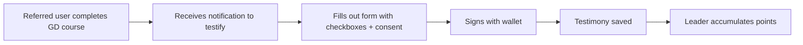

# R-#219: Testimony system for GD completers

Testimony system for Global Disciples completers to attest to their leader's
impact. **Separado de REQ/163** (referral rewards): los testimonios son un
sistema de verificación social con su propio ciclo (diseño de privacidad,
moderación, consentimiento) y no deben bloquear la implementación de las
recompensas de referidos.

> **Relación con REQ/163:** el referido que completa el curso GD recibe la
> invitación a testificar (acción de posventa del programa de referidos);
> las **recompensas de referidos** viven en 163. Ver referencias mutuas.

---

## 1. Purpose

When a referred user completes the Global Disciples course, they can fill out a
**testimony form** attesting to the leader's impact. Used to:

1. Calculate the leader's score for the **Program Director** role.
2. Verify the leader's missionary activity.
3. Reward leaders with additional points.

## 2. Privacy-first (requisito de diseño, 2026-08-29)

En países con persecución, atestiguar públicamente el impacto de un líder
vincula **líder ↔ referido ↔ iglesia** — el mismo riesgo de REQ/164 y REQ/155.

- **Seudonimato**: el testimonio NO se publica vinculado a la identidad real
  del testigo ni del líder (solo agregados de score).
- **Consentimiento**: el testigo elige si su testimonio es público (sin
  persecución) o privado (solo score agregado).
- **Verificación sin exposición**: verificar que el testigo completó el curso
  (#161) sin hacer pública la relación.
- Alineado con la capa de identidad seudónima (motor `pq-wallet`, REQ/166/176).

## 3. Testimony Form

When a referred student completes the Global Disciples course, they receive a
notification to "Testify for your leader."

| Field | Type | Description |
|-------|------|-------------|
| `presented_christ` | Checkbox | The leader introduced me to Christ for the first time |
| `discipled` | Checkbox | The leader discipled me (taught me to follow Christ) |
| `came_mission` | Checkbox | The leader came on a mission trip to my area |
| `invited_event` | Checkbox | The leader invited me to a Bible study/event |
| `helped_faith` | Checkbox | The leader helped me grow in my faith |
| `relationship` | Select | Pastor, Group Leader, Friend, Family, Other |
| `other_relationship` | Text | If "Other" is selected |
| `comments` | Textarea | Additional comments (optional) |
| `public` | Boolean | Consentimiento: público vs solo score agregado (privacy, §2) |

## 4. Testimony Flow



## 5. Testimony Database

```sql
CREATE TABLE testimonies (
    id SERIAL PRIMARY KEY,
    leader_id INTEGER REFERENCES usuario(id) NOT NULL,
    witness_id INTEGER REFERENCES usuario(id) NOT NULL,
    course_id INTEGER,                      -- Which GD course (for future multi-course support)
    presented_christ BOOLEAN DEFAULT FALSE,
    discipled BOOLEAN DEFAULT FALSE,
    came_mission BOOLEAN DEFAULT FALSE,
    invited_event BOOLEAN DEFAULT FALSE,
    helped_faith BOOLEAN DEFAULT FALSE,
    relationship VARCHAR(50),
    other_relationship TEXT,
    comments TEXT,
    public BOOLEAN DEFAULT TRUE,            -- Privacy-first (§2): consentimiento
    signature_wallet VARCHAR(42) NOT NULL,
    created_at TIMESTAMP DEFAULT CURRENT_TIMESTAMP,
    UNIQUE(leader_id, witness_id)
);
```

## 6. Testimony Score (Program Director Selection)

| Criterion | Points |
|-----------|--------|
| Presented Christ | +10 |
| Discipled | +8 |
| Came on mission | +6 |
| Invited to event | +4 |
| Helped grow in faith | +4 |
| Is my pastor | +5 |
| Is my group leader | +3 |

```typescript
// lib/leader-score.ts
export function calculateLeaderScore(testimonies: Testimony[]): number {
  let score = 0
  for (const t of testimonies) {
    if (t.presented_christ) score += 10
    if (t.discipled) score += 8
    if (t.came_mission) score += 6
    if (t.invited_event) score += 4
    if (t.helped_faith) score += 4
    if (t.relationship === 'pastor') score += 5
    if (t.relationship === 'group_leader') score += 3
  }
  return score
}
```

## 7. API

| Route | Method | Auth | Description |
|-------|--------|------|-------------|
| `/api/testimony` | POST | Yes (wallet-signed) | Submit testimony for a leader |
| `/api/testimony/:id` | GET | Yes | Get testimony details (respects `public`/seudonimato) |
| `/api/testimony/leader/:id` | GET | Leader | Aggregate score + list (private) |

## 8. Implementation phases

| Phase | Description | Depends on |
|-------|-------------|------------|
| 1 | Migration: `testimonies` table | — |
| 2 | `/api/testimony` — submit (wallet-signed, consent) | Phase 1, #161 |
| 3 | `calculateLeaderScore` + Program Director view | Phase 2, REQ/154 (ranking personal) |
| 4 | Notification "Testify for your leader" (from 163 flow) | Phase 2, REQ/163 |

---

**Created:** 2026-08-29
**Status:** Pendiente
**Motor:** core (plataforma base; el score alimenta el ranking personal de gdcluster)
