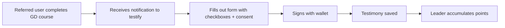

# R-#219: Testimony system for GD completers

Testimony system for Global Disciples completers to attest to their leader's
impact. **Separate from https://github.com/pasosdeJesus/learn.tg/issues/163** (referral rewards): testimonies are a
social verification system with its own cycle (privacy design,
moderation, consent) and must not block the implementation of the
referral rewards.

> **Relation to https://github.com/pasosdeJesus/learn.tg/issues/163:** the referred user who completes the GD course receives the
> invitation to testify (a post-sale action of the referral program);> the **referral rewards** live in 163. See the cross-references.

---

## 1. Purpose

When a referred user completes the Global Disciples course, they can fill out a
**testimony form** attesting to the leader's impact. Used to:

1. Calculate the leader's score for the **Program Director** role.
2. Verify the leader's missionary activity.
3. Reward leaders with additional points.

## 2. Privacy-first (design requirement, 2026-08-29)

In a restricted region (region type 2), publicly attesting to a leader's impact
links **leader ↔ referred user ↔ church** — the same risk as https://github.com/pasosdeJesus/learn.tg/issues/164 and https://github.com/pasosdeJesus/learn.tg/issues/155.

- **Pseudonymity**: the testimony is NOT published linked to the real identity
  of the witness or the leader (only aggregate scores).
- **Consent**: the witness chooses whether their testimony is public (region
  type 1) or private (aggregate score only).
- **Verification without exposure**: verify that the witness completed the course
  (#161) without making the relationship public.
- Aligned with the pseudonymous identity layer (`pq-wallet` engine, https://github.com/pasosdeJesus/learn.tg/issues/166/176).

## 3. Testimony Form

When a referred student completes the Global Disciples course, they receive a
notification to "Testify for your leader."

| Field | Type | Description |
|-------|------|-------------|
| `presented_christ` | Checkbox | The leader introduced me to Christ for the first time |
| `discipled` | Checkbox | The leader discipled me (taught me to follow Christ) |
| `came_mission` | Checkbox | The leader came on a mission trip to my area |
| `invited_event` | Checkbox | The leader invited me to a Bible study/event |
| `helped_faith` | Checkbox | The leader helped me grow in my faith |
| `relationship` | Select | Pastor, Group Leader, Friend, Family, Other |
| `other_relationship` | Text | If "Other" is selected |
| `comments` | Textarea | Additional comments (optional) |
| `public` | Boolean | Consent: public vs aggregate score only (privacy, §2) |

## 4. Testimony Flow



## 5. Testimony Database

```sql
CREATE TABLE testimonies (
    id SERIAL PRIMARY KEY,
    leader_id INTEGER REFERENCES usuario(id) NOT NULL,
    witness_id INTEGER REFERENCES usuario(id) NOT NULL,
    course_id INTEGER,                      -- Which GD course (for future multi-course support)
    presented_christ BOOLEAN DEFAULT FALSE,
    discipled BOOLEAN DEFAULT FALSE,
    came_mission BOOLEAN DEFAULT FALSE,
    invited_event BOOLEAN DEFAULT FALSE,
    helped_faith BOOLEAN DEFAULT FALSE,
    relationship VARCHAR(50),
    other_relationship TEXT,
    comments TEXT,
    public BOOLEAN DEFAULT TRUE,            -- Privacy-first (§2): consent
    signature_wallet VARCHAR(42) NOT NULL,
    created_at TIMESTAMP DEFAULT CURRENT_TIMESTAMP,
    UNIQUE(leader_id, witness_id)
);
```

## 6. Testimony Score (Program Director Selection)

| Criterion | Points |
|-----------|--------|
| Presented Christ | +10 |
| Discipled | +8 |
| Came on mission | +6 |
| Invited to event | +4 |
| Helped grow in faith | +4 |
| Is my pastor | +5 |
| Is my group leader | +3 |

```typescript
// lib/leader-score.ts
export function calculateLeaderScore(testimonies: Testimony[]): number {
  let score = 0
  for (const t of testimonies) {
    if (t.presented_christ) score += 10
    if (t.discipled) score += 8
    if (t.came_mission) score += 6
    if (t.invited_event) score += 4
    if (t.helped_faith) score += 4
    if (t.relationship === 'pastor') score += 5
    if (t.relationship === 'group_leader') score += 3
  }
  return score
}
```

## 7. API

| Route | Method | Auth | Description |
|-------|--------|------|-------------|
| `/api/testimony` | POST | Yes (wallet-signed) | Submit testimony for a leader |
| `/api/testimony/:id` | GET | Yes | Get testimony details (respects `public`/pseudonymity) |
| `/api/testimony/leader/:id` | GET | Leader | Aggregate score + list (private) |

## 8. Implementation phases

| Phase | Description | Depends on |
|-------|-------------|------------|
| 1 | Migration: `testimonies` table | — |
| 2 | `/api/testimony` — submit (wallet-signed, consent) | Phase 1, #161 |
| 3 | `calculateLeaderScore` + Program Director view | Phase 2, https://github.com/pasosdeJesus/learn.tg/issues/154 (ranking personal) |
| 4 | Notification "Testify for your leader" (from 163 flow) | Phase 2, https://github.com/pasosdeJesus/learn.tg/issues/163 |

---

**Created:** 2026-08-29
**Status:** Pending
**Revisión 2026-09-25 (código):** no hay tabla, modelo, ruta ni componente de testimonios
(`testimony`/`testimonio` no aparecen en el esquema ni en la app). **No cerrable:** el
sistema de testimonios para egresados de GD no está empezado.
**Engine:** core (base platform; the score feeds the gdcluster personal ranking)
