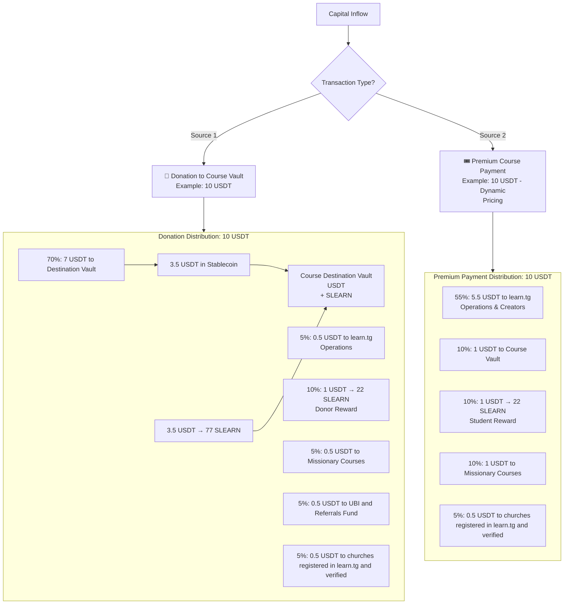
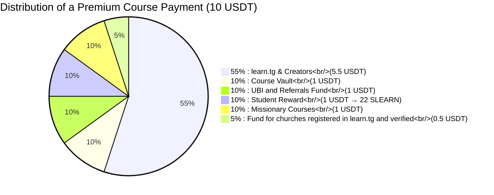
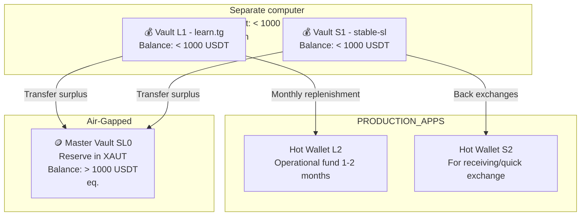

# SLEARN: Whitepaper
## A Utility Token for Community-Powered Learning

SLEARN is a utility token that transforms learning and donations into scholarships.
Every 10 USDT donated creates 10 scholarships; every student payment automatically
funds others' education. It's backed 1:1 by XAUT/USDT/CELO reserves and indexed to the 
Sierra Leone Leone for stability.

*Fundamental Disclaimer: SLEARN is a restricted-access utility token and a
digital tool for educational access within the pdJ ecosystem ([learn.tg](http://learn.tg),
[stable-sl.pdJ.app](http://stable-sl.pdJ.app) and [sivel.xyz](http://sivel.xyz)).
It is not an investment, a security, or a financial instrument regulated by any
authority. It is not a cryptocurrency for speculation and cannot be bought or
traded on external markets. Its value is indexed to the Leone (SLE) for internal
accounting stability. Users accept that cryptocurrency technology carries
inherent technical risks, which they use at their own discretion.*

---

## 1. Vision: Learn by Creating Value

[learn.tg](http://learn.tg) exists to democratise access to transformative
education. SLEARN is the engine of a new economy where every learning act
and every contribution generates digital value, which in turn unlocks more
education. We close the loop between donors and students in an automated
and transparent way.

Learn Through Games operates under a Christian framework that is not
exclusive – everyone is welcome to learn – but it is the compass that
guides the system’s design.

*“Take my yoke upon you and learn from me, for I am gentle and humble in
heart, and you will find rest for your souls.” (Matthew 11:29)*

---

## 2. What is SLEARN?

- **Digital utility token** – A unit of account that represents a future
  learning option inside learn.tg, which can be redeemed for Leones (SLE).
- **Meritocratic** – Earned by learning (completing guides), donating
  (to courses), or investing in yourself (paying for premium courses).
- **Practical use** – Used to pay for premium courses and, in Sierra Leone,
  it will be possible to exchange it for Leones (SLE) through our partner
  [stable-sl.pdJ.app](https://stable-sl.pdj.app/). That platform maintains
  a reserve vault that backs SLEARN; its total value can be checked on‑chain
  and verified to be greater than or equal to the amount issued and reported
  on the [learn.tg Transparency Dashboard](https://learn.tg/en/transparency).
- **Technical** – An ERC‑20 token on the Celo network, with 2 decimals and
  restricted transfer functions to guarantee its use as a tool, not a
  speculative asset.

---

## 3. The Economic Model: Automated Impact

The power of SLEARN lies not in its price, but in the automatic value cycle
it enables. Every transaction on the platform follows predefined, immutable
rules that fund education.

### 3.1. Fund Inflow and Distribution

The system is fed by two main sources: directed donations and premium course
payments. The diagram below illustrates the complete value flow, showing
how each dollar multiplies into learning opportunities.

#### 3.1.1 Concrete example of a 10 USDT donation (assuming 1 USD = 22 SLE)

1.  7 USDT go to the donated course vault: 3.5 USDT finance 3.5 scholarships
    (1 USDT each) and 3.5 USDT are converted into 77 SLEARN to finance
    77 scholarships (1 SLEARN each).
2.  0.5 USDT funds learn.tg operations.
3.  1 USDT for the donor as 22 SLEARN as credit for their own learning.
4.  0.5 USDT automatically support free missional courses.
5.  0.5 USDT feed the UBI (in CELO) and Referrals Fund for daily community rewards.
6.  0.5 USDT to the fund for churches registered in learn.tg and verified

#### 3.1.2 Example with a Premium Course Payment

The model also activates when a user pays to access an exclusive course.
The price is dynamic, adjusted according to the student’s country development
index, promoting fairness. A percentage of this payment is converted into
SLEARN for the paying student and is used to finance more scholarships.

##### Distribution of a 10 USDT premium course payment (example from Sierra Leone)

This mechanism ensures that every investment in one’s own education directly
contributes to platform sustainability, personal incentive, scholarship
creation, and the missional fund, creating a powerful virtuous cycle of
growth.

### 3.2. Use, Redemption and Sustainability

- **On‑platform use** – Users **burn** SLEARN to access premium courses.
- **Local redemption (future)** – In Sierra Leone, SLEARN may be exchanged
  for Leones (SLE) through our partner stable-sl.pdJ.app. This feature will
  be introduced **after** the token has established its primary utility as a
  medium of exchange for education. It is not a speculative “cash‑out” but a
  conversion to local currency for legitimate educational or personal needs,
  subject to reasonable limits and identity verification (published on the
  Transparency Dashboard).
- **Sustainability** – The system is circular. SLEARN issued for scholarships
  are burned when used, and the USDT backing is kept in auditable reserves.

### 3.3. The Role of stable-sl.pdJ.app: A Trust Bridge

For SLEARN to fulfil its promise of real‑world utility, it connects with the
economy of Sierra Leone through stable-sl.pdJ.app, a service that converts
digital assets to the national currency (SLE).

#### 3.3.1. Identity Verification, Access and Operation Limits

SLEARN uses a tiered KYC approach with progressive limits, detailed in Section 5.8:

1. **Tier 1 (100 SLE/day, ~US$5):** Users confirm funds are not from illegal sources.
2. **Tier 2 (200 SLE/day, ~US$10):** Orange Money name verification via cross-check.
3. **Tier 3 (200–400 SLE/day, ~US$20):** Enhanced verification via learn.tg + sivel.xyz ZK proofs of passport details.

Limits may evolve based on operational experience, but remain deliberately low.

#### 3.3.2. Cashback in SLEARN

For selling crypto in stable-sl.pdJ.app we propose to give some Cashback
in SLEARN (for example 0.05 SLEARN per USDT with additional Cashback for
each course certificate obtained limited at 0.1 SLEARN per USDT).

#### 3.3.3. Security and Operating Model

- **Escrow for USDT:** A smart contract acts as a neutral custodian, freezing
  the user’s USDT until the operator confirms receipt of SLE.
- **Execution with prior confirmation:** The user does not transfer funds until
  the operator confirms their availability.
- **Trust network:** The service is operated by a small group of trusted
  collaborators, aligned with the project’s values and mission.
- **Transparency:** Order status is recorded and verifiable. The reserve vault
  backing SLEARN is public and on‑chain.

---

## 4. Security and Custody Architecture

The integrity of community funds is paramount. We operate under a segmented
custody model with defined thresholds to minimise risks.

**Key policies:**

- **Reserve backing:** SLEARN is backed 1:1 by combined USDT (operational 
  liquidity) and XAUT (strategic reserve) holdings, auditable on-chain.
  
- **Custody model:** Three layers:
  1. **Hot wallets (L2/S2):** 1-2 months operational funds in USDT, CELO and SLEARN
  2. **Main vaults (L1/S1):** < 1,000 USDT equivalent, holds multiple assets 
     (USDT, CELO, SLEARN) for operations and exchanges
  3. **Master vault (SL0):** Air-gapped, XAUT only, > 1,000 USDT equivalent
  
- **Asset management:** Pasos de Jesús manages multi-asset operations 
  (CELO, USDT, SLEARN, GoodDollar, XAUT) through stable-sl.pdJ.app to 
  maintain liquidity and facilitate redemptions.
  
- **Excess reserves:** Holdings exceeding the 1:1 SLEARN backing requirement 
  fund platform operations, ecosystem development, and educational initiatives. 
  All usage is transparently reported.
  
- **Transparency:** All reserve balances are on-chain and independently verifiable.
---

## 5. Design Pillars and Governance

The design of SLEARN is based on fundamental principles that prioritise its
utility, transparency and alignment with the mission, above any speculative
financial dynamics.

### 5.1. Radical Transparency and On‑Chain Verification

All policies and thresholds are published on the
[Transparency Dashboard](https://learn.tg/en/transparency) and subject to
periodic review.

Reserve auditable on-chain; SLEARN always 1:1 backed by USDT + XAUT.
Any user can,at any time, independently verify that the value in this vault is always
greater than or equal to the total value of SLEARN in circulation (calculated
at the parity of 1 SLEARN = 1 SLE). This cross‑verification creates an open
and immutable solvency guarantee.

### 5.2. Functional Stability

While SLEARN reserves are denominated in XAUT to preserve long-term value against
monetary volatility, the token's educational purchasing power remains indexed to the
Leone (SLE) for functional clarity. In case of inflation in Sierra Leone we could
peg 1 SLEARN to 1/22 USDT to keep its value, because SLEARN is designed as a 
stable utility unit. Any surplus generated by reserve appreciation is not distributed
to individual holders, but is redirected by the operator according to the ecosystem's
priority needs — whether operational expenses of any project of the pdJ ecosystem, 
scholarship expansion, or strengthening of the UBI and Referrals Fund — always logged
transparently on the Dashboard. The gold backing protects the system's solvency; the
yield of that protection is reinvested into the community, not captured privately. 

### 5.3. Non-Speculative by Design
Restricted transfers; cannot be transferred between users and cannot be 
traded on exchanges.

### 5.4. Organic Issuance without Arbitrary Limit
Unlike most tokens, SLEARN has no predefined maximum supply (hard cap) and
incorporates no artificial deflationary mechanisms. This is a key philosophical
decision:

1.  **Value derives from utility, not scarcity:** The “value” of SLEARN is its
    purchasing power within the ecosystem (1 SLEARN = 1 SLE for redemption),
    backed by assets, not a market price.
2.  **Issuance is tied to real value creation:** New SLEARN enter circulation
    exclusively as a result of actions that add value to the system: learning,
    donating or paying for a premium course. It is a flow economy.
3.  **Balance is achieved through use:** SLEARN are destroyed (burned) when used
    to pay for a course or redeemed for SLE. This cycle of issuance through
    contribution and burning through use ensures that supply dynamically
    adjusts to real activity, without the need for artificial limits.
    A growing and sustainable supply is an indicator of an active and healthy
    community.

### 5.5. Local Impact with a Global Vision
Fixed % of revenue funds missional courses/

### 5.6. Fair Launch and Migration
No ICO, no private sale. First SLEARN migrated 1:1 from Learning Score.

### 5.7. Future Governance (Adaptive Model)
Phase 4: Community voting (users, donors, earners) with operator legal and technical veto.

### 5.8. Regulatory and Compliance Framework

SLEARN operates in Sierra Leone, where cryptocurrency is unregulated. Our KYC/AML
framework is transparent, proportional to risk, and respectful of privacy.

**KYC – Tiered Verification:**
- **Tier 1:** Basic account (100 SLE/day)
- **Tier 2:** Orange Money name match (200 SLE/day)
- **Tier 3:** Passport verification via sivel.xyz ZK proofs, integrated with learn.tg Profile Score (400 SLE/day max)

**AML:** Users attest via checkbox that funds are not from illegal sources.
Transaction monitoring flags unusual patterns for review.

flowchart TB
    %% ==================== DESCUBRIMIENTO ====================
    A[🌐 Tráfico de Entrada Iglesias · Redes · SEO · Referidos] --> B{¿Primera vez?}
    B -->|Sí| C[🎯 Landing: "Aprende · Crea · Multiplica"]
    B -->|No| D[🔐 Login directo]
    
    C --> E[📝 Registro gratuito learn.tg Profile Score]
    
    %% ==================== ONBOARDING EMOCIONAL ====================
    subgraph ONBOARDING ["ETAPA 1: BIENVENIDA CON PROPÓSITO"]
        direction TB
        E --> F[🕊️ Ceremonia de bienvenida "Alguien invirtió en ti"]
        F --> G[📖 Acceso a guías gratuitas + 1 SLEARN de bienvenida <i>Evidencia inmutable inicial</i>]
        G --> H{¿Completó la primera guía?}
        H -->|Sí| I[⭐ Recibe SLEARN como evidencia de logro]
        H -->|No| J[💬 Re-engagement: Comunidad · Tutoría · Recordatorios]
        J --> G
    end
    
    %% ==================== SEGMENTACIÓN ====================
    I --> K{Perfil del Aprendiz}
    
    subgraph BECADOS ["ETAPA 2A: BECA AUTOMÁTICA"]
        direction TB
        K -->|Bajo IDH / Sin recursos| L[🎁 Beca del Course Vault SLEARN asignados para curso premium]
        L --> M[🎓 Cursa premium sin pago directo]
    end
    
    subgraph PAGADORES ["ETAPA 2B: PAGO CON PROPÓSITO"]
        direction TB
        K -->|Puede invertir| N[💳 Precio dinámico ajustado a país]
        N --> O[Pago en USDT / CELO]
        O --> P[🔥 10% cashback en SLEARN <i>"Tu pago fundó X becas"</i>]
        P --> Q[🎓 Cursa premium consciente de su impacto]
    end
    
    subgraph REFERIDOS ["ETAPA 2C: RED DE IMPACTO"]
        direction TB
        K -->|Alto engagement| R[🤝 Invitar amigos]
        R --> S[👥 Ambos reciben SLEARN + alerta comunitaria: <i>"Tu red financió N becas"</i>]
        S --> Q
    end
    
    %% ==================== GRADUACIÓN ====================
    M --> T[🏆 Certificación on-chain Evidencia inmutable de competencia adquirida]
    Q --> T
    
    %% ==================== POST-CURSO: LA REPLICA ====================
    T --> U{¿Y ahora qué?}
    
    subgraph CICLO ["ETAPA 3: CICLO VIRTUOSO"]
        direction TB
        U -->|Seguir aprendiendo| V[📚 Siguiente curso usando SLEARN acumulado]
        U -->|Multiplicar impacto| W[💝 Convertirse en donante Dashboard: "Has habilitado N certificaciones"]
        U -->|Enseñar| X[👨‍🏫 Aplicar como creador de contenido]
        U -->|Evangelizar| Y[📢 Compartir evidencia en redes / iglesia]
        
        W --> Z[🌍 Donación al Vault → Genera nuevas becas → Vuelve a ETAPA 2A]
        Y --> A
        V --> T
    end
    
    %% ==================== ESTILOS ====================
    style A fill:#e3f2fd,stroke:#1565c0,stroke-width:2px
    style F fill:#fff8e1,stroke:#ff8f00,stroke-width:2px
    style I fill:#fff9c4,stroke:#f9a825,stroke-width:2px
    style T fill:#c8e6c9,stroke:#2e7d32,stroke-width:2px
    style W fill:#ffcdd2,stroke:#c62828,stroke-width:2px
    style Z fill:#f3e5f5,stroke:#6a1b9a,stroke-width:2px
---

## 6. Roadmap

- **Phase 1 (April–May 2026):** Contract deployment on Celo Sepolia (testing).
  Whitepaper and transparency dashboard publication. Community feedback
  requested on the Celo Forum.
- **Phase 2 (June 1, 2026):** Launch on Celo mainnet. 1:1 conversion of
  Learning Points to SLEARN. Activation of SLEARN as a payment method for
  premium courses (burn mechanism).
- **Phase 3 (SLEARN ↔ SLE swap activation)** (post-education utility)
  Initially operated via verified human agents with on-chain attestation.
  Automated Orange Money merchant payout integration will be introduced
  as regulatory frameworks and API availability permit.
- **Phase 4 Governance** (Pending Phase 2 and 3 adoption): A two-chamber
  model adapted to our scale. A Learner House (meritocratic, based on
  course completion and contribution history) votes on curriculum and
  scholarship policies. A Donor House (weighted by contribution history)
  advises on treasury allocation. Both chambers submit proposals;
  pdJ retains a technical veto for security and legal compliance,
  publishable on the Transparency Dashboard.
---

## 7. Conclusion: More Than a Token

SLEARN is not the goal. It is the tool.

The goal is a self‑sustaining community where learning flows freely, where
every donation multiplies into scholarships and where every student,
regardless of their economic background, has a clear path to grow.

This is the future we are building, one transaction at a time.

---

To learn more, audit the contract or see live impact:

- [Real‑time Transparency Dashboard](https://learn.tg/en/transparency)
- [Verified SLEARN Contract on CeloScan](https://celoscan.io/address/...) (link
  available after deployment)
- [Fundamental Principles of learn.tg](https://learn.tg/principles)

Contact: vtamara@pasosdeJesus.org

*Last updated: April 17, 2026. This is a living document that may evolve with
the project.*
