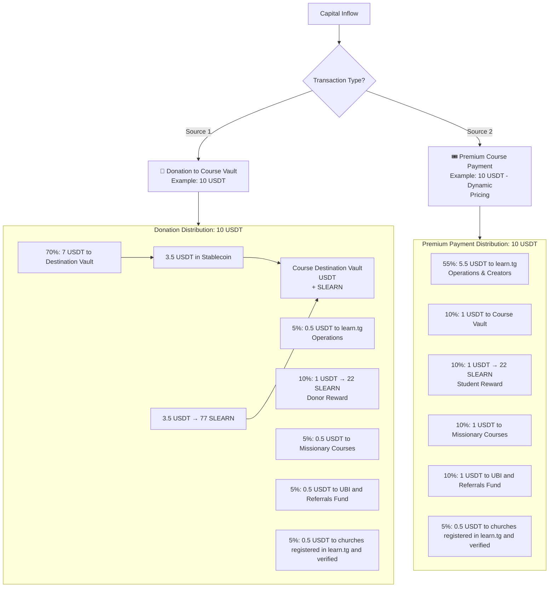
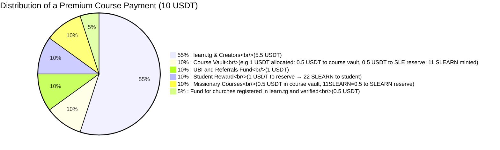

# SLEARN: Whitepaper
## A Utility Token for Community-Powered Learning

*Fundamental Disclaimer: SLEARN is a restricted-access utility token and a
digital tool for educational access within the pdJ ecosystem (learn.tg, 
stable-sl.pdJ.app and sivel.xyz). It is not an investment, a security, a 
stablecoin, a currency peg, or a financial instrument regulated by any
authority. It cannot be bought or traded on external markets. Its internal
accounting unit is the Leone (SLE), with a USD reference floor to protect
long-term educational purchasing power. Users accept that cryptocurrency
technology carries inherent technical risks, which they use at their own
discretion.*

---

## 1. Vision: Learn by Creating Value

[learn.tg](http://learn.tg) exists to democratise access to transformative
education. SLEARN is the engine of a new economy where every learning act
and every contribution generates digital value, which in turn unlocks more
education. We close the loop between donors and students in an automated
and transparent way.

Learn Through Games operates under a Christian framework that is not
exclusive – everyone is welcome to learn – but it is the compass that
guides the system’s design.

*“Take my yoke upon you and learn from me, for I am gentle and humble in
heart, and you will find rest for your souls.” (Matthew 11:29)*

---

## 2. What is SLEARN?

- **Digital utility token** – A unit of account that represents a future
  learning option inside learn.tg, which can be redeemed for Leones (SLE).
- **Meritocratic** – Earned by learning (completing guides), donating
  (to courses), using the pdJ ecosystem, or investing in yourself
  (paying for premium courses).
- **Practical use** – Used to pay for premium courses and, in Sierra Leone,
  it will be possible to exchange it for Leones (SLE) through our partner
  [stable-sl.pdJ.app](https://stable-sl.pdj.app/). That platform maintains
  a reserve vault that backs SLEARN; its total value can be checked on‑chain
  and verified to be greater than or equal to the amount issued and reported
  on the [learn.tg Transparency Dashboard](https://learn.tg/en/transparency).
- **Technical** – An ERC‑20 token on the Celo network, with 2 decimals and
  restricted transfer functions to guarantee its use as a tool, not a
  speculative asset.

### 2.1. Current State and Initial Backing

It can be checked at https://learn.tg/es/leaderboard, as of April 2026, learn.tg has **482 users with connected wallets**, of which **143 active users** hold **309 Learning Points** (to be converted 1:1 to SLEARN at launch). The platform has also distributed **$288.36 in scholarships** and **373.76 CELO** as UBI, with **$1.45 in donations** received.

To ensure proper backing from day one, **pdJ (Pasos de Jesús)** will make an initial donation equivalent to the value required to back the initial SLEARN tokens on 1st June 2026 (minimum $1/22 USDT per SLEARN, as per the Reserve Backing Rule in Section 4). This guarantees that every SLEARN token in circulation at launch is fully reserved.

---

## 3. The Economic Model: Automated Impact

SLEARN enables a circular value cycle through predefined, immutable rules on the blockchain.

### 3.1. Fund Inflow and Distribution

Capital enters the system via directed donations or premium payments.

#### 3.1.1 Concrete example of a 10 USDT donation (assuming 1 USD = 22 SLE)

1.  7 USDT go to the donated course vault: 3.5 USDT finance 3.5 scholarships
    (1 USDT each) and 3.5 USDT go to the SLEARN reserve to mint 77 SLEARN
    to finance 77 scholarships (1 SLEARN each).
2.  0.5 USDT funds learn.tg operations.
3.  1 USDT to the SLEARN reserve and 22SLEARN minted for the user as credit
    for their own learning.
4.  0.5 USDT automatically support free missional courses (half USDT to vault and half
    to SLEARN reserve).
5.  0.5 USDT feed the UBI (in CELO) and Referrals Fund for daily community rewards.
6.  0.5 USDT to the fund for churches registered in learn.tg and verified

#### 3.1.2 Example with a 10 USDT Premium Course Payment

The model also activates when a user pays to access an exclusive course.
The price is dynamic, adjusted according to the student’s country development
index, promoting fairness. A percentage of this payment is converted into
SLEARN for the paying student and is used to finance more scholarships.

This mechanism ensures that every investment in one’s own education directly
contributes to platform sustainability, personal incentive, scholarship
creation, and the missional fund, creating a powerful virtuous cycle of
growth.

---

## 4. Stability and Reserve Backing
To protect users from volatility, SLEARN employs a dual-reference stability framework.

1.  **Reserve Backing Rule:** Every SLEARN is minted only when equivalent value
    (minimum $1/22$ USDT) is deposited into the SLE reserve.
2.  **Asset Mix:** Backing consists of **USDT** (liquidity), **CELO** (ecosystem),
    and **XAUT** (strategic gold reserve to hedge against fiat inflation).
3.  **Stability Formula:** 1 SLEARN is pegged to 1 Sierra Leone Leone (SLE). To
    protect against devaluation, we apply:

    $$V_{SLEARN} = \max(FX_{SLE/USD}, 1/22)$$

    Where $1/22$ is the historical upper-bound rate from 2025.
4.  **Reserve Surplus and Ecosystem Reinvestment:** The SLEARN reserve is designed
    to maintain a 1:1 backing of all tokens in circulation. However, operational
    efficiency and community growth may generate a surplus. This surplus may be
    allocated to develop and maintain the pdJ ecosystem and we will inform its
    usage in the transparency dashboard.
 
---

## 5. The Trust Bridge: stable-sl.pdJ.app
For SLEARN to fulfill its promise of real-world utility, it connects with the economy of Sierra Leone through `stable-sl.pdJ.app`.

### 5.1. Identity & Privacy (Self.xyz Integration)
We prioritize user privacy by utilizing learn.tg verification that in turn
uses the **Self Protocol (self.xyz)** on Celo.
- **NFC Verification:** Users verify their identity using their smartphone's NFC reader against their official passport.
- **ZK Proofs:** Validation is performed via Zero-Knowledge proofs. **learn.tg** only stores the user's name and country, ensuring "privacy by design" while meeting compliance requirements.

### 5.2. Tiered Access and Limits
Redemption is subject to progressive verification tiers:
- **Tier 1:** 100 SLE/day (~$4.5). Requires 1 Premium Course SBT and learn.tg
  verification via Self.xyz.
- **Tier 2:** 200 SLE/day (~$9). Requires 2 Premium Course SBTs and Orange Money name match.
- **Tier 3:** 400 SLE/day (~$18). Requires 3 Premium Course SBTs

### 5.3. Operating Model & Rewards
The bridge operates as a secure link between digital assets and local liquidity.
- **Non-Custodial Escrow:** A smart contract acts as a neutral custodian, freezing digital assets until the operator confirms the receipt of SLE. This minimizes counterparty risk.
- **Cashback Incentive:** To encourage ecosystem growth, users selling crypto through the bridge receive **SLEARN Cashback**. Rewards are proportional to the spread (up to 0.05 SLEARN per USDT), with bonuses for each Premium Course SBT obtained (up to 0.1 SLEARN per USDT).

---

## 6. Security and Governance

### 6.1. Segmented Custody Architecture
Funds are managed across three layers to minimize attack surfaces:
- **Hot Wallets (L2/S2):** 1-2 months of operational funds for quick exchanges.
- **Main Vaults (L1/S1):** Online storage limited to < 1,000 USDT.
- **Master Vault (SL0):** Air-gapped storage for the strategic XAUT (Gold) reserve.

### 6.2. Adaptive Governance

To adapt to market and operational situations, in the first 3 phases of SLEARN, the
founder and operator pdJ (Pasos de Jesús = Steps of Jesus) will adjust percentages
and formulas subject to:
* Transparency: Published on the Transparency Dashboard at least 30 days in advance.
* Limits: The allocation to the SLEARN Reserve will always exceed the value of
  SLEARN in circulation.
* Community Notification: Announced via Telegram/WhatsApp groups.

In Phase 4, the protocol will transition to a two-chamber model:
1.  **Learner House:** Meritocratic voting based on course completion.
2.  **Donor House:** Weighted by historical contributions.
*Note: pdJ (Pasos de Jesús or Steps of Jesus) retains a technical veto to ensure legal and security compliance.*

---

## 7. Regulatory and Compliance Framework
SLEARN operates primarily in Sierra Leone, where digital assets remain largely
unregulated. However, we proactively implement:
- **AML/CTF:** Users must attest to the legal source of funds via a mandatory checkbox.
  Transaction monitoring flags unusual patterns for manual review.
- **Proportional KYC:** Identity requirements scale with the volume of value exchanged.
- **Transparency:** All reserves and distribution logs are public and audit-ready on
  the [Transparency Dashboard](https://learn.tg/en/transparency).

---

## 8. Risks

Using SLEARN involves several risks inherent to utility
tokens and blockchain systems, users should consider these
risks before donating or paying for courses in learn.tg.

- **Smart contract risk**: Even after audits, vulnerabilities
  in the token, reserve vault, or bridge contract could lead
  to loss of funds.
- **Bridge risk**: The initial SLEARN ↔ SLE bridge relies on
  human operators and smart contract escrow. Delays, errors,
  or technical issues may occur during redemption.
- **Reserve volatility**: The backing (USDT, CELO, XAUT) may
  fluctuate in value, affecting the stability of SLEARN.
- **Low adoption**: If learn.tg does not grow sufficiently,
  the utility and demand for SLEARN could remain limited.
- **Liquidity risk**: SLEARN is a restricted utility token.
  There is no secondary market, and conversion outside the
  official bridge is not intended.
- **Regulatory risk**: Future regulations in Sierra Leone
  or other jurisdictions could restrict the bridge or the
  use of SLEARN.
- **Operational risk**: In early phases, the project depends
  heavily on Pasos de Jesús (pdJ) for operations and
  reserve management.

---

## 9. Roadmap
- **Phase 1 (April 2026):** Celo Sepolia deployment and community feedback.
- **Phase 2 (June 1, 2026):** Mainnet launch. 
  We will not set a maximum supply because value of SLEARN depends on its utility
  as a learning reward not on scarcity.  There won't  be an ICO, we will convert 1:1
  Learning Points gained at learn.tg, sivel.xyz and stable-sl.pdJ.app to SLEARN.
- **Phase 3:** SLEARN ↔ SLE swap activation. Post-education utility.
  Currently operated via verified human agents with on-chain attestation.
  Automated Orange Money merchant payout integration will be introduced
  as regulatory frameworks and API availability permit.
- **Phase 4:** Implementation of the two-chamber governance model.

---

## 10. Conclusion

SLEARN is not the goal. It is the tool.

The goal is a self‑sustaining community where learning flows freely, where
every donation multiplies into scholarships and where every student,
regardless of their economic background, has a clear path to grow.

- [Real‑time Transparency Dashboard](https://learn.tg/en/transparency)
- [Verified SLEARN Contract on CeloScan](https://celoscan.io/address/...) (link
  available after deployment)
- [Fundamental Principles of learn.tg](https://learn.tg/principles)

**Contact:** vtamara@pasosdeJesus.org  

*Last updated: April 20 2026. This is a living document that may evolve with
the project.*
