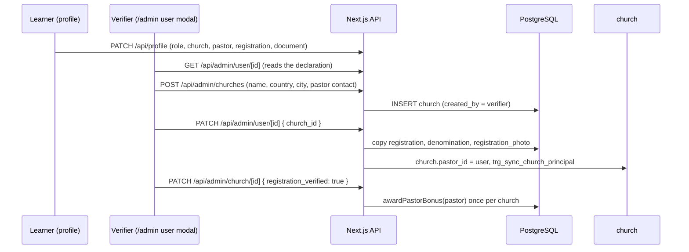

# Church registration and pastors

How a learner's church declaration becomes a `church` record, how a pastor's
registration document is verified, and what that unlocks. This is the single
protocol document: the profile page, the admin dashboard and the APIs all follow
it. UI details of the verifier dashboard are in [admin-guide.md](admin-guide.md).

> Related: [ARCHITECTURE.md](../ARCHITECTURE.md) (§Reward System, §Database
> Schema), [api-security.md](api-security.md) (route rules),
> [guide-writing.md](guide-writing.md) for course content, and the requirement
> https://github.com/pasosdeJesus/learn.tg/issues/152.

## Actors

| Actor | What they do |
|---|---|
| **Learner** | Declares the church (name, town), their role (`church_relationship`), the pastor's name and WhatsApp and, when they are a pastor, the church registration number, the document and the denomination. |
| **Verifier (pdJ)** | Reviews the declaration, creates or assigns the `church`, copies the registration data, verifies profile fields and confirms the registration document. |
| **System** | Keeps one lead pastor per church, keeps `church.pastor_id` in sync, copies the registration data on assignment and pays the pastor bonus once per church. |

## Data model

Two places hold church data. A pastor declares on `usuario`; the verifier
creates or assigns the canonical `church`.

`usuario` (declaration, written by `PATCH /api/profile`):

| Column | Purpose |
|---|---|
| `church_relationship` | `pastor` (lead), `co_pastor`, `leader`, `member` |
| `church_id` | Set by the verifier when the church exists; **NULL while the church does not exist yet** |
| `place_of_worship` | Church name (free text); for Christians it is filled from the selected church |
| `place_of_worship_location`, `city_id` | Town of the church (autocomplete, `msip_centropoblado`) |
| `pastor_name`, `pastor_whatsapp` | Contact the verifier uses to create the church |
| `registration`, `registration_photo`, `denomination` | Declared by a pastor/co-pastor |
| `verified_church_relationship`, `verified_place_of_worship`, `verified_place_of_worship_location`, `verified_city_id` | Verifier confirmations used by the profile score |

`church` (22 columns). NOT NULL: `name`, `country_id`, `pastor_name`,
`pastor_whatsapp`, `created_by`.

| Column | Purpose |
|---|---|
| `name`, `country_id`, `department_id`, `municipality_id`, `city_id`, `city_name`, `address` | Identity and location. `city_name` is free text and mirrors the declarer's `place_of_worship_location` |
| `pastor_name`, `pastor_whatsapp`, `pastor_telegram`, `pastor_id` | Contact and the lead pastor user (`usuario.id`) |
| `denomination`, `registration`, `registration_photo`, `registration_verified` | Registration data and the verifier's confirmation of the document |
| `cluster_wallet` | GD cluster funds (see https://github.com/pasosdeJesus/learn.tg/issues/220) |
| `created_by`, `created_at`, `updated_at`, `merged_into_id`, `deleted_at` | Provenance, merge and soft delete |

## Flow

### 1. The learner declares

`app/[lang]/profile/page.tsx`. The church role selector appears for Christians
(`religion_id = 2`) and the registration number, the document
(`side=registration` on `/api/user/id-photo`) and the denomination appear when
the role is `pastor` **or** `co_pastor`. The upload stores
`uploads/user/{userId}/id_registration.{ext}` and writes the relative path
(`user/{userId}/id_registration.{ext}`) into `usuario.registration_photo`.
Declaration alone does **not** create a church.

### 2. The verifier creates or assigns the church

In the admin user modal (`components/admin/AdminWidgets.tsx`):

- **No church yet** (`usuario.church_id` NULL): the modal shows the declared
  church name and town, the **pastor name and WhatsApp** and, for a
  pastor/co-pastor, the **registration number and document (read-only)**. The
  yellow panel calls `POST /api/admin/churches` (name, country, city, pastor name
  and WhatsApp; the route also accepts `denomination`, which the modal does not
  send) and assigns the new record.
- **Church already registered**: the modal shows the canonical name and location
  and hides the declaration (see [admin-guide.md](admin-guide.md)).

Assigning (setting `church_id`) is what makes the system copy data:

`PATCH /api/admin/user/[id]` (`app/api/admin/user/[id]/route.ts`), when the body
carries `church_id`:

1. Auto-verifies `verified_place_of_worship` from `place_of_worship`.
2. Rejects a second lead pastor (**409**, one pastor per church).
3. Sets `church.pastor_id` when the user is a pastor.
4. Copies `registration` and `denomination` **only if the church lacks them**.
5. Copies the document file to `uploads/church/{churchId}/registration.{ext}`
   and stores `church/{churchId}/registration.{ext}` in
   `church.registration_photo` (again, only if the church lacks one).
6. Clears `church.pastor_id` of the previous church when a pastor moves.

Invariants (migration `20260901074316_church_principal_roles`): a partial unique
index `one_principal_per_church` allows one `usuario.church_relationship =
'pastor'` per church, and the trigger `trg_sync_church_principal` keeps
`church.pastor_id` equal to that user.

### 3. The verifier confirms the document

`church.registration_verified` is set from the church modal
(`PATCH /api/admin/church/[id]`, allowlist includes `registration` and
`registration_verified`); the document itself is served to admins by
`GET /api/admin/church/[id]/registration-photo`. Confirming the document gives
**no profile score points**: it is a legitimacy check.

### 4. Pastor bonus

`packages/rewards/src/lib/pastor-bonus.ts`, `BONUS_AMOUNT = 22` SLEARN. Paid
only when all of these hold:

- `church_relationship = 'pastor'` and the country is 170 (Colombia) or 694
  (Sierra Leone), `position_israel_gaza = 'no'` and `profilescore > 90`;
- `verified_church_relationship = 'pastor'` (the verifier confirmed the role);
- the user is `church.pastor_id`;
- `church.registration_verified = true`;
- the user has a wallet.

Dedupe is **per church**, not per user: the bonus is paid once per church even
if the lead pastor changes.

## Profile score impact

The church counts for **9 of 100 points** (`lib/score-rules.ts`, the single
source of truth, also used by the admin modal):

- Christian (`religion_id = 2`): 9 points when `church_id` is set and
  `church_relationship = verified_church_relationship`.
- Non-Christian: 9 points when `place_of_worship = verified_place_of_worship`.

Full breakdown: 26 name, 24 country, 9 email, 9 WhatsApp/Telegram, 7
GoodDollar, 9 location (`city_id`/`place_of_worship_location`), 9 church/place
of worship, 7 interview.

## Privacy

- Identity and registration documents are private; they are **never** in
  `public/`. `GET /api/user/id-photo/[userId]?side=front|back|registration`
  serves them only to the **owner or an admin** (the session's user must match
  `userId`, or the wallet must be a verifier in `NEXT_PUBLIC_VERIFIER_WALLET`).
- Church registration documents served by
  `GET /api/admin/church/[id]/registration-photo` are admin-only.
- The verifier sees the pastor's declaration read-only in the modal: the pastor
  declares, the verifier does not edit it (`ADMIN_EDITABLE_FIELDS` in
  `app/api/admin/user/[id]/route.ts` excludes `registration`, `registration_photo`
  and `denomination`).

## Endpoints

| Endpoint | Auth | Purpose |
|---|---|---|
| `PATCH /api/profile` | authenticated (owner) | The learner declares or edits the declaration |
| `POST /api/user/id-photo`, `DELETE /api/user/id-photo` | authenticated (owner) | Upload/delete the `front`, `back` and `registration` documents |
| `GET /api/user/id-photo/[userId]` | owner or admin | Serve a document |
| `GET /api/admin/user/[id]` | admin | Read the declaration (registration, document, denomination included) |
| `PATCH /api/admin/user/[id]` | admin | Assign the church (copies the registration data) and verify fields |
| `POST /api/admin/churches` | admin | Create the church from the declaration (name, country, city, pastor contact, denomination) |
| `PATCH /api/admin/church/[id]` | admin | Edit the church, set `registration_verified` |
| `GET /api/admin/church/[id]/registration-photo` | admin | Serve the church document |
| `POST /api/church` | admin | Creation endpoint with no UI caller; **admin-only since 2026-09-29** (it does not set `pastor_id`, `denomination` or the registration data) |

## Known gaps

1. **`POST /api/church` has no caller** (the removed `NewChurchDialog` used it from the
   profile page). It is **admin-only since 2026-09-29**, when the weaker
   user-facing door was closed. It duplicates `POST /api/admin/churches` but stays
   narrower: it does not accept `denomination` and never sets `pastor_id` or the
   registration data (that is the assignment in step 2). Decide whether to remove
   it in favour of the admin route.
2. **`POST /api/admin/churches` does not accept `registration` or
   `registration_photo`** (it does accept `denomination`, but the admin modal does
   not send it). They reach the church only through the copy on assignment
   (step 2.4-2.5), which requires the verifier to save the user modal after
   creating the church.
3. **The verifier cannot edit the declaration** (`registration`,
   `denomination`) from the modal; only the pastor can, from the profile.
